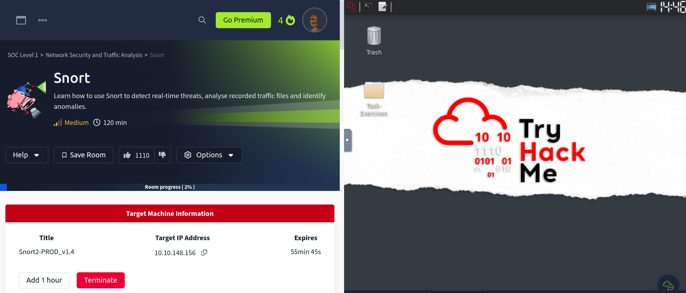
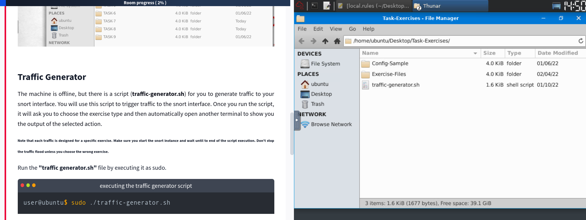
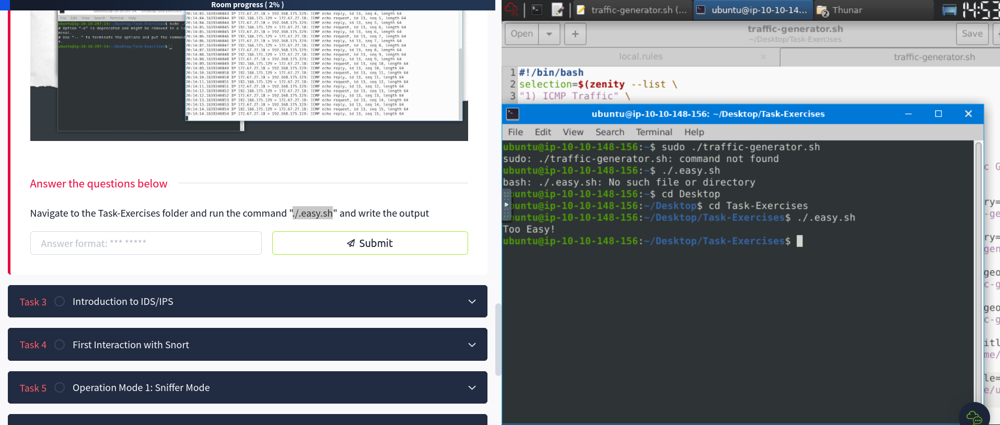
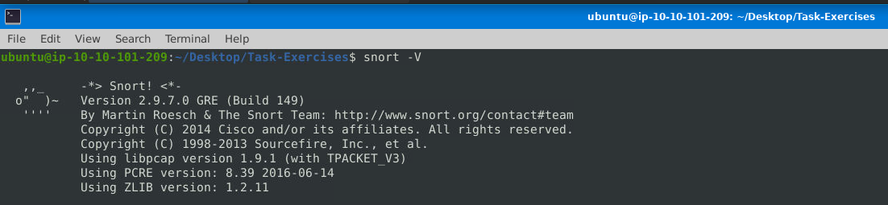
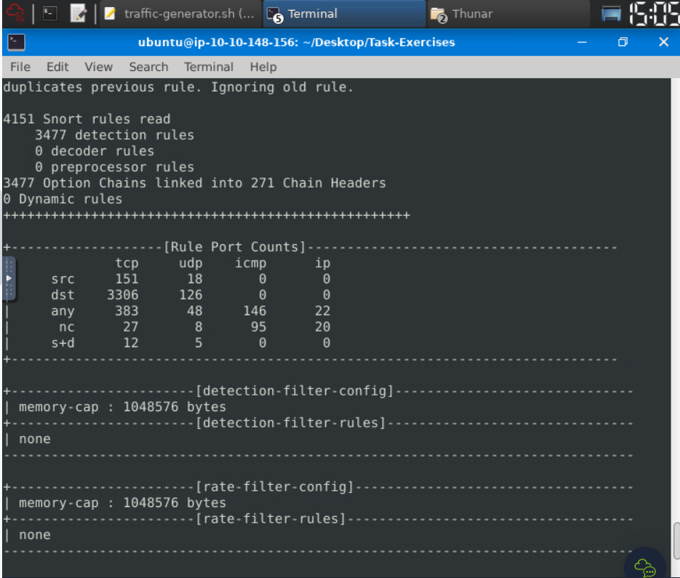
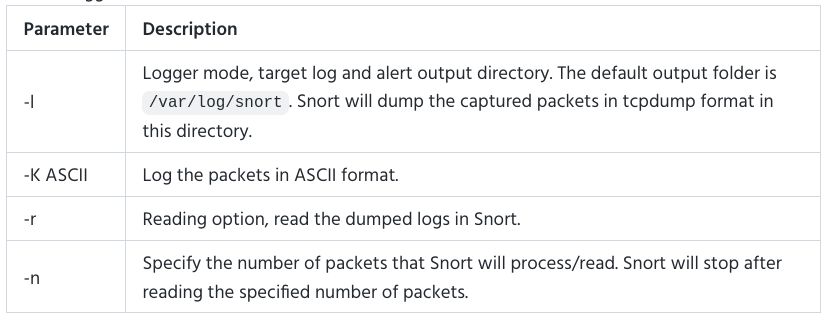

## Topic: Snort
---

## Introduction

In this room we will learn about the basic Linux command-line functionalities like general system navigation and Network fundamentals (ports, and protocols).

## Interactive Material and VM

Fistly, I have started the machine to do all the task that are in the room.

After successfully deploying the machine I have navigated to the folder named "Task-Exercises" on the Desktop and found the following subfolders:

* Config-Sample" - Contains sample Snort configuration and rule files.
* "Exercise-Files" - Contains folders for each exercise with pcap, log, and rule files.

There is also a "traffic-generator.sh" script in the "Task-Exercises" folder. This script is used to generate traffic to the Snort interface.

Inside the machines terminal I ran this command "./.easy.sh" and found that the output is Too Easy!

## Intrusion Detection System (IDS):

It is the passive monitoring solution for detecting malicious activities, anomalies, and policy violations

There are two main types:

1. Network IDS (NIDS) - Monitors network traffic across a subnet

2. Host-based IDS (HIDS) - Monitors traffic on a single endpoint device

It generates alerts when suspicious events are detected

### Intrusion Prevention System (IPS):

Active protection solution for preventing malicious activities, anomalies, and policy violations

These has four main types:

1. Network IPS (NIPS) - Monitors and terminates malicious network traffic
2. Behavior-based IPS (Network Behavior Analysis - NBA) - Learns normal behavior to detect anomalies
3. Wireless IPS (WIPS) - Protects wireless network traffic
4. Host-based IPS (HIPS) - Stops or terminates suspicious events as soon as they are detected. 

IDS systems identify threats but require user intervention, while IPS systems can automatically block and prevent threats when they are detected.

## First Interaction with Snort

These are the Snort parameters that can be used to interact with Snort:

* -V or --version: Check the Snort version

* -c: Specifies the location of the  configuration file.

* -T: Runs a self-test on the file to validate it, without actually starting Snort.

* -q: Run Snort in quiet mode to suppress the default output.

The version of Snort is 149.

To test the current instance with "/etc/snort/snort.conf" file and check how many rules are loaded with the current build, I used the following command:

`snort -T -c /etc/snort/snort.conf`

## Operation Mode 1: Sniffer Mode

These are the different Snort sniffer mode parameters:

* -v (Verbose): Displays the TCP/IP output in the console.

* -d (Display Packet Data): Displays the packet payload data.

* -e (Display Headers): Displays the link-layer (TCP/IP/UDP/ICMP) headers.

* -X (Display Hex): Displays the full packet details in hexadecimal format.

* -i (Interface): Allows you to specify a specific network interface to sniff on, in case you have multiple interfaces.

This command `sudo snort -v -i eth0` starts Snort in verbose mode (-v) and specifies the network interface "eth0" to listen on (-i).

The command `sudo snort -v` starts Snort in verbose mode (-v), which will display the TCP/IP output in the console.

`sudo snort -d` command is used to display the packet data (payload) of the captured traffic.

`sudo snort -de` is used to display both the link-layer (TCP/IP/UDP/ICMP) headers (-e) and the packet data (payload) (-d).

This command `sudo snort -X` tells Snort to display the full packet details in hexadecimal format.

## Operation Mode 2: Packet Logger Mod

Packet Logger Mode Parameters are:

## Operation Mode 3: IDS/IPS

Snort can work as a guard to detect problems (IDS mode) and also act to prevent them (IPS mode), along with its abilities to sniff and log packets.

### IDS/IPS Mode Parameters:

| Parameter | Description | 
| ----------- | ----------- | 
| -c | Defining the configuration file.   |
|  -N | Disable logging. |
| -T | Testing the configuration file. |
| -D | Running Snort in background mode. | 
| -A | Gives all the details possible about the alert. This is the default mode if you don't choose any other. |

These are the different IDS/IPS mode parameters:

1. Testing Configuration: It uses `-c` and `-T` to start Snort and check the configuration file for errors: `sudo snort -c /etc/snort/snort.conf -T`

2. Disabling Logging: Uses `-N` to run Snort without logging: `sudo snort -c /etc/snort/snort.conf -N`

* Background Mode: Uses -D to launch Snort as a background process: `sudo snort -c /etc/snort/snort.conf -D`

## Operation Mode 4: PCAP Investigation

These are the different PCAP investigation parameters:

| Parameter	| Description | Example |
| ----------- | ----------- | ----------- | 
| -r / --pcap-single= | Read a single PCAP file. | `sudo snort -c /etc/snort/snort.conf -q -r icmp-test.pcap -A console -n 10` |
| --pcap-list=""	| Read multiple PCAP files provided in the command (space-separated). | `sudo snort -c /etc/snort/snort.conf -q --pcap-list="icmp-test.pcap http2.pcap" -A console` |
| --pcap-show	| Show the PCAP name on the console during processing. | `sudo snort -c /etc/snort/snort.conf -q --pcap-list="icmp-test.pcap http2.pcap" -A console --pcap-show` |

## Snort Rule Structure
The structure of a Snort rule consists of the following components:

1. Action: Specifies what Snort should do when the rule is triggered.
* alert: Raises an alert and logs the packet.
* log: Only logs the packet.
* drop: Blocks and logs the packet.
* reject: Blocks the packet, logs it, and terminates the packet session.

2. Protocol: Defines the network protocol to be inspected (e.g., IP, TCP, UDP, ICMP).
3. Source and Destination IP Addresses: Specifies the source and destination IP addresses or networks.
4. Source and Destination Ports: Specifies the source and destination port numbers.
5. Rule Options: Provides additional criteria to match the traffic.
* Msg: Provides a brief message or identifier for the rule.
* Sid: Unique identifier for the rule. Should be greater than 100,000,000.
* Reference: Optional reference to external information like CVE IDs.
* Rev: Revision number for the rule.

## Snort2 Operation Logic: Points to Remember

The main Components of Snort:

* Packet Decoder: Collects and prepares packets for pre-processing.
* Pre-Processors: Arranges and modifies packets for the detection engine.
* Detection Engine: Processes, dissects, and analyzes packets by applying rules.
* Logging and Alerting: Handles log and alert generation.
* Outputs and Plugins: Integrates output modules and supports additional plugins.

1. Types of Snort Rules:

* Community Rules: Free ruleset under the GPLv2, publicly accessible.
* Registered Rules: Free ruleset, requires registration, with a 30-day delay.
* Subscriber Rules (Paid): Paid ruleset, requires subscription, updated twice a week.

2. Snort Configuration Files:

* snort.conf: The main Snort configuration file.
* local.rules: The file for user-generated rules.

3. Key Sections in the snort.conf File:

* Set the network variables:
    * HOME_NET: The network you are protecting.
    * EXTERNAL_NET: The external network, usually set to 'any' or '!$HOME_NET'.

* Configure the decoder:
    * Enable the IPS mode with config daq: afpacket and config daq_mode: inline.

* Configure output plugins:
    * Customize the logging and alerting formats.

* Customize your ruleset:
    * Include the local rules file ($RULE_PATH/local.rules).
    * Include the default/downloaded rules files ($RULE_PATH/rulename).

The configuration file is important for Snort's proper functioning, and it's to understand its structure and settings to effectively use Snort in your environment.

