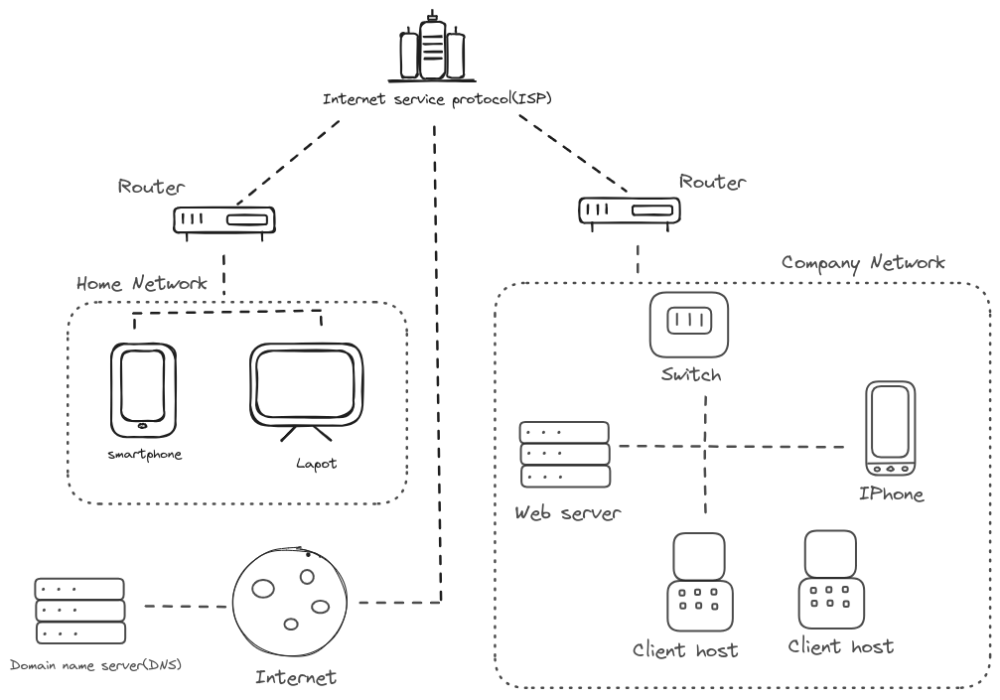
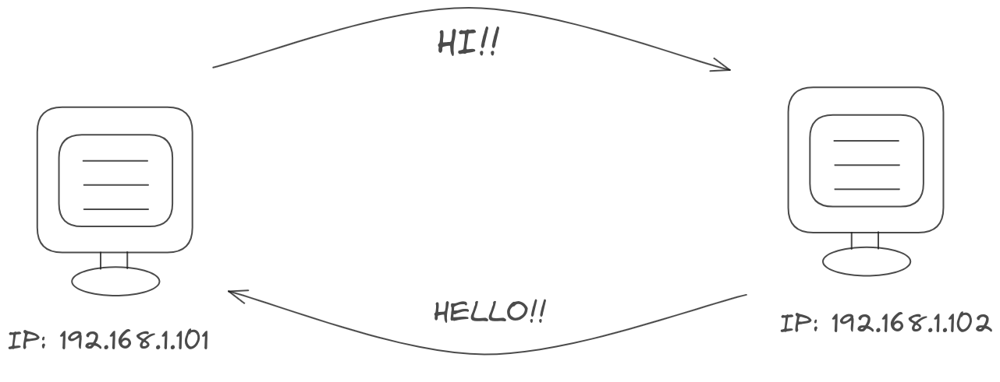

## Topic: Networking
---

#### Introduction.

Hello everyone! I'm exploring the world of the internet to understand how it works. Usually, I use the internet without thinking much about what's happening in the backend. Lets see what makes it all happen.

#### What I understood.

Networking is all around us. When you call a friend, watch TV, or play games, you're using networking. Almost everything we do every day is possible because of networks.

I'm picturing the internet as this giant playground without borders. It connects people and ideas from all over the world. It's not just for fun; it's a place for sharing knowledge and making cool stuff happen.

Now, I've understood the concept of OSI model, which exlpain the concept of how I can communicate and receive files from my friend. This model is all about explaining how data moves between one computer and another.

#### What I didnt know before.

I found out that every computer or devices has a code called IP address, which are like a secret code assigned to a devices which helps to communicate with each other. 

Even though there are billions of people using many devices, we don't run out of codes because of Network Address Translation(NAT) and Dynamic Host Configuration Protocol (DHCP) which assigns the distribution of this IP addresses to each and every devices. I had no clue about these things before!

#### Wifi and hospot 

When I was a kid and didn't know about the internet or Wi-Fi, I used to believe that devices had magical powers like the ones in cartoons, allowing them to communicate with each other. 

It wasn't until 7th grade that I learned about Wi-Fi. In our computer lab, internet was provided through Ethernet cables, which connected computers to a local network or the internet. These cables gave a wired connection for devices to talk to each other and share information.

#### Public Network

A public network is like a big playground where many people can talk and share information with each other. It's open for everyone, not just owned by one person, and it's there for the whole community to use and enjoy.

#### Private Network

A private network is like a personal club where access is limited to a specific group, such as an organization or individual. It's designed for internal communication and sharing data within that group. For instance, your home Wi-Fi network acts as a private network, allowing only your devices to connect and communicate.

#### Confusing Part

The concept of public and private Ip address is bit confusing at first, but now I am familar with this things. Think of a public IP address as your home's internet address. Every device on the internet has a unique public IP assigned by your internet provider, used for communication with the wider internet.

Now, think of a private IP address as an internal address for devices within your home. Your router assigns private IP addresses, like home addresses, so devices like your phone and laptop can communicate with each other. These private addresses are not directly reachable from the internet.