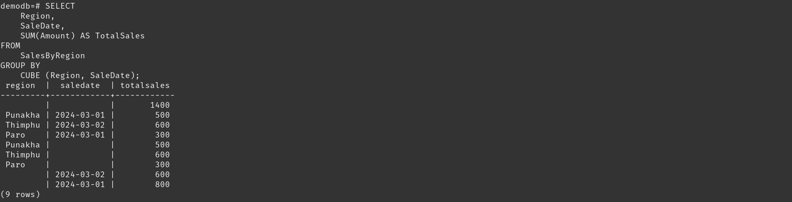

## Topic: Advanced Aggregation Functions
---

Hello everyone, In this blog we will explore some of the advanced SQL aggregation functions. SQL provides a powerful set of tools for aggregating and organizing data.  Some of the advanced SQL aggregation functions are Ranking, Windowing, Pivoting, Rollup, and Cube. These functions allows to perform complex calculations and data transformations efficiently.

During the flipped class session, we were split into four groups and have to discuss on the given topics. I got the topic "windowing function in sql". The class went smoothly where all students were actively participating in their respected groups. After the 30 minutes of discussion each group shared on what they have learned and also did demonstration to make us all understand.

Here are some of my understandings during the flipped class;

### Ranking

Ranking allows us to order our data based on specific criteria. It is all about putting things in order. The RANK() function is used to assign a unique rank to each row within a partition of a result set. The rank of a row is determined by the order specified in the ORDER BY clause.

#### Lets see a demonstration!!

I have created a database called demobd.

Then I have created a table to store information about students and their scores, and then I added three students with their IDs, names, and scores into this table. 

So, by using RANK() function it assigns a unique rank to each row within the result set.It retrieves the names and scores of all students from the StudentScore table and assigns a rank to each student based on their score, with the highest score receiving a rank of 1.

### Windowing

Windowing functions allow us to perform calculations across a set of rows that are related to the current row. It is a way of performing calculations on a subset of rows within a result set, without actually changing the result set itself. 

#### Demonstration

In my demodb database, I have created a table to store information about sales, including the product sold, the date of the sale, and the amount of the sale, and then adds three sales with their IDs, product names, sale dates, and amounts into this table.

The OVER() clause is used to define the window of rows to consider for each calculation. This code retrieves the product name, sale date, and amount for each sale from the Sale_bhutan table and calculates a running total of the sales amounts, ordered by the sale date. 

### Pivoting

Pivoting in SQL is a way to rearrange data by turning rows into columns. It helps to organize and analyze data more effectively, making it easier to read in a table.

#### Demonstration

I created a table to store information about sales, including the product sold, the date of the sale, and the amount of the sale, and then adds three sales with their product names, sale dates, and amounts into this table.

It is useful for analyzing sales data for specific products over time. It allows you to see the maximum sales for 'Maggi' and 'Wai Wai' on each sale date, which can help in understanding sales trends for these products.

### Rollup and Cube

Rollup and Cube are advanced grouping functions that allow us to generate subtotals and grand totals for our data. Rollup gives you a hierarchy of subtotals and then an overall total. It groups your data by different columns, starting from the first one you choose, then the second, and so on, until it reaches the last one. Finally, it gives you a total for everything. 

Cube does something similar, but it goes even further by giving you subtotals for all possible combinations of the columns you pick. It's like Rollup but includes all possible groupings of the columns.

#### Demonstration 

I have created a table called sale by region, and has three attributes region, sale date and amount. It shows the sales sold to differnt regions.

The ROLLUP function organizes data by Region and SaleDate, creating subtotals for each combo and a grand total. It's like making a summary that includes both detailed and overall sales information.

This demo calculates the total sales amount for each Region and SaleDate combination, and also provides subtotals for each Region and a grand total for all sales.

The CUBE function helps organize data by Region and SaleDate, producing subtotals for every possible combo of these, and a grand total for the entire dataset. It's like summarizing information to show both detailed and overall sales figures.

This demo calculates the total sales amount for each Region and SaleDate combination, and also provides subtotals for each Region, each SaleDate, and for the combination of both, as well as a grand total for all sales. 

