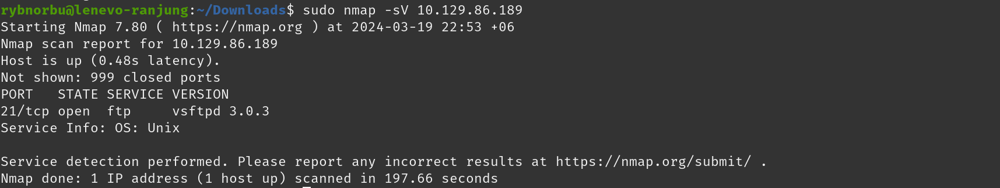

## Topic: Hack the box
---

Welcome to my blog, today we'll be looking at the Hack The Box Machines tier 0 and 1. We will be discussing how we gained access to the system and the new tools and protocols we learned along the way.

Hack the Box is a plateform learn cybersecurity skills. It's a fun way to learn by doing, with challenges and games that make learning exciting. It helps you practice and improve your cybersecurity skills in a hands-on way.

## Connect To The Hack The Box VPN

To get access to all the machine, we need first need to connect to the Hack The Box VPN. This involves downloading certain files and then running the command "openvpn file_name" in the terminal. This VPN connection is necessary to access all the machines in both tier 0 and 1.

* OpenVPN: Provides a safe and private method to reach resources on a network or browse the internet, which is useful for both individuals and organizations.

After successfully connecting to the hack the box VPN, we can active the machine my clicking the "Spawn Machine" button. After the machine has been spawned you will be provided with th IP address which is used to communicate with the machine.

### Note

We must be on the same network to gain access to all the machines. Therefore, we should always be connected to Hack the boxs VPN.

## Tier 0

## Meow Machine

### Gaining Access to the System

The final task in this machine is to submit the root flag. So, to capture the root flag we need to get into the meow machine. First, we need to find out how many ports are open and what services are running on each port.

After starting up the machine, I received my IP address. I'll have to use this IP address to complete all the tasks on my machine.

First, I checked whether I can talk with the machine. Inorder to check that I used the ping command. Ping command is used to test if the machine can accept requests.

To know which ports are open and which server are available on the port I used nmap command where this command scans the network giving the informations about machine.

#### Result
* port 23/tcp is open and its running on server telnet. 

As the scan showed that the server is only listeninng to telenet on port 23, I tried connecting to telnet server inorder to access the machine.

Now to login into the machine, I used root as my user and it worked!!

I have successfully loged into the machine and now to answer the final question submit root flag, I need to find the password which is hidden in some files. I found out that there is a flag.txt and snap file in the machine. I found the password while navigating into the flag.txt file.

#### Command I used
* ls: list all the files that are in the directory.
* cat: display what's inside the file.

### Learning Through the Meow Machine

In this machine I have learned how to access the machine which is running on server Telnet.

* Virtual machine: It run different operating systems or software on your main computer without affecting its setup. It is like a computer within a computer
* Terminal: Is a shell, a program that allows users to interact with their operating system through a command-line interface.
* Ping: It allows a user to test if a particular destination IP address exists and can accept requests.
* Nmap: It is used to scan a network. It identifies active devices and open ports.
* Telnet: Enables us to connect to to a local computer.

## Fawn
---
### Gaining Access to the System

First, we need to check whether we are connected to the hack the box VPN. Same like the moew machine to get the IP address we need to start the machine by clicking the button "Spawn machine". Remember this applies to all the machines.

#### Target IP Address

First thing I did was, I checked whether I can communicate with the machine using the tool ping.

As i can exchange informations with the IP address, I scanned the network to get more informations using nmap.
* The `-sV` is used to display the version of the services running on the open ports.

#### Result
* port 21/tcp is open.
* running the FTP service.

Unlike the moew machine, this machines is running on FTP server. So, I tried connecting to the FTP server to gain control over the machine. FTP is a service that allows you to transfer files between a client and server. We can take advantage of the anonymous login feature in FTP server where sometimes we can login into the server anonymously.

As I am successfully loged in into the server, I found out that there is only one file; flag.txt. So, I downloaded the file by using get command.

The downloaded file will be saved in the download folder and we can answer the final question.

By doing all these penetration testing, I'm able to access the machine and answer all the qustions that are in the machine.
#### Learning Through the Fawn Machine

This machine introduces us to the fundamentals of attacking a machine which is running on server File Transfer Protocol(FTP). I have learned that in FTP server using anonymous as my username and random password can help me login into the server.
* FTP (File Transfer Protocol): Is a service that allows you to transfer files between a client and server.
* ftp -h: using this command helps us to display help menu.
* Nmap -sV: is used to display the version of the services running on the open ports.
* get: used to download files.

## Dancing
---
#### Gaining Access to the System
Make sure that you are connected to the same network so that you can spawn the machine and get the IP address.

#### Target IP Address

To gain access to the machine, I first used nmap tool to see the informations about the machine's IP address on which ports are open and their server.

#### Result
* There are three ports open and the port 445/tcp is open and running on microsoft-ds which includes SMB functionality.

I have listed the contents of the share that are available in the server.

There are 4 shares on the machine and the sharename "workspace" is connected without providing any password. So, I tried navigating to the workspace and found out that there are 2 user directories, 'Amy.J' and 'James.P'.

And then, I have navigated to the WorkShares directory, I found a file named “flag.txt” in the “James.P” directory. I navigated into the flag.txt file and found the root flag.

This is how I have got accessed to the machine and by doing all this testing I am able to do all the questions easily.

#### Learning Through the Dancing Machine

In this machine I have learned about Server Message Block. SMB exploit allows attackers to impersonate user and gain unauthorized access. We can use get command to download the file inside SMB server.
* SMB (Server Message Block): This is a communication protocol used for sharing access to files and other resources on a network.
* smbclient: talks to an SMB server
* -L: It will lists share on server and provide access to SMB resources.

## Redeemer
---

#### Target IP Address

To solve the this machine, I performed a scan on my IP address using the Nmap tool.

#### Result
* TCP port 6379 is open.
* redis service is running on the 6379 port that is open on the machine.

Redis (Remote Dectionary Server) is an open-source advanced NoSQL key-value data store used as a database. The data is stored in a dictionary format having key-value pairs.

To get the information about the machine I used the `redis-cli -h` command where -h is used to  specify the hostname.

From the output, I found out that there is only one database with index 0 and having 4 keys.

I found the root flag by listing all the keys using `keys *` and used get command to see the contents of the inside the flag file.

By doing all this steps I'm able to get access to the machine and answer all the questions that are in the machine.

### Learning Through the Redeemer Machine

In this machine I'm able to learn about the redis server and knew how to gain access to the machines that are running in redis server. I knew that this machine is designed to introduce about the fundamentals of attacking a machine that is running Redis server.
* redis-cli is a command-line is used to interact with the redis server.
* We can use select command to select the desired database in redis server.
* Redis: Redis (Remote Dictionary Server) is an open-source, in-memory data structure store, used as a database, cache, and message broker. The data is stored in a dictionary format having key-value pairs.
