## Topic: Hack the box
---

## Tier 1

## Appointment

### Gaining Access to the System

Before aming to access the machine, we need to make sure that we are on the same network. After that we need to spawn the machine just like tier 0. So, by doing this I got the the IP address that I need to use to gain access to the machine.
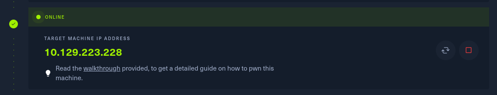

 Now, let’s ping the server to see if we are connected and communicate.
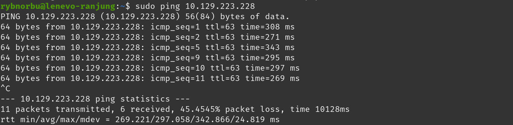

### Port Scanning with Nmap:
I have scanned the machine using nmap tools to find open ports and services running on the target machine.
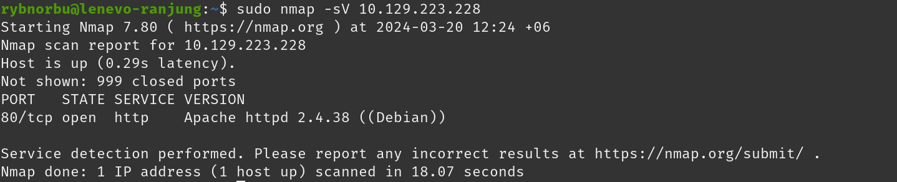

#### Result
* port 80 is open
* running Apache httpd server with version 2.4.38

The HTTP Server Header script (http-server-header) reveals information embedded in the HTTP response header, while the HTTP Title script (http-title) extracts the title of the web page.

If we type the IP address into the browser, we will see a website of a login form.
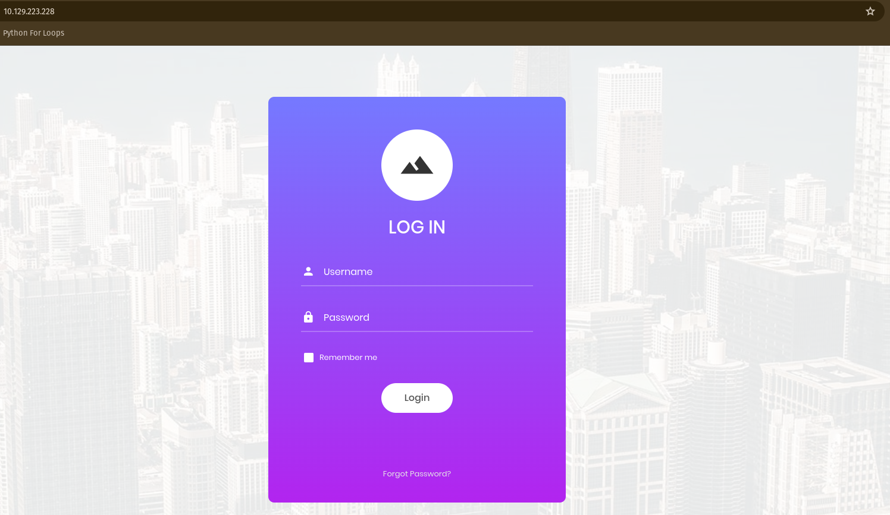

Hypertext Preprocessor(PHP) allows web developers to create dynamic content and interact with databases. So, in PHP, we can use # to comment lines of code. With this we can do SQL injection in the login form.

In the username input, I used admin'#. I did this because # code checks only for the usernames with admin and ignores the password. By doing this, we can put any value in password field and can login successfully. Basicaly, using # code only checks the letters that are spelled before and ignores that are after the # code.
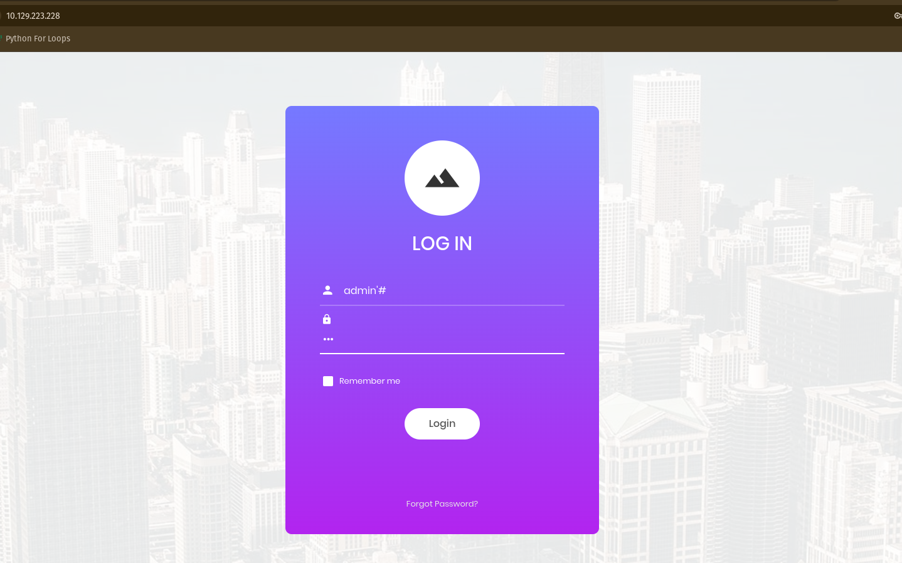

See, by using this I logged in successfully and found the root flag.
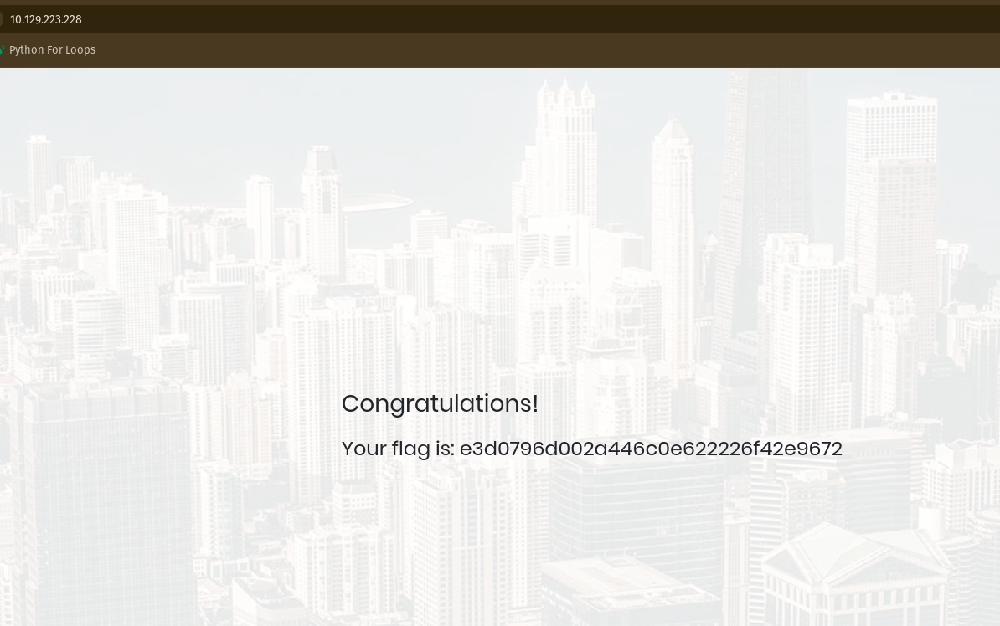

I got accesed in this machine as the login form on the website was vulnerable to SQL injection.
### Learning Through the Appoinment Machine
In this machine I have learned that the HTTP Server is the communication between a web server or browser and the end user. I have also learned that the SQL Injection is when attackers insert malicious SQL code into input fields on a website, this allowes them to manipulate the database or access information.
* Apache httpd server is used for running web pages on either physical or virtual web servers.
* The `#` character in a line ignores every character that is after; by the server. Everything that is after the `#` is treated as command.

## Sequel
---

In this machine we will have to use the SQL (Structured Query Language) service to gain access to all the databases and tables.

### Gaining Access to the System

#### Target IP Address

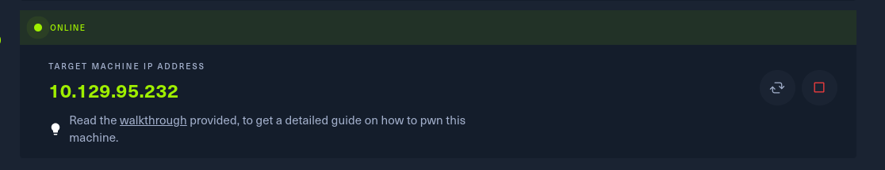

I have started scanning the target IP address by using nmap tool to find open ports and services.

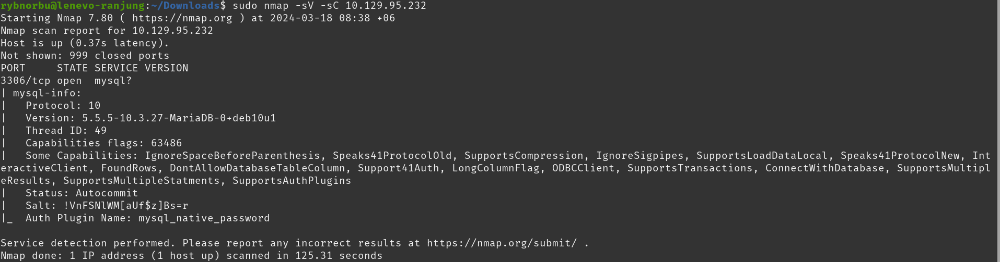

#### Result
* Scan shows that the port 3306 is open and it is running on myql server.

Then I have tried logging in as a root user. In mariadb we are able to login in into the server using root as our username without entering the password.
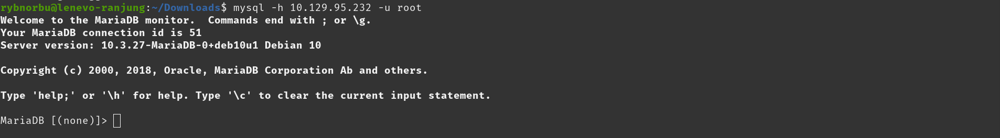

Now, I'm logged in into the database.

To list all the databases that are present in SQL I used the command `SHOW databases;`
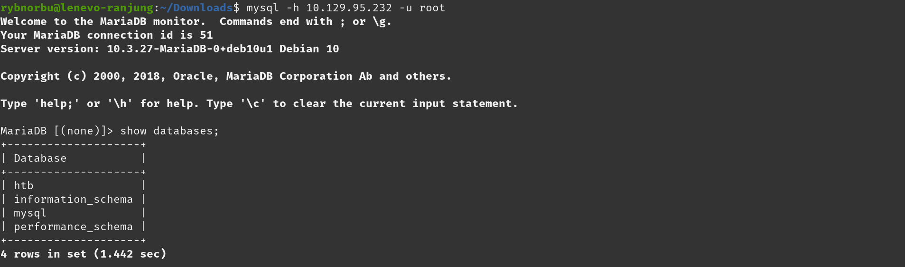

As, you can see there are 4 databases present in the set. Let's check htp database. To select the htp database I used the command `USE htb;`
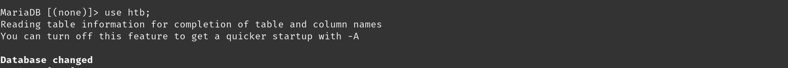

I have successfully changed my database to htp.
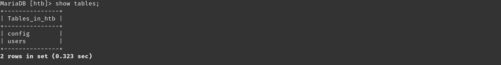

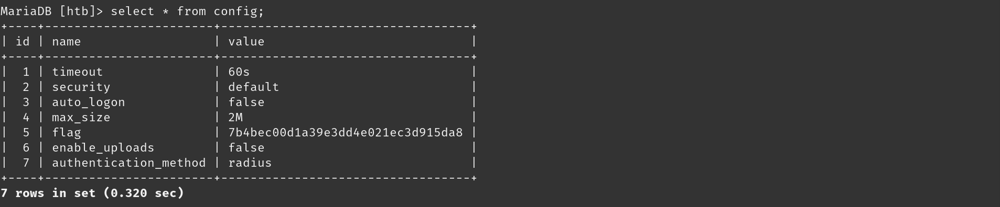

When I looked into the htp database, I found two tables: "config" and "users" and Inside the "config" table, I found the root flag.

### Learning Through the Sequel Machine
In this sequel machine, I have learned that Structured query language (SQL) is a standard language that is  used to communicate with a database. There are many rules and symbols and used in SQL. For example; `;` symbol is used at the end of each query and `*` symbol is used to display everything inside a table.

In this machine, the server MySQL version is running on mariadb. So, mariadb is an open source database to help store and organize data.

## Crocodile

### Gaining Access to the System
#### Target IP Address
I will use this IP Address to find the root falg in this machine.
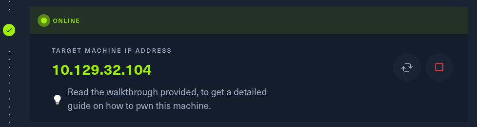

As usual, I have started scanning the target IP address by using nmap tool to find open ports and services.
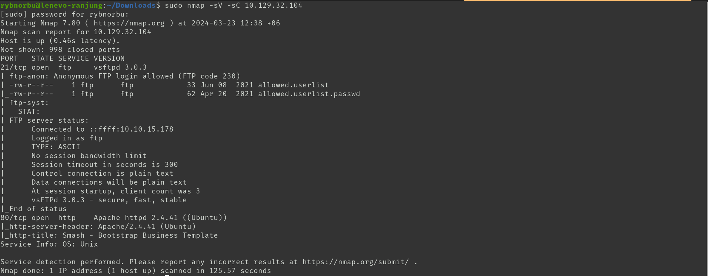

#### Result 
* Port 21 is open which is FTP (File Transfer Protocol)
* Port 80 is open which is Apache httpd 2.4.41.

As you can see there are two file allowed.userlist and allowed.userlist.passwd in ftp server port 21. I tried logging into the server as anonymous and downloaded these files.
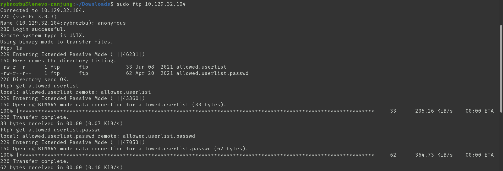

Inside this files there are list of user and their password.
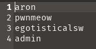  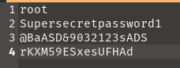
As I have found the user and their password I need to discover hidden URLs, files, and directories within websites to find the root flag. So, Inorder to find this I used Fuzz Faster U Fool(ffuf) to find hidden URLs.
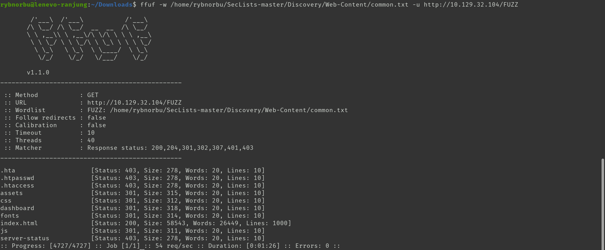

Using Fuzz Faster U Fool(ffuf) I have found many hidden URLs, I tried all these URLs and found the login page using the dashboard. In this page I have tried logging in using all the user and password that I have downloaded earlier and finally worked using user admin. 
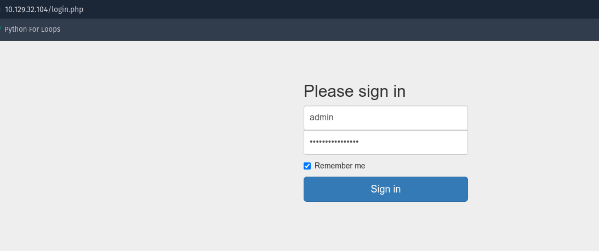

And finally logging in using the admin user and password, I have found the root flag.
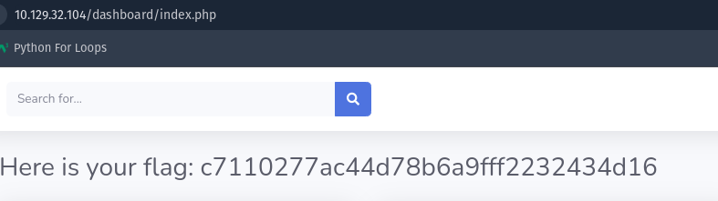

### Learning Through the Crocodile Machine
In this machine I have learned about discovering hidden URLs, files, and directories within websites using Fuzz Faster U Fool(ffuf). This command does vrute-force attack in the web application's using HTTP POST requests. I have also tried using gobuster but it is slow and not efficient unlike ffuf.
* Ffuf is used for fuzzing Get and Post data but can also be used for finding hidden files, directories or subdomains.

