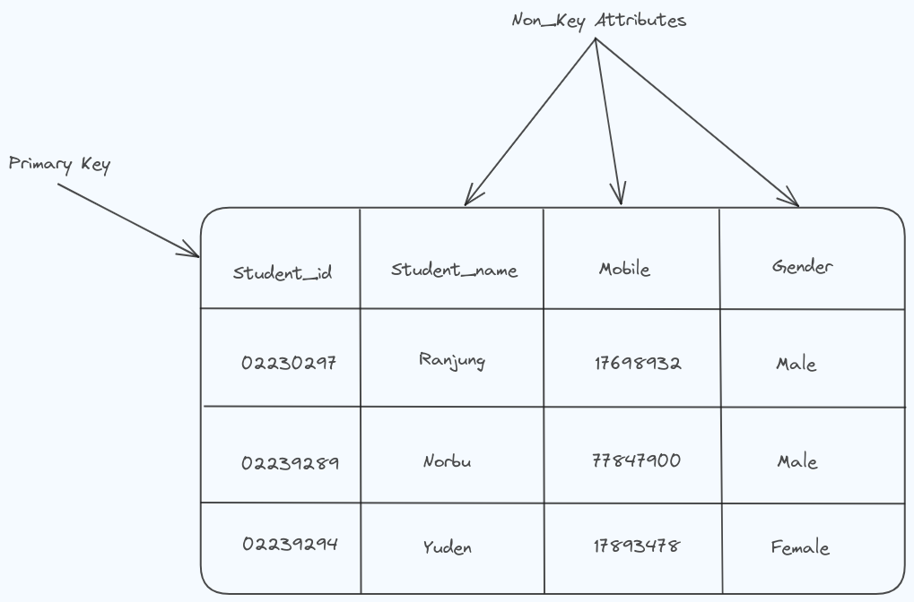
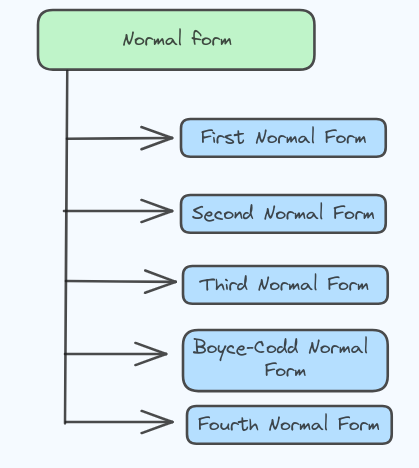
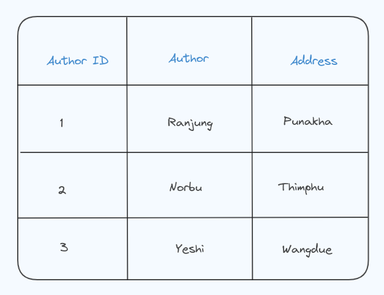
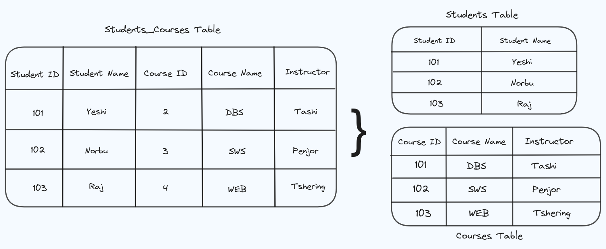
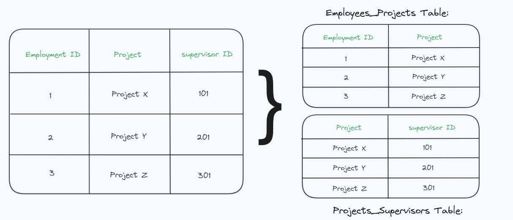
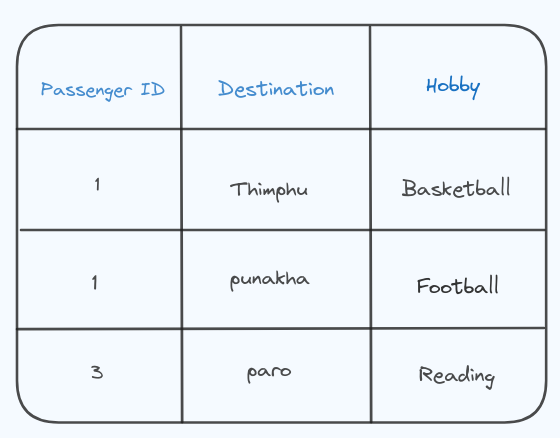
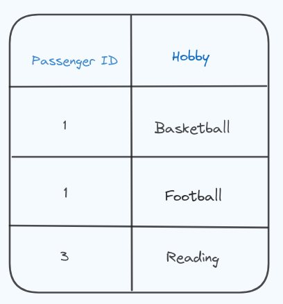

## Topic: Normalization.
---

Today in the flipped class, we studied about the normalization in Database Management Systems. It was an insightful session where we explored the concept of organizing data efficiently to minimize redundancy and dependency.

When the data in tables is messy and hard to understand because it's all mixed up, we can use something called normalization in DBMS. It's like organizing the data in the tables keeping data consistent by storing the data in one table.

Before we talk about different types of normalization, let's understand what a primary key and non-key attributes are.

In the table shown above, the "student_id" column serves as the primary key. This means that each row in the table can be uniquely identified by its "student_id" value. Consequently, the other columns in the table are referred to as non-key attributes.

## Types of DBMS Normal forms
There are many types of Normal forms in DBMS, They are;

## First Normal Form (1NF)

We can say that a table is in the First Normal Form, If the tables:
* Have single(atomic) valued attributes/columns.
* The values within a column should all belong to the same category or type.
* All the columns should have unique names.
* The datas can be in any order.

### For Example;

The course column has multiple values in the first tuple, so the table fails to pass the First Normal form.

Inorder to pass the First Normal form, each column should have a single value.

Now the table fulfills the 1NF conditions!

## Second Normal Form (2NF)

In 2NF;
* It should be in the First Normal form 
* All non-key attributes must dependent on the entire primary key, meaning no partial dependencies should exist.
#### For Example;

##### Unauthorized table

This table violates 2NF because the author address is dependent on the author, not the book itself.

#### Normalized Tables (2NF):

To achieve 2NF, we need remove partial dependencies.

* Books Table:

* Author table:

Now the Books table contains information about books and refers to authors using the Author ID and the Authors table contains information about authors and their addresses. Each author has a unique ID.

The address is not stored with each book but is instead linked to the author. This avoids redundancy, meeting the requirements of 2NF.

## Third Normal Form

In 3NF, we need to ensure that there are no transitive dependencies. This means that non-key attributes should not depend on other non-key attributes.

### For example;

The table "student_courses" violates the 3rd Normal Form because there is a transitive dependency where the Instructor depends on Course ID, not on the entire key.

I have created 2 tables:

* In the Students table, each non-key attribute (Student Name) depends only on the candidate key (Student ID).
* In the Courses table, each non-key attribute (Course Name, Instructor) depends only on the candidate key (Course ID).

Creating these tables ensures that there are no transitive dependencies, satisfying the requirements of the 3rd Normal Form.

## Boyce-Codd Normal Form (BCNF)

BCNF ensures each information in a database table is uniquely identified by its primary key and eliminates certain types of data redundancies, without any unnecessary dependencies between different attributes.

### For Example;

In the above diagram, the Employee ID does not uniquely determine Supervisor ID, this violates BCNF because Supervisor ID is functionally dependent on a non-superkey (Employee ID).

To achieve BCNF, I have created two tables;
* In the Employees_Projects table, each information is uniquely identified by Employee ID.
* In the Projects_Supervisors table, each information is uniquely identified by Project.

This ensures that there are no non-trivial functional dependencies where the determinant is not a superkey satisfying the requirements of BCNF. 

## Fourth Normal Form (4NF)

In 4th Normal Form (4NF) it ensures that there are no repeating groups of data and that each attribute in the table is directly dependent on the primary key.

### For example

In this a passenger can go to multiple place, and each passenger can have multiple hobbies. The column destination and hobby are independent of each other voilating the Fourth Normal Form (4NF) because it contains multi-valued dependencies.

I have created 2 tables to satisfy 4NF;

By creating this we have eliminated the violation of 4NF. Now, each table represents a single-valued fact about the entity.

## What we did in Flipped class

First, our class was divided into four groups, with each group assigned a topic to discuss among its members and present to the class. It was an intresting session where we actively participated and learned different types of normal forms.