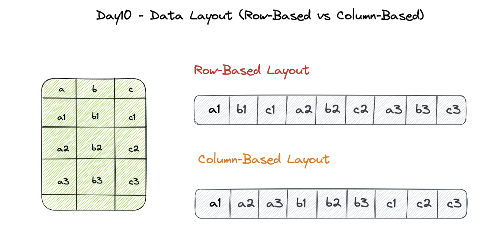

## Topic: Types of NoSQL Databases
---

Hello everyone, In this blog we will explore some of the Advantages, Disadvantages and Applications of types of Nonrelational Databases.

Let us first learn about what NoSQL is? Basically NoSQL are non-tabular databases and store data differently than relational tables. It can deal with all kinds of messy data, even if it's not perfectly sorted. Plus, as you add more and more stuff, it can handle it without any fuss.

## Types of NoSQL Databases


| Database types | Key characteristics | Example |
| ----------- | ----------- | ----------- |
| Document-based Databases | Stores and retrieves data in flexible, JSON-like document | MongoDB, Firebase, CouchDB, Cloudant |
| Key-value Stores | Simple key-value storage model | redis, Amazon DynamoDB |
| Column-oriented Databases | Data organized and stored by column rather than rows | Apache Hbase, Amazon Redshift
| Graph-based Databases | Stores and manage data as nodes and relationships | Amazon Neptune, Neo4j |
| Vector Databases | Storing and querying high-dimensional data for similarity search tasks. |  Milvus |
| Time-Series Databases | Designed for time series data management In a time-series database | InfluxDB |


## Document-based Databases

Document-based databases is also known as document stores. It is designed to store, retrieve, and manage document-oriented information. The datas are stored in documents similar to JSON (JavaScript Object Notation).  This makes it easier to save and search information.


### Example of Document-based database.

```
{
  "_id": ObjectId("8a42r06765"),
  "student_id": "02230297",
  "name": "Yeshi",
  "age": 19,
  "grade": 12,
  "courses": ["Mathematics", "Science"]
}
```
### Advantages:

* Flexibility: They can handle different types of information without needing a fixed structure. You can store things like text, numbers, and even images all in one place.
* Easy to Use: They're simpler to work with than some other types of databases. You don't need to spend as much time planning out how to store your data because you can just throw it in and go.
* Handling Lots of Stuff: They're good at managing lots of information, even when it's a huge amount.

### Disadvantages:

* They may require multiple queries or operations against differing aggregate structures, which can complicate transaction management.
* For applications requiring complex transactions, the performance might decrease due to the need for multiple queries.

### Applications:

* Blogging Platforms: They are excellent for managing content and user data.
* E-commerce Applications: They can efficiently handle product information, user profiles, and transaction data.
* Real-time Analytics: They are suitable for applications that require real-time data processing and analysis.


## Key-value Stores

Key-value stores are the simplest form of NoSQL databases. They store data as a collection of key-value pairs, where each key is unique and associated with a value.


### Advantages:

* Simplicity: The design is straightforward, making it easy to understand and implement.
* High Performance: Ideal for applications that require fast data access and retrieval, such as session management and caching.
* Scalability: Can handle massive data loads and store schema-less data, making it suitable for large-scale applications.

### Disadvantages:

* They are not suitable for complex queries or frequent data updates.

### Applications:

* They are used for managing user shopping cart data.
* Session-based Applications: Ideal for storing session information.
* Large-scale Data Handling: They can efficiently manage large volumes of data.
* They are suitable for applications that require fast access to data.

## Column-oriented Databases
Column-oriented databases store data in columns instead of rows, allowing for efficient data retrieval and storage. They are designed to handle large datasets and perform well with aggregation queries.



### Advantages:

* High Performance: Efficient for aggregation queries like SUM, COUNT, AVG, MIN.
* Scalability: Capable of handling large data loads on distributed machines.
* Reduces storage space and improves query performance.

### Disadvantages:

* Difficult to maintain strong consistency across all columns.
* Requires multiple write events on disk for each column, adding to the complexity.

### Applications:

* They are used for storing large volumes of data for analysis.
* Ideal for applications that require complex data analysis.
* They can efficiently manage customer relationship data.

## Graph-based Databases

Graph databases store data in nodes and edges. Nodes typically store information about people, places, and things, while edges store information about the relationships between the nodes. They are particularly effective for applications that require complex relationship analysis.


### Advantages:

* Flexible Model: Supports multi-relational data and can scale across multiple systems.
* High Performance: Efficient for queries with joins compared to relational databases.
* Easy Relationship Management: Establishing relationships is swift as data is already present.

### Disadvantages:

* Managing many entity types and relationships can be challenging.
* Often used alongside traditional databases.

### Applications:

* Social Networks: Ideal for applications that require relationship analysis, such as Facebook.
* Spatial Data Analysis: They are suitable for applications that require spatial data analysis.

## Vector Database

A vector database is a collection of data stored as mathematical representations. Each vector has a certain number of dimensions, which can range from tens to thousands, depending on the complexity of the data.


### Advantages.

* Vector databases are good at storing and processing high-dimensional data, such as embeddings or feature vectors used in machine learning and data analysis tasks.

* Vector databases can scale horizontally to handle large volumes of data and query loads, making them suitable for big data applications.

### Disadvantage

* Vector databases are specialized for similarity search operations and may lack the flexibility to perform complex queries common in other types of databases.

* Vector databases are most suitable for applications that heavily rely on similarity search and high-dimensional data analysis.

### Applications 

* Many businesses use vector databases to store embeddings generated by machine learning models. 

* In some cases, vector databases are optimized for real-time querying, making them a good fit for applications that need quick responses.

* Used in location-Based Services applications, like geocoding services, rely on vector databases to guarantee real-time, location-specific information to users.

## Time-Series Database

They are specifically designed for time series data management In a time-series database, every record contains a timestamp. The timestamp can be used to display a single data point or in graphing and analytics. 

They can be measured in seconds and minutes, hourly, daily, weekly, monthly, quarterly, half-yearly, or annually.


### Advantages

* Time series databases are specifically designed to efficiently handle data that changes over time, making them ideal for storing and querying time-stamped data points.

* Time series databases can scale horizontally to accommodate growing volumes of time-stamped data, making them suitable for applications dealing with large-scale data ingestion and storage.

### Disadvantage

* They may have a limited data model compared to general-purpose databases, focusing primarily on time-stamped values. This can restrict their suitability for storing complex or heterogeneous data.

* Managing time series data efficiently may require expertise in handling data retention policies, and data aggregation strategies to balance storage efficiency with query performance.

### Applications

* Time series databases are commonly used in IoT (Internet of Things) applications to store sensor data, and analyze trends over time.

* They are widely used in financial services for storing and analyzing time-stamped market data, stock prices, and trading volumes to identify patterns and make informed decisions.
