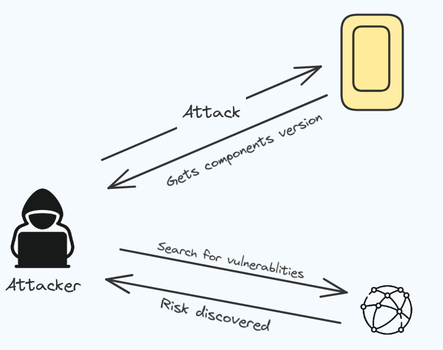
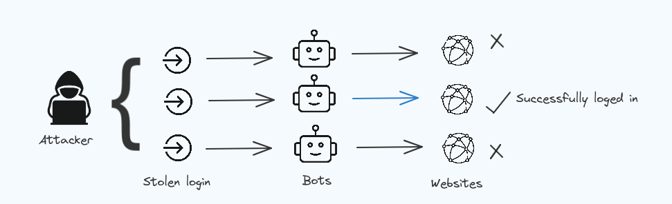

## Topic: OWASP Top 10 - 2021
---

In this page we will be learning about the OWASP Top 10 2021 vulnerabilities to better understand their impact and how they can be avoided.

Basically, OSWAP stands for the Open Web Application Security Project. It is the organisation that make sure websites are safe from cyber attacks.

The top 10 OSWAP highlights on the ten biggest security problems that web applications can face. The newest OWASP Top 10 list came out on September 24, 2021. The updated list are;

---
## Broken Access Control.

Access control ensures that users have appropriate permissions to access or perform actions within a system or application.. When this control breaks, It can lead to unauthorized user gaining access to the datas.

### For example
In most of the cases website have pages that are protected from the regular visitor. Only the admin can access these pages, but if a regular visitor can access the protected pages they are not meant to see, then the access controls are broken.

### Insecure direct object references (IDOR)
Insecure direct object references (IDOR) happen when a program lets users to control the things like files directly, which they're not supposed to see.

For example; let's say you're logging into your bank account (BOB), after successfully logging in we will get a URL like this https://BOB/account?id=102213. On this page, we can see all our important bank details, and a ypu can do whatever they need to do.

However, anyone can change the id parameter to something else like 112413, and he would be able to access to someone else's bank account.

---
## Cryptographic Failures

Other peoples are not able to see the conservation of me and my friend because the communication between the server and client are encrypted. 

Cryptography is the process of hiding information so that only the person a message was intended for can see it. If this cryptography fails attackers will be able to access all the informations and gain full control over it.

Cryptographic failures can lead to user being able to 
* break into systems
* steal informations
* pretend to be someone else. 

---
## Injection

SQL Injection means when attacker insert harmfull substances or codes into the website or applications. If the website isn't properly protected, the database will execute those  commands and gives the attacker access to important informations like usernames and passwords.

Injection can lead to;
* data loss
* security breaches
* loss of control of the target host

---
## Insecure Design

Insecure design means that there are weaknesses in how the applications are built. These weaknesses makes it easier for hackers to attack the application, putting its security at risk.

Insecure design can lead to many security risks and problems, such as 
* unauthorized access to important resources
* data breaches
* system crashes

---
## Security Misconfiguration

Security Misconfiguration occurs when the settings in software or servers are not set up correctly, making easier for attackers to exploited the application.

Common example of security misconfiguration is not using HTTP security headers.

### Prevention
* Ensure that the software is always up-to-date.
* restrict unauthorized access to systems and resources.
* Avoid the usage of default usernames and passwords.

---
## Vulnerable and Outdated Components

Vulnerable and Outdated Components refers to software or application that are old and haven't been up-to-date updated. This can create security weakness where attackers can easily find and break into the system.

* Using old software having old operating systems and database management systems (DBMs).

* Not scanning your computers regularly and ignoring security news can leave your application exposed.

---
## Identification and Authentication Failures

Identification and Authentication Failures occurs when the sotware or application fails to recognise the main user, giving access to other users.

* There are no protection against attacks, attackers can use brute fore to get the passwords and can get access to the datas.

To prevent that we should;

* Limit the number of login attempts.
* Use strong and unique passwords.
* Regularly review and update passwords.

---
## Software and Data Integrity Failures

The Software and Data Integrity Failures involves  problems with software updates, important data, and processes like continuous integration and continuous deployment (CICD) that don't have enough checks to make sure everything is safe. This can let attackers to access and spread harmful software.

These can be prevented by;

* Secure your updates.

* Ensure that no unencrypted data is sent to untrusted clients without an integrity check.

---
## Security Logging & Monitoring Failures

It is important to keep track of activities that user performs.

Security Logging & Monitoring Failures occurs when system doenot keep records of security events and having lack of alerts.

---
## Server-Side Request Forgery (SSRF)

Server-Side Request Forgery (SSRF) occurs when a attacker makes requests to servers on behalf of other user, allowing them to access information or exploit vulnerabilities. Uses non-HTTP services to get remote code execution (RCE).

This can be prevented by;

* Using different networks for remote access resources. 
* making sure URLs follow a specific format