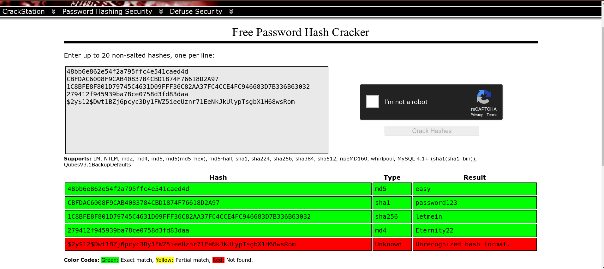
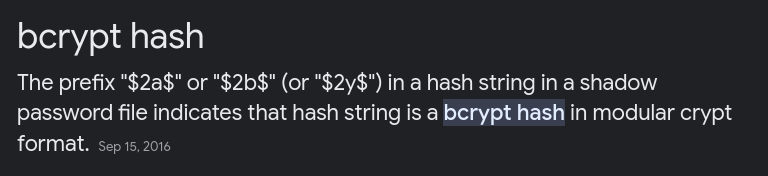
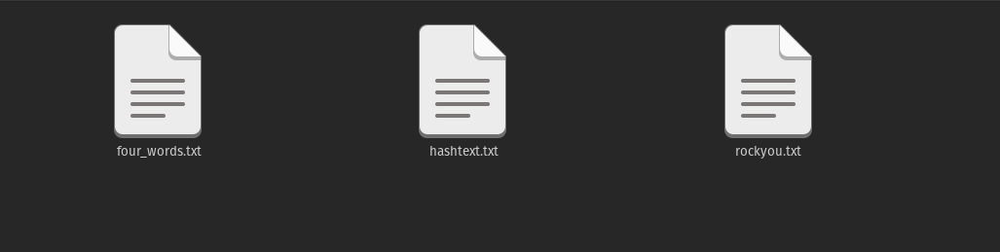
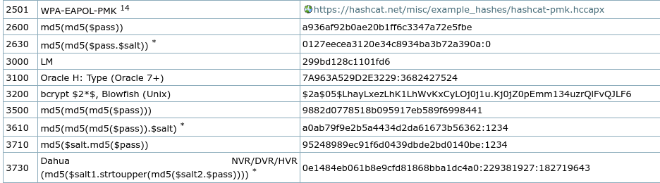
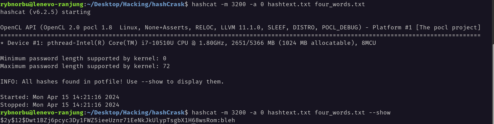
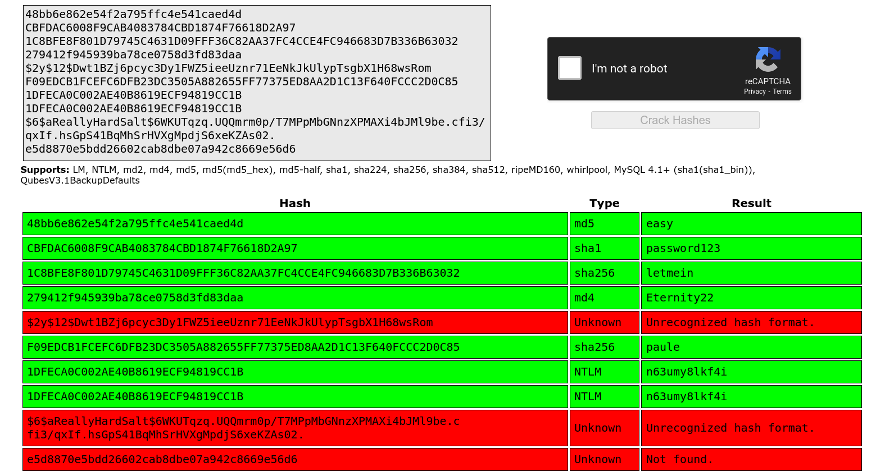
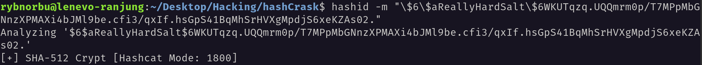

## Topic: Crack The Hash
---

Hello everyone, I hope you all are doing good! In this page we will be learning about the Crack The Hash challenges from Try Hack Me.

In this room we will learn about:

- Hash cracking
- Password cracking
- Brute-force

### Description

Hash are encrypted and we can unencrypt by cracking it to recover plain text passwords from the hashed forms.

I have used the CrackStation website to crack the hash. (https://crackstation.net/)

In this website we can crack the hash by entering the hash value in the input field and click on the crack hash button.

The output displays the type of the hash and the result.

### Demonstration

### Level 1

### Crack Station

    Task 1: 48bb6e862e54f2a795ffc4e541caed4d

    Task 2:CBFDAC6008F9CAB4083784CBD1874F76618D2A97

    Task 3: 1C8BFE8F801D79745C4631D09FFF36C82AA37FC4CCE4FC946683D7B336B63032

    Task 4: $2y$12$Dwt1BZj6pcyc3Dy1FWZ5ieeUznr71EeNkJkUlypTsgbX1H68wsRom
    
    Task 5: 279412f945939ba78ce0758d3fd83daa

I have used Crack station to crack the hash and do the tasks.

To identify the hash, I googled the first 4 character

`$2y$12$Dwt1BZj6pcyc3Dy1FWZ5ieeUznr71EeNkJkUlypTsgbX1H68wsRom` Is a bcrypt hash. This is difficult to crack because it takes a very long time to crack.

* Hint: Filter rockyou for 4 character words.

I have filered the rockyou.txt file for four character and saved in a file called four_words.txt. I have also saved the hash in a file called hashtext.txt. 

This filters the rockyou.txt file for 4 character words.

I have used this code to crack the hash `hashcat -m 3200 -a 0 hashtext.txt four_words.txt`
* -m: The type of hash with a default value. 3200 is the hash type for bcrypt.
* -a: The attack mode with a default value.

See the default value for bcrypt hash type is 3200.

As, I have done this task earlier I used `--show` in the end of the code to display the cracked hash. And the cracked hash is `bleh`.

### Level 2

    Task 1:  F09EDCB1FCEFC6DFB23DC3505A882655FF77375ED8AA2D1C13F640FCCC2D0C85

    Task 2: 1DFECA0C002AE40B8619ECF94819CC1B

    Task 3: $6$aReallyHardSalt$6WKUTqzq.UQQmrm0p/T7MPpMbGNnzXPMAXi4bJMl9be.cfi3/qxIf.hsGpS41BqMhSrHVXgMpdjS6xeKZAs02.

    Task 4: e5d8870e5bdd26602cab8dbe07a942c8669e56d6

I have tried using crack station to hash these cracks but task 3 and task 4 are not able to crack.

Let's see the hash type of the task 3.

I can see the hash type and mode in the terminal using hashid.

    hashid -m "\$6\$aReallyHardSalt\$6WKUTqzq.UQQmrm0p/T7MPpMbGNnzXPMAXi4bJMl9be.cfi3/qxIf.hsGpS41BqMhSrHVXgMpdjS6xeKZAs02."

Before every $ sign we need to use backslash to escape the character.

The hash is a sha512crypt hash and its mode is 1800. This is difficult to crack because it takes a very long time to crack.

I have saved the hash in a file called hashtext2.txt.

I used the hashcat to crack the hash. I have used the code `hashcat -m 1800 -a 0 hashtext2.txt four_words.txt` to crack the hash. The default value for sha512crypt hash type is 1800. 

