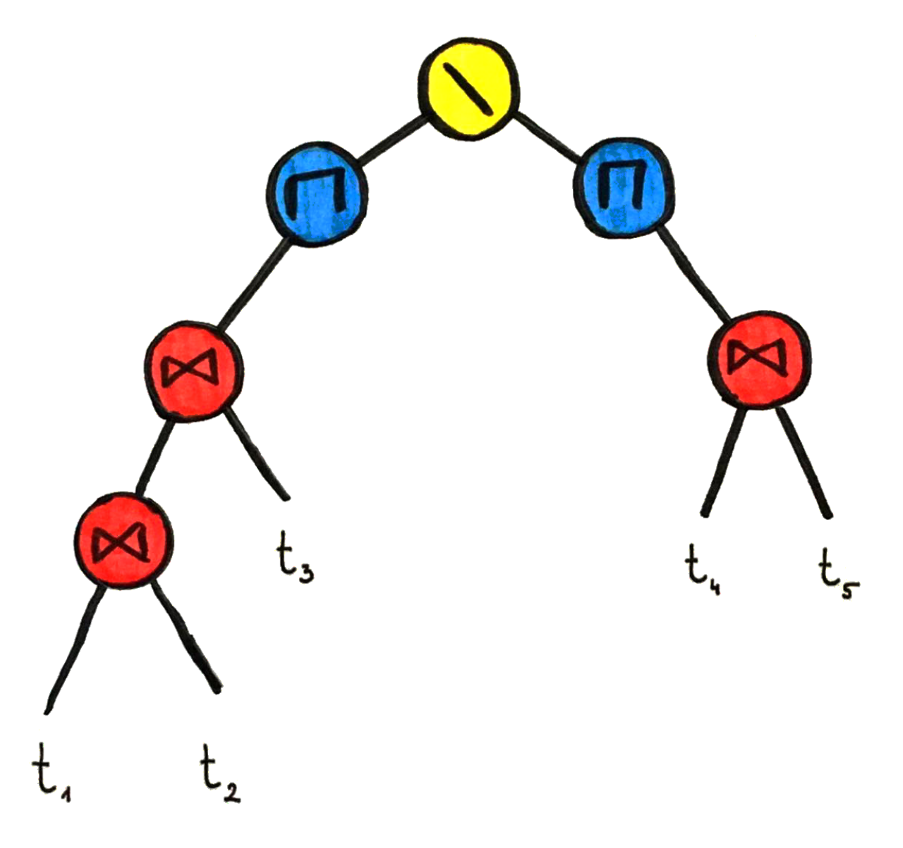
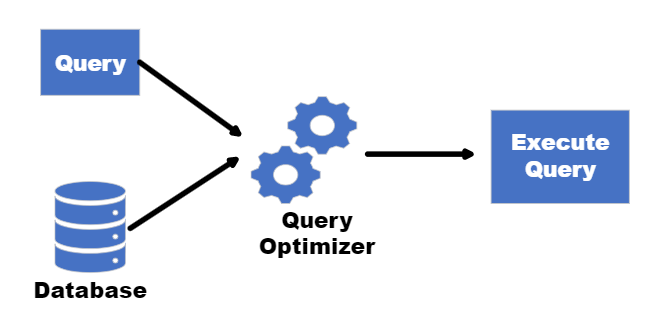
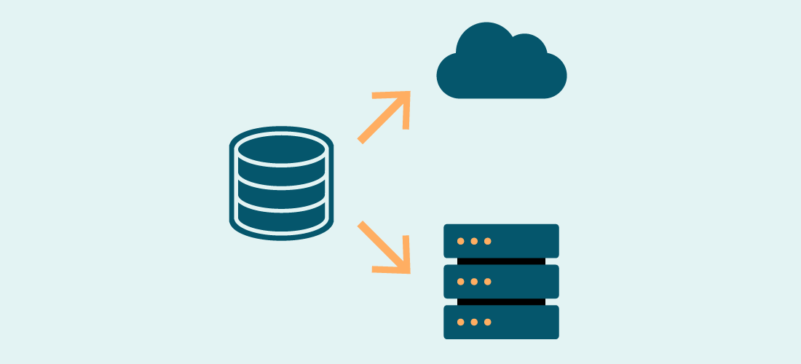

## Topic: Tasks on Storage and buffer management 
---

Today in flipped class I have learned about creating virtual representations of disk storage units, setting up RAID setups for redundancy and performance, and managing temporary data storage in memory buffers efficiently.

A database schema defines how data is organized within a relational database; this is inclusive of logical constraints such as, table names, fields, data types and the relationships between these entities.

A database schema is considered the “blueprint” of a database which describes how the data may relate to other tables or other data models. However, the schema does not actually contain data.

## Exerise tasks
In the exercise task I have learned the important procedures to be followed when building a relational database from scractch and their importance.

Important procedures when building a relational database from scratch:

* Design Phase: Plan out the database structure, including tables, relationships, and constraints.

* Normalization: Organize data into logical tables to minimize redundancy and dependency.

* Schema Creation: Define the database schema using SQL statements to create tables, indexes, and constraints.

* Data Population: Insert initial data into the database tables.

* Query Optimization: Tune queries for optimal performance by creating indexes and optimizing SQL queries.

* Backup and Recovery: Establish procedures for regular backups to prevent data loss and ensure quick recovery in case of failure.

* Security Implementation: Set up access controls and permissions to protect sensitive data and ensure data privacy.

### Data Structures commonly used

| Data structure | Key characteristics | 
| ----------- | ----------- | 
| Tables | Store data in rows and columns. Rows represent individual records, and columns represent attributes of those records. | 
| Indexes | Indexes are data structures that improve the speed of data retrieval operations on a database table. |
| Keys | Keys are used to uniquely identify rows within a table and to establish relationships between tables. Two main types of keys: primary keys and foreign keys. |
| Primary Key | Uniquely identify each record in a table. |
| Foreign key | Link records in two tables |  
| Views | A view is a virtual table based on a query’s result. Views provide a way to present a subset of data from a database in a specific format. |

### RAID Configuration
RAID (Redundant Array of Independent Disks) is all about balancing speed, safety, and cost when storing data. It combines methods like striping (dividing data across multiple disks), mirroring (creating duplicates of data), and parity (extra data for error correction) to boost availability, protect against failures, and improve performance.

### Buffer Pool Management
A memory buffer pool stores frequently accessed data to reduce disk reads for better performance. Choosing the right size and using replacement policies efficiently are crucial for good performance and data integrity, especially in multi-user environments.

### Transaction Management:
Transactions must adhere to ACID properties to prevent data inconsistencies. A transaction log is vital for recovery and rollback, maintaining integrity

### Query Processing
To make things run smoothly, we need a tool that can understand and make the best use of all the SQL queries. It figures out the best way to find and change data, like scanning tables and indexes. This tool connects different parts of our system, like storage and memory, to handle data consistently and efficiently.

### Recovery and Backup
Recovery and backup systems, such as checkpointing and write-ahead logging, makes sure data stays safe and can be recovered if something goes wrong. Doing regular backups is really important to keep your data protected and to bounce back from any disasters.

