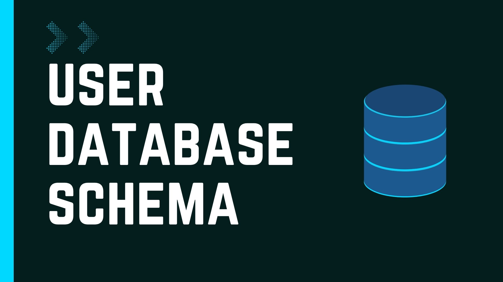
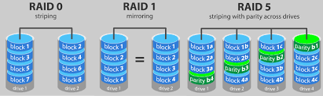

## Topic: 
---

Today in flipped class I have learned about creating virtual representations of disk storage units, setting up RAID setups for redundancy and performance, and managing temporary data storage in memory buffers efficiently.

A database schema defines how data is organized within a relational database; this is inclusive of logical constraints such as, table names, fields, data types and the relationships between these entities.

A database schema is considered the “blueprint” of a database which describes how the data may relate to other tables or other data models. However, the schema does not actually contain data.

### Data Structures

| Data structure | Key characteristics | 
| ----------- | ----------- | 
| Tables | These are the primary containers for data in a relational database. Each table represents a specific entity and contains rows and columns. Rows represent individual records, and columns represent attributes of those records. | 
| Indexes | Indexes are data structures that improve the speed of data retrieval operations on a database table. |
| Keys | DKeys are used to uniquely identify rows within a table and to establish relationships between tables. There are two main types of keys: primary keys and foreign keys. |
| Primary Key | Uniquely identify each record in a table. |
| Foreign key | Link records in two tables |  
| Views | A view is a virtual table based on a query’s result. Views provide a way to present a subset of data from a database in a specific format. |

### RAID Configuration
RAID (Redundant Array of Independent Disks) is all about balancing speed, safety, and cost when storing data. It combines methods like striping (dividing data across multiple disks), mirroring (creating duplicates of data), and parity (extra data for error correction) to boost availability, protect against failures, and improve performance.

### Transaction Management:
Transactions must adhere to ACID properties to prevent data inconsistencies. A transaction log is vital for recovery and rollback, maintaining integrity

### Recovery and Backup
Recovery and backup systems, such as checkpointing and write-ahead logging, makes sure data stays safe and can be recovered if something goes wrong. Doing regular backups is really important to keep your data protected and to bounce back from any disasters.

### Query Processing
To make things run smoothly, we need a tool that can understand and make the best use of all the SQL queries. It figures out the best way to find and change data, like scanning tables and indexes. This tool connects different parts of our system, like storage and memory, to handle data consistently and efficiently.