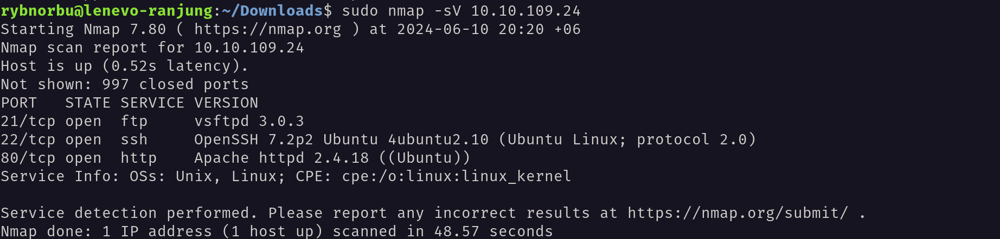
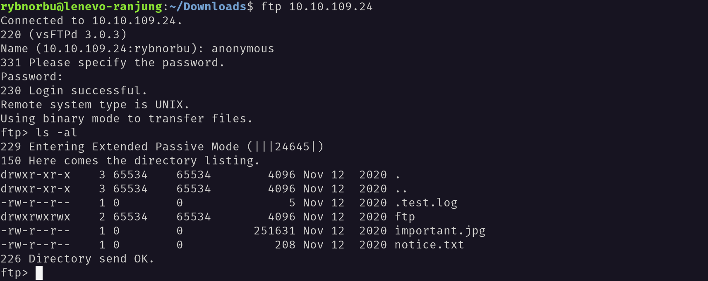
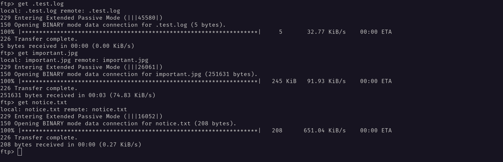
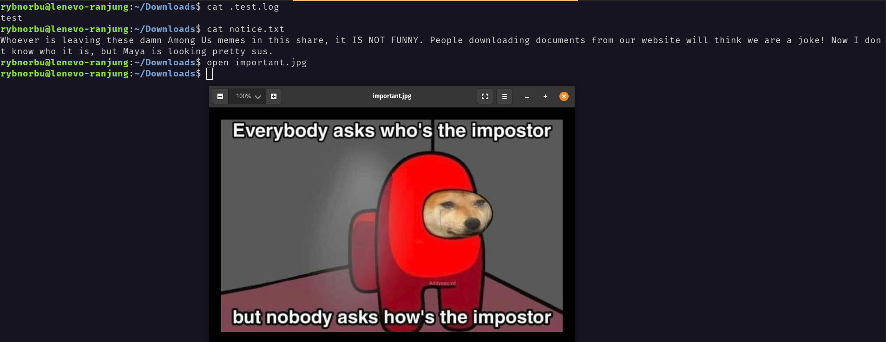
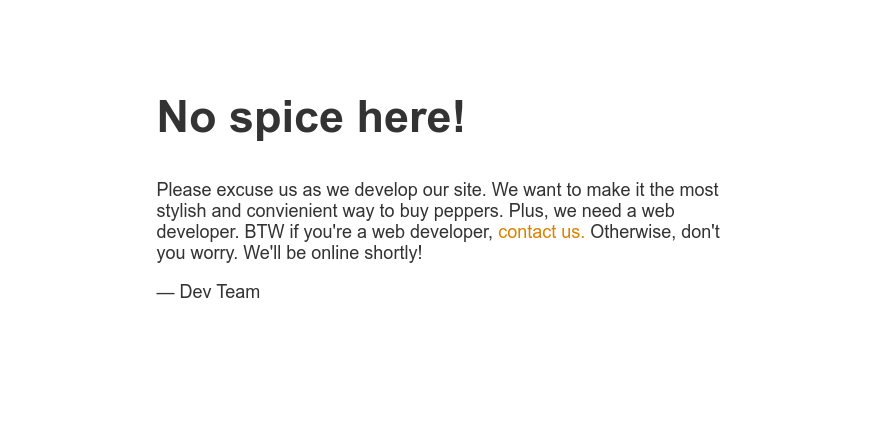
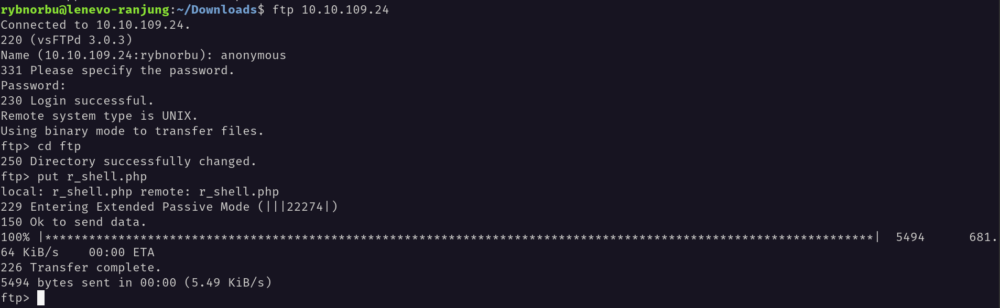
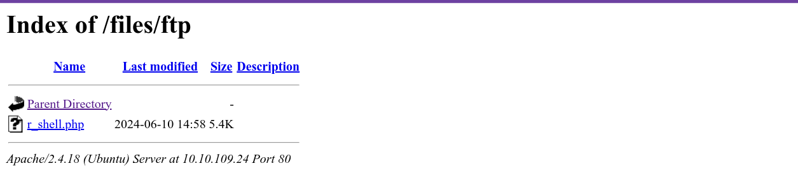
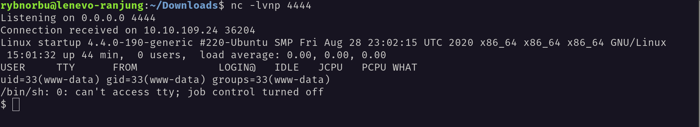
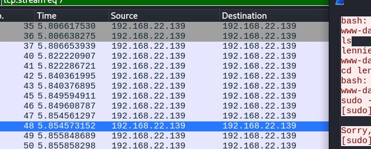
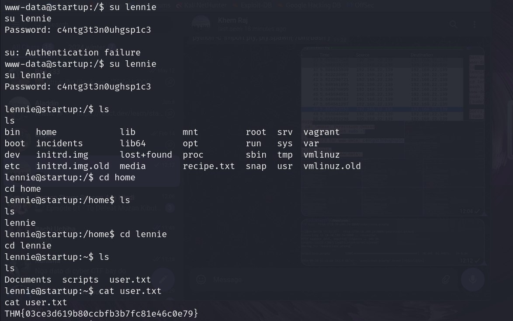

## Topic: Startup
---

Hello everyone, I hope you all are doing good! In this page we will be learning about the Startup challenges from Try Hack Me.  

## Target IP Address

    10.10.109.24

## Enumeration

First, I pinged the target machine to check whether I can communicate with the target machine or not using the ping command and the target IP address. The machine is up and running.

### Nmap

I have used nmap to scan the target IP address to see the open ports.

### Result

There are three ports open and they are;

* 21/tcp open  ftp     vsftpd 3.0.3
* 22/tcp open  ssh     OpenSSH 7.2p2 Ubuntu 4ubuntu2.10 (Ubuntu Linux; protocol 2.0)
* 80/tcp open  http    Apache httpd 2.4.18 ((Ubuntu))

## FTP

From the nmap scan I knew that Anonymous login is allowed in this ftp server.

I have logged in successfully, and found a couple of files there and download them to our machine with the get command.

I have read the content inside the cat.txt file and found this.

From this I have fouund that the user is `Maya`.
## Webpage

After that I have navigated to the web browser and visited the target IP address to see what is there. I found the following webpage.

## Brute force

I have used ffuf to brute force the directories and found the following directories.

    rybnorbu@lenevo-ranjung:~/Downloads$ ffuf -w /home/rybnorbu/SecLists-master/Discovery/Web-Content/common.txt -u http://10.10.109.24//FUZZ

            /'___\  /'___\           /'___\       
        /\ \__/ /\ \__/  __  __  /\ \__/       
        \ \ ,__\\ \ ,__\/\ \/\ \ \ \ ,__\      
            \ \ \_/ \ \ \_/\ \ \_\ \ \ \ \_/      
            \ \_\   \ \_\  \ \____/  \ \_\       
            \/_/    \/_/   \/___/    \/_/       

        v1.1.0
    ________________________________________________

    :: Method           : GET
    :: URL              : http://10.10.109.24//FUZZ
    :: Wordlist         : FUZZ: /home/rybnorbu/SecLists-master/Discovery/Web-Content/common.txt
    :: Follow redirects : false
    :: Calibration      : false
    :: Timeout          : 10
    :: Threads          : 40
    :: Matcher          : Response status: 200,204,301,302,307,401,403
    ________________________________________________

    .htpasswd               [Status: 403, Size: 277, Words: 20, Lines: 10]
    .hta                    [Status: 403, Size: 277, Words: 20, Lines: 10]
    .htaccess               [Status: 403, Size: 277, Words: 20, Lines: 10]
    files                   [Status: 301, Size: 312, Words: 20, Lines: 10]
    index.html              [Status: 200, Size: 808, Words: 136, Lines: 21]
    server-status           [Status: 403, Size: 277, Words: 20, Lines: 10]
    :: Progress: [4727/4727] :: Job [1/1] :: 62 req/sec :: Duration: [0:01:16] :: Errors: 0 ::

So, I have navigated to the `files` directory and uploaded a reverse shell to the target machine.   

Then I have started a listener on my machine and executed the reverse shell to get the shell access to the target machine.

Then I have executed this code to stablize the shell.

    python3 -c 'import pty; pty.spawn("/bin/bash")'

After that I have found the user called lennie but we don’t have permission to get in.

So I have downloaded incident that was in one of the directory, there was a file called suspicious.pcapng.

I have downloaded the file and opened it in wireshark.

Now I have found the password for lennie and I have logged in as lennie.

I have found the flag.

