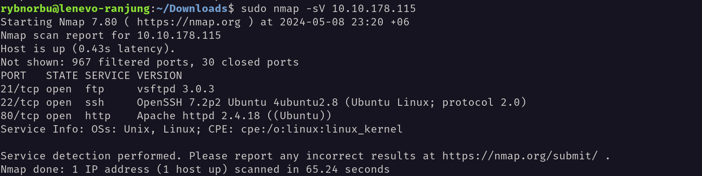
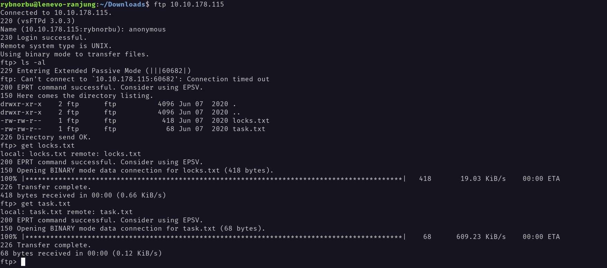
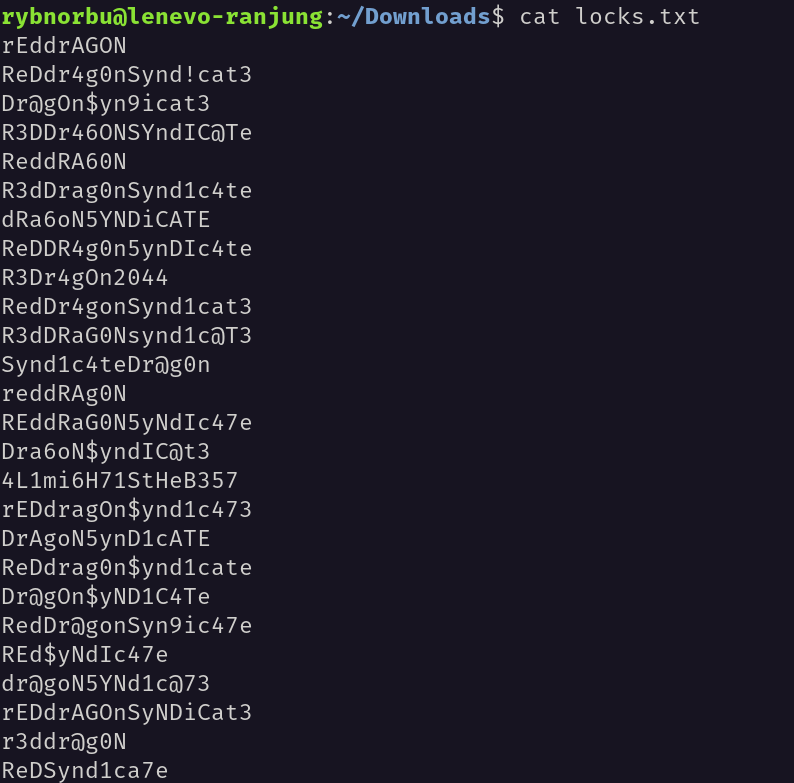
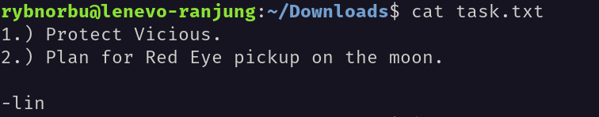
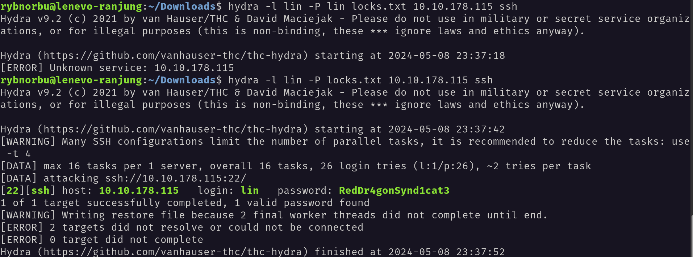
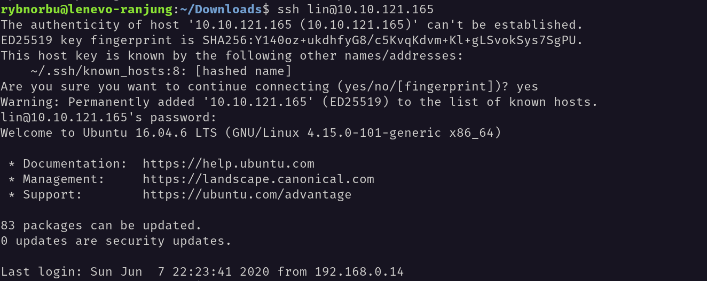
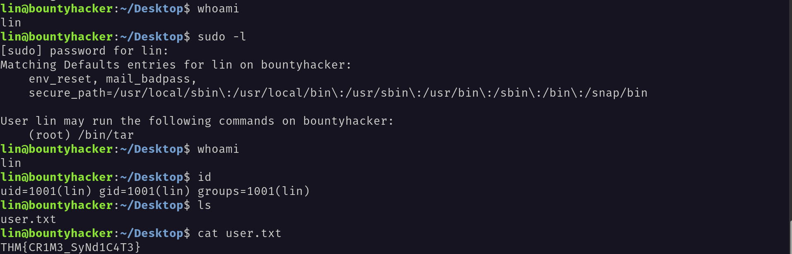
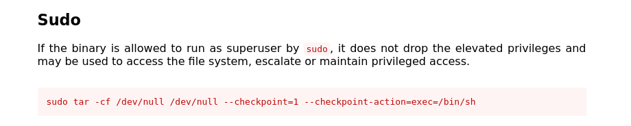
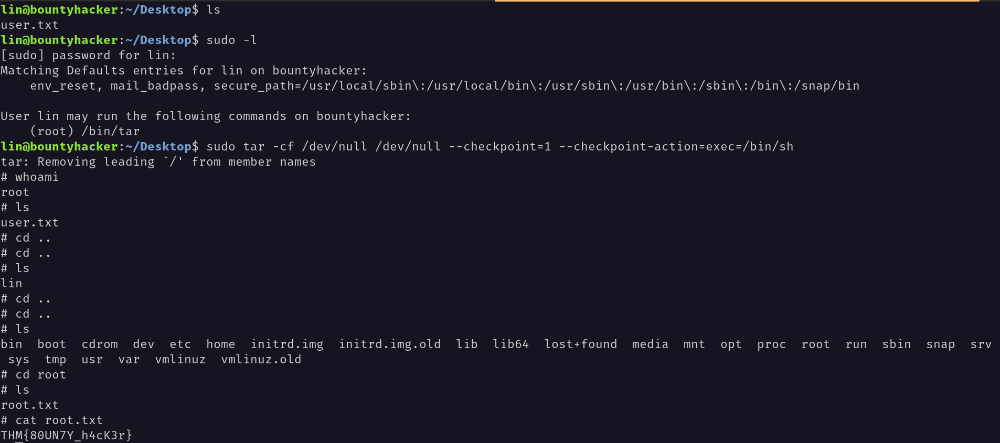

## Topic: Bounty hacker
---

## Description

Hello everyone, I hope you all are doing good! In this page we will be learning about the Bounty hacker challenges from Try Hack Me.

## Target IP Address

    10.10.178.115

## Enumeration

### nmap

First, I have pingged the target IP address and it is up. Then I have used nmap to scan the target IP address.

There are 3 open ports and they are;

* 21 ftp vsftpd 3.0.3
* 22 ssh OpenSSH 7.2p2
* 80 http Apache httpd 2.4.18

### FTP

From the nmap scan I knew that Anonymous login is allowed in this ftp server.

I have successfully logged into the ftp server using the anonymous login.

Inside the port 21, I have found a file called `locks.txt and task.txt.` I have downloaded these file using the `get` command.

I have read the content inside the lock.txt file and found this.

I have read the content inside the task.txt file and found this.

In this task.txt file, I have found a hint to find the hidden directory. The file contains a note from someone named `Lin`.

Then after getting the information I used Lin as a username and tried to brute force the password using hydra. I have used the rockyou.txt file to brute force the password.

I have successfully found the password `RedDr4gonSynd1cat3`and able to log into the ssh server.

## Privilege Escalation

Inside the ssh server I have found a file called `user.txt` and Inside this file I have found the user flag.

Inorder to find the root flag I used the command `sudo -l` to find the sudo permissions. I have found that we can run `/usr/tar` as root.

I have used this command  `sudo tar -cf /dev/null /dev/null --checkpoint=1 --checkpoint-action=exec=/bin/sh` to get the root shell.

And finally I was able to find the root flag.

