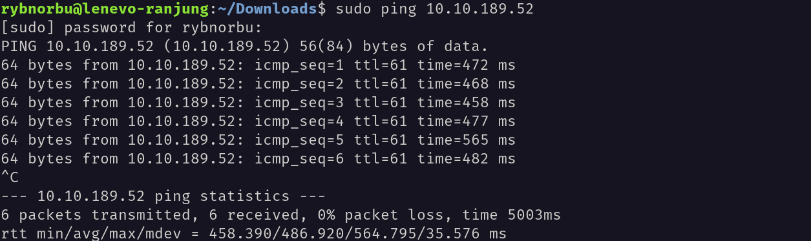
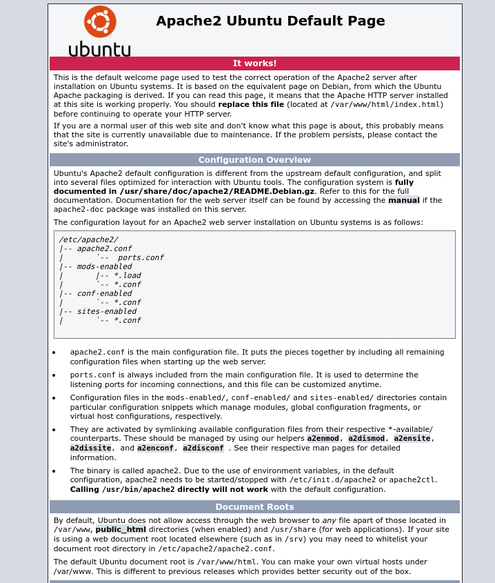
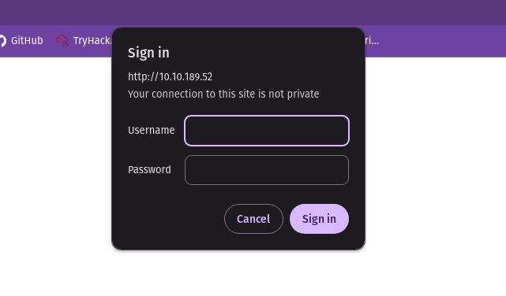

## Topic: Dav
---

Hello everyone, I hope you all are doing good! In this page we will be learning about the Dav challenges from Try Hack Me.

## Target IP Address

## Enumeration

### Ping

I pinged the target machine to check whether I can communicate with the target machine or not using the ping command and the target IP address.

    rybnorbu@lenevo-ranjung:~/Downloads$ sudo ping 10.10.189.52

Yes, the machine is online and I can communicate with it.

Then, I scaned the target machine using Nmap to identify open ports and services.

### Nmap

I scanned the machine to see the open ports;

### result

* 80/tcp open  http    Apache httpd 2.4.18 ((Ubuntu))

### Web 

This is what I got when I visited the target IP address in the browser.

It is about default Apache website. 

Then I brute forced the directories using ffuf and found the following directories.

    rybnorbu@lenevo-ranjung:~/Downloads$ ffuf -w /home/rybnorbu/SecLists-master/Discovery/Web-Content/common.txt -u http://10.10.189.52//FUZZ

            /'___\  /'___\           /'___\       
        /\ \__/ /\ \__/  __  __  /\ \__/       
        \ \ ,__\\ \ ,__\/\ \/\ \ \ \ ,__\      
            \ \ \_/ \ \ \_/\ \ \_\ \ \ \ \_/      
            \ \_\   \ \_\  \ \____/  \ \_\       
            \/_/    \/_/   \/___/    \/_/       

        v1.1.0
    ________________________________________________

    :: Method           : GET
    :: URL              : http://10.10.189.52//FUZZ
    :: Wordlist         : FUZZ: /home/rybnorbu/SecLists-master/Discovery/Web-Content/common.txt
    :: Follow redirects : false
    :: Calibration      : false
    :: Timeout          : 10
    :: Threads          : 40
    :: Matcher          : Response status: 200,204,301,302,307,401,403
    ________________________________________________

    .htpasswd               [Status: 403, Size: 296, Words: 22, Lines: 12]
    .htaccess               [Status: 403, Size: 296, Words: 22, Lines: 12]
    .hta                    [Status: 403, Size: 291, Words: 22, Lines: 12]
    index.html              [Status: 200, Size: 11321, Words: 3503, Lines: 376]
    server-status           [Status: 403, Size: 300, Words: 22, Lines: 12]
    webdav                  [Status: 401, Size: 459, Words: 42, Lines: 15]
    :: Progress: [4727/4727] :: Job [1/1] :: 73 req/sec :: Duration: [0:01:04] :: Errors: 0 ::

I found the webdav directory. When I visited the webdav directory I found the login page.

