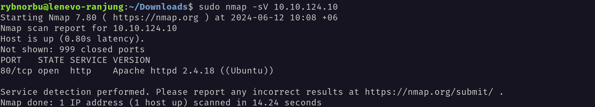
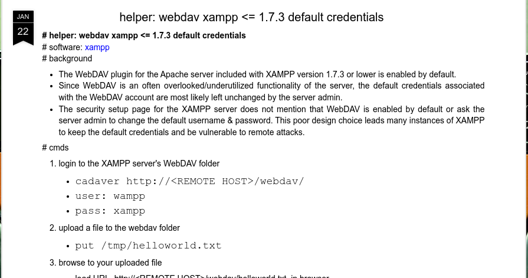
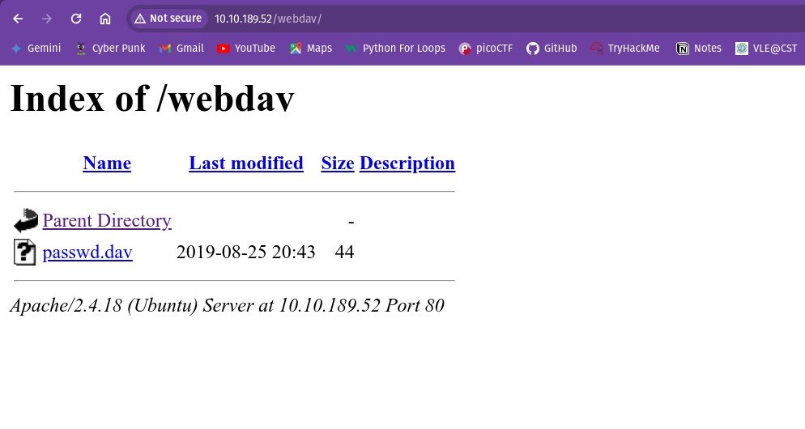
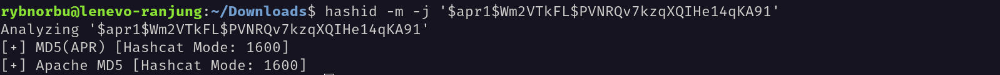
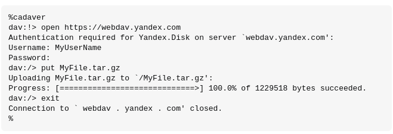
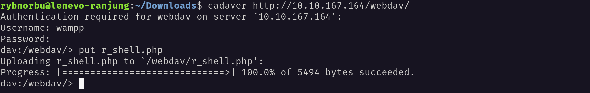
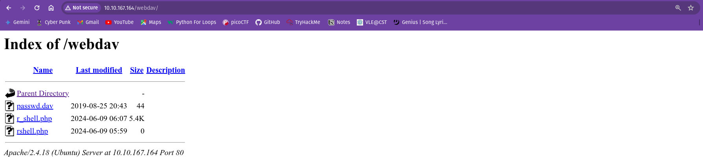
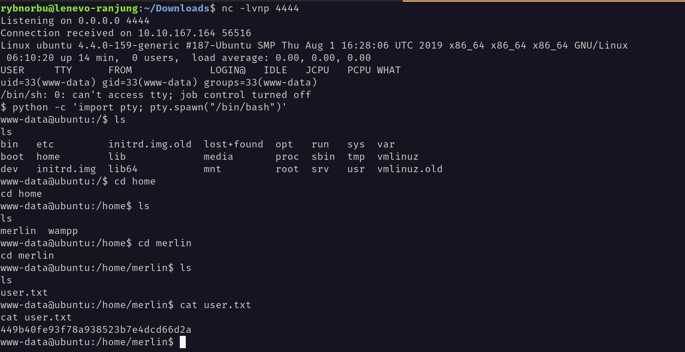
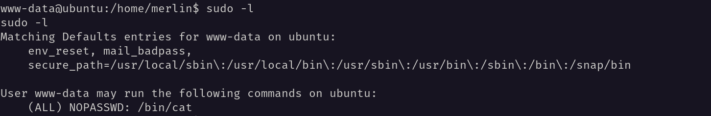
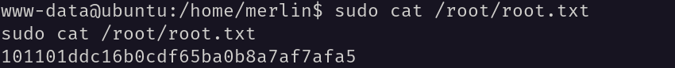

## Topic: Dav
---

Hello everyone, I hope you all are doing good! In this page we will be learning about the Dav challenges from Try Hack Me.

## Target IP Address

    10,.10..189.52

## Enumeration

### Ping

I pinged the target machine to check whether I can communicate with the target machine or not using the ping command and the target IP address.

Yes, the machine is online and I can communicate with it.

Then, I scaned the target machine using Nmap to identify open ports and services.

### Nmap

I scanned the machine to see the open ports;

### result

* 80/tcp open  http    Apache httpd 2.4.18 ((Ubuntu))

### Web 

This is what I got when I visited the target IP address in the browser.

It is about default Apache website. 

Then I brute forced the directories using ffuf and found the following directories.

    rybnorbu@lenevo-ranjung:~/Downloads$ ffuf -w /home/rybnorbu/SecLists-master/Discovery/Web-Content/common.txt -u http://10.10.189.52//FUZZ

            /'___\  /'___\           /'___\       
        /\ \__/ /\ \__/  __  __  /\ \__/       
        \ \ ,__\\ \ ,__\/\ \/\ \ \ \ ,__\      
            \ \ \_/ \ \ \_/\ \ \_\ \ \ \ \_/      
            \ \_\   \ \_\  \ \____/  \ \_\       
            \/_/    \/_/   \/___/    \/_/       

        v1.1.0
    ________________________________________________

    :: Method           : GET
    :: URL              : http://10.10.189.52//FUZZ
    :: Wordlist         : FUZZ: /home/rybnorbu/SecLists-master/Discovery/Web-Content/common.txt
    :: Follow redirects : false
    :: Calibration      : false
    :: Timeout          : 10
    :: Threads          : 40
    :: Matcher          : Response status: 200,204,301,302,307,401,403
    ________________________________________________

    .htpasswd               [Status: 403, Size: 296, Words: 22, Lines: 12]
    .htaccess               [Status: 403, Size: 296, Words: 22, Lines: 12]
    .hta                    [Status: 403, Size: 291, Words: 22, Lines: 12]
    index.html              [Status: 200, Size: 11321, Words: 3503, Lines: 376]
    server-status           [Status: 403, Size: 300, Words: 22, Lines: 12]
    webdav                  [Status: 401, Size: 459, Words: 42, Lines: 15]
    :: Progress: [4727/4727] :: Job [1/1] :: 73 req/sec :: Duration: [0:01:04] :: Errors: 0 ::

I found the webdav directory. When I visited the webdav directory I found the login page.

So, after some research I found that the default credentials for webdav is `wampp:xampp`. I referenced this from [here](https://xforeveryman.blogspot.com/2012/01/helper-webdav-xampp-173-default.html).

I logged in with this credentials and found the site.

Inside the passwd.dav. I found this:

    wampp:$apr1$Wm2VTkFL$PVNRQv7kzqXQIHe14qKA91

I used hash-identifier to identify the hash type.

I tried to crack the hash but failed. I used hashcat to crack the hash.

    rybnorbu@lenevo-ranjung:~/Desktop/Hacking/hashCrask$ hashcat -m 1600 -a 0 hash_dav.txt rockyou.txt

This is the output of the hashcat.

    Session..........: hashcat                                
    Status...........: Quit
    Hash.Mode........: 1600 (Apache $apr1$ MD5, md5apr1, MD5 (APR))
    Hash.Target......: $apr1$Wm2VTkFL$PVNRQv7kzqXQIHe14qKA91
    Time.Started.....: Sat Jun  1 17:59:50 2024 (41 secs)
    Time.Estimated...: Sat Jun  1 18:11:27 2024 (10 mins, 56 secs)
    Kernel.Feature...: Pure Kernel
    Guess.Base.......: File (rockyou.txt)
    Guess.Queue......: 1/1 (100.00%)
    Speed.#1.........:    20559 H/s (12.19ms) @ Accel:128 Loops:250 Thr:1 Vec:8
    Recovered........: 0/1 (0.00%) Digests
    Progress.........: 850944/14344384 (5.93%)
    Rejected.........: 0/850944 (0.00%)
    Restore.Point....: 850944/14344384 (5.93%)
    Restore.Sub.#1...: Salt:0 Amplifier:0-1 Iteration:750-1000
    Candidate.Engine.: Device Generator
    Candidates.#1....: montero02 -> momo5390
    Hardware.Mon.#1..: Temp: 87c Util: 91%

    Started: Sat Jun  1 17:59:30 2024
    Stopped: Sat Jun  1 18:00:33 2024

I found a resource that teach to upload a shell using `cadaver`. I used this tool cadaver to upload a reverse shell.

This is how to use cadaver to upload a shell.

Same like this first I logged into the site inside the terminal and then uploaded the shell. The shell I used is `r_shell.php`. I uploaded the shell in the webdav directory.

I have successfully uploaded the shell.

Now, I started the listener in my machine and visited the shell in the browser.

I have used a snippet of code to stabilize the shell. 

    python -c 'import pty; pty.spawn("/bin/bash")'

This is the code I used to stabilize the shell. And I got the user flag.

### Privilege Escalation Phase

I checked the privileges of the user using the command `sudo -l`.

From this I got a hint that I can get the root access by running the command `sudo /bin/bash` without password. So, I ran the command `sudo /bin/bash` and got the root access. I used cat as root without password.

Finally, I got the root flag.

    Thank You!!

