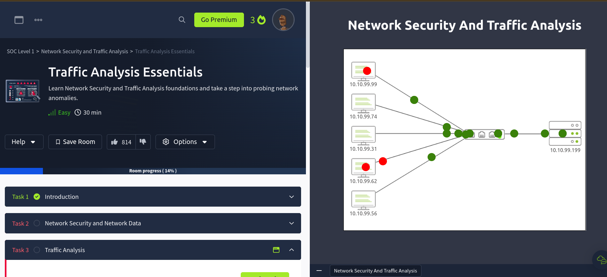
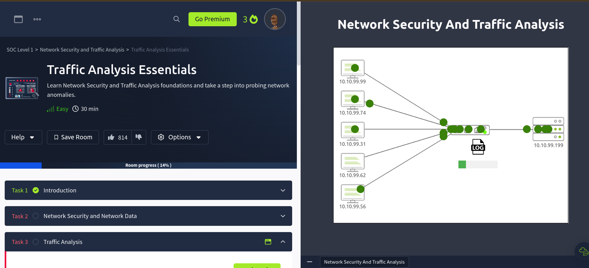
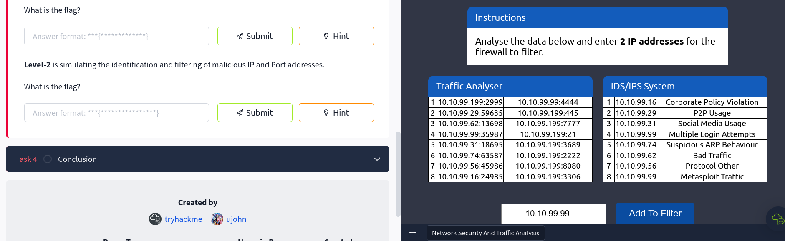
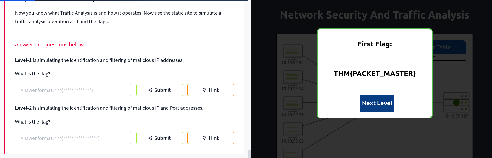
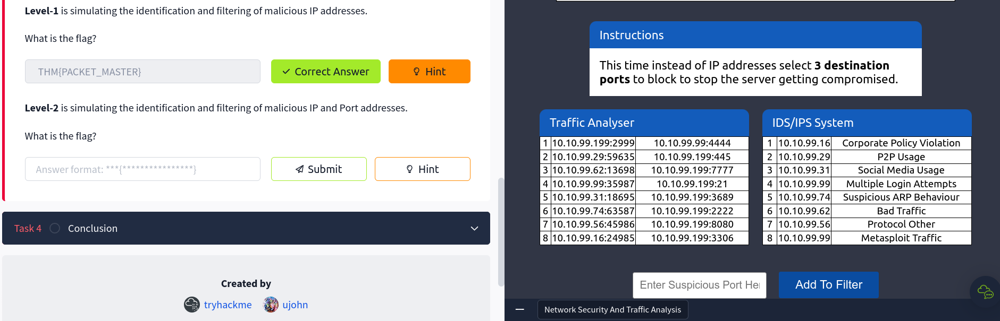
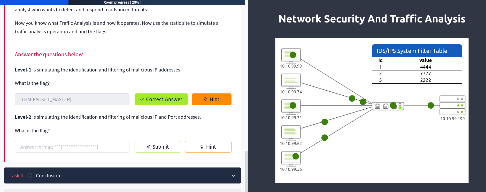
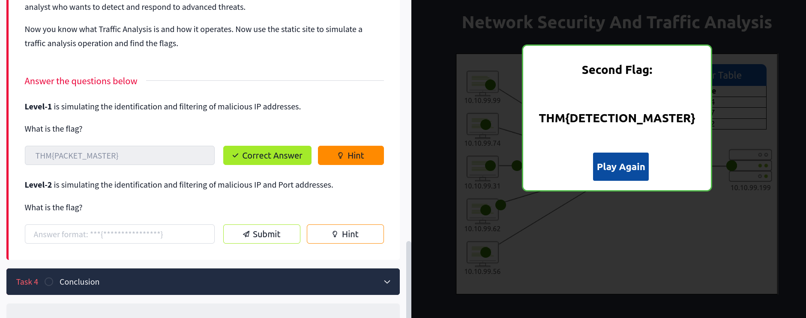

## Topic: Traffic Analysis Essentials Room
---

## Introduction

Network security is about protecting the data, and applications that are connected to a network. Network security is used to design, and manage the network infrastructure to ensures the network is secure, reliable, and can continue to function even when problems occur.

One specific area of network security is traffic analysis, also called network traffic analysis. This focuses on closely examining the network data to identify any problems or unusual activity that could indicate a security issue.

## Network Security and Network Data.

The Network Security focuses on two core concepts: 

1. Authentication: The process of verifying the identity of a user or process.

2. Authorisation: The process of verifying that a user has the necessary permissions to access a resource.

It contain three base control levels to ensure the maximum available security management.

| Control level | Key characteristics | 
| ----------- | ----------- | 
| Physical | This involves preventing physical access to network devices like servers, routers, and cables.  |
|  Technical | This prevents unauthorised access to network data. |
| Administrative | This focuses on policies and procedures to maintain network security. It includes creating strong password policies, and security awareness training for users. | 

The main approaches to network security are:

1. Access control - This is about controlling who can access the network, using firewalls, and virtual private networks (VPNs).

2. Threat control - Is about detecting and preventing malicious activities on the network, using tools like intrusion detection/prevention systems, data loss prevention, and security monitoring.

Common elements that are used to secure a network include:

* Firewalls to control traffic
* Network access control to verify devices
* Identity management to control user access
* Encryption to protect data
* Security monitoring to watch for anomalies

Since, most of the organizations doesnot have the resources to handle network security fully. That's where Managed Security Services (MSS) come in. MSS are services provided by specialist security service providers (MSSPs) to help with tasks like:

* Penetration testing to assess security
* Vulnerability assessments to find weaknesses
* Incident response to deal with security breaches
* Behavior analysis to detect unusual activity

Using the combination of physical, technical, and administrative controls to protect the network can help to ensure that the network is secure, reliable, and can continue to function even when problems occur.

## Traffic Analysis

Network traffic analysis is a method of monitoring, recording, and analyzing the data and communication patterns in a network.It is used to detect and respond to system issues, network anomalies, and potential security threats.

The network is a rich source of data, so traffic analysis can be useful for both operational and security purposes:

* Operational issues: Checking system availability and measuring performance
* Security issues: Detecting anomalies and suspicious activities on the network

Traffic analysis is an essential part of various network security disciplines, including:

* Network sniffing and packet analysis
* Network monitoring
* Intrusion detection and prevention
* Network forensics
* Threat hunting

There are two main techniques used in traffic analysis:

1. Flow analysis:

* Collects data and evidence from network devices
* Provides statistical summary without deep packet inspection
* Easier to collect and analyze, but lacks full packet details

2. Packet analysis:

* Collects all available network data
Performs in-depth packet-level inspection (Deep Packet Inspection)
* Provides more detailed information to identify root causes
* More time-consuming and requires more expertise

The benefits of traffic analysis include:

* Providing full network visibility
* Helping to establish a comprehensive baseline for asset tracking
* Detecting and responding to anomalies and threats

### Level-1 is simulating the identification and filtering of malicious IP addresses.

To Identify the malicious IP addresses, I have clicked the view button to see the IP addresses and then filtered the malicious IP addresses. 

Inside this I have found an topology of network and a couple of PCS. These PCS exchange traffic with the switch and thus the switch is connected to a router. 

In the picture above the packages are comming from the PCS and the red dots represents the malicious traffic.

Then when I investigate the traffics, It generates a log file that contains the IP addresses of the malicious traffic.

After filtering all the malicious traffic I got the list of IP addresses that are malicious. Identifying the malicious IP address I entered the Suspicious IP addresses in the text box. 

I found out that the Suspicious IP addresses are:
1. 10.10.99.62 - Bad Traffic
2. 10.10.99.99 - Metasploit Traffic

After Identifying these IP addreeses and restarting the room, these IP addresses are blocked and the traffic is not allowed to pass through the network. Then I found the root flag.

### Level-2 is simulating the identification and filtering of malicious domains.

This time we have to select 3 destination ports to block to stop the server getting compromised.

Now to complete this task I have to find the destination ports from the traffic analyzer and then block them. 

I have identified the destination ports and they are 4444, 7777, and 2222.

Then after ruuning the room, I found the root flag.

