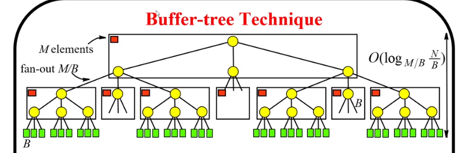
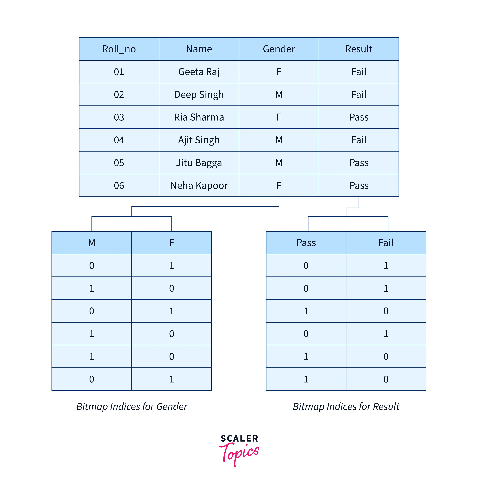

## Topic: Indexing
---

## What we did in the flipped class.

Then flipped class was really enjoyable entertaining experience and a memoriable one. First, our tutor began to divide us into six group based on song lyrics, then assigned topic to each group. The topics is on Indexing. After that, we began to conduct a quiz and we are split into two teams for a quiz session covering buffer trees, bitmap indexing, and the indexing of spatial and temporal data. The quiz went well and we all had fun. It was very challenging for both the teams but we all learned a lot from it. Lastly, both the team has equal points and we decided the winner by playing rock paper scissors. My team, team A won and we got chocolate as our reward and other team got chewing gum. This flipped class was a great experience and I learned a lot from it.

# Indexing

Hello everyone, Hope you are doing well. Today we will discuss the topic of Indexing and Its types.

Before explaining the types of Indexing, let's first understand what Indexing is.

Indexing is a data structure that improves the speed of data retrieval operations on a database table at the cost of additional writes and storage space to maintain the index data structure.

## Types of Indexing:

### Buffer Tree

A Buffer Tree, also called a B-Tree, is a data structure used to efficiently store and manage large amounts of data, such as audio or video files.
* It keeps everything neat and sorted so that finding, adding, or removing stuff is  quick and easy. 
* It is like a super organized system that makes searching, adding, and deleting data super fast, whether it's in a computer database or managing files on a computer's storage.
* It's called a tree because it's made up of nodes that are connected like branches on a tree.

#### How does a buffer tree work?

Firstly, the buffer tree divides the data into smaller, more manageable chunks called "buffers."

Then these buffers are then organized into a tree-like structure, with each buffer stored in a node of the tree.

The tree is designed to be balanced, meaning that the height of the tree is kept as low as possible, which makes it faster to access the data.

#### How the buffer tree is used

* They are used in multimedia applications, such as video and audio players, to manage the storage and playback of large media files.

* They are also used in file systems and database management systems to efficiently store and retrieve large amounts of data.

#### Advantages of a buffer tree

1. By breaking the data into smaller chunks and storing them in a balanced tree, the buffer tree can store large amounts of data more efficiently.

2. The tree-like structure of the buffer tree allows for quick and easy access to specific parts of the data, without having to read through the entire file.

3. It is eay to accommodate the new data, without impacting the performance as the amount grows.

### Bitmap Indexing

Bitmap indexing is a technique used to manage and improve the performance of read-only queries involving large datasets. It is used to reduce the response time for large classes and queries. Some examples of Bitmap are 
* GIF, 
* JPEG, 
* PNG.

#### Example 

Bitmap indexing uses 0s and 1s to represent the presence or absence of data values.

In the above example It uses 0s and 1s to reprwsents yes and no.

* 1 means yes
* 0 means no

#### Applications of Bitmap Indexing are:

* We use bitmap indexing when we need to find something in a big dataset quickly

* If you're Looking for data within a specific range, bitmap indexing can find it in a snap.

* When dealing with large amounts of data it is great for saving space.

### Indexing of Spatial and Temporal Data

Indexing spatial and temporal data includes creating structures that organize and retrieve information based on location and time dimensions.

#### Indexing of Spatial Data:

* Is about organizing and finding things based on where they are in space.
* Includes things like points, lines, and shapes, all described by their geographic or geometric coordinates.
* Spatial indexing helps quickly find things based on their location or how they relate to each other spatially.
* For example, helps to find all the restaurants within a certain distance from your current location.

### Indexing of Temporal Data:

* Is about tracking things that change over time, like the temperature each day or sales numbers over months.
* It involves managing data with timestamps or time intervals, so you can see how things evolve over different time periods.
* Temporal indexing helps retrieve data based on when it happened, like finding all the sales made in the last week.
* For example, it helps analyze trends over time, like whether sales go up or down during certain seasons.
    
#### Applications

| Application | Characteristics | 
| ----------- | ----------- | 
| Navigation Apps | Used in navigation apps to find the best route to a destination.  |
| Social Media  | Used in social media apps to show posts from friends based on their location and time of posting. |
| Real Estate Websites | Used in e-commerce apps to recommend products based on the user's location and time of day | 

