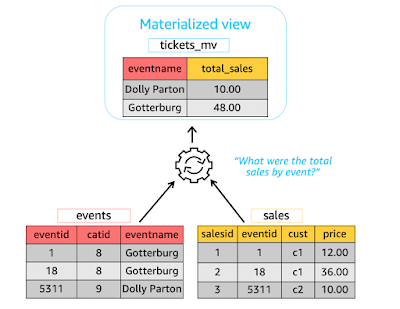
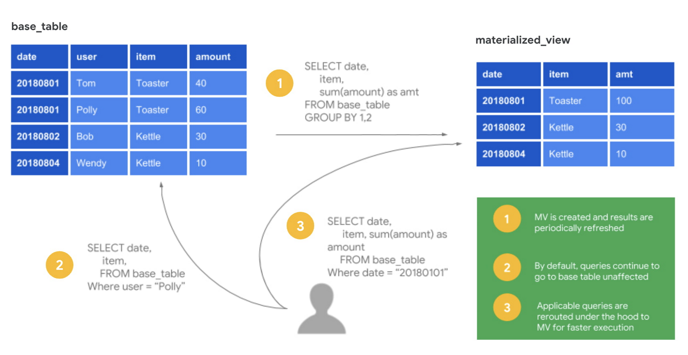
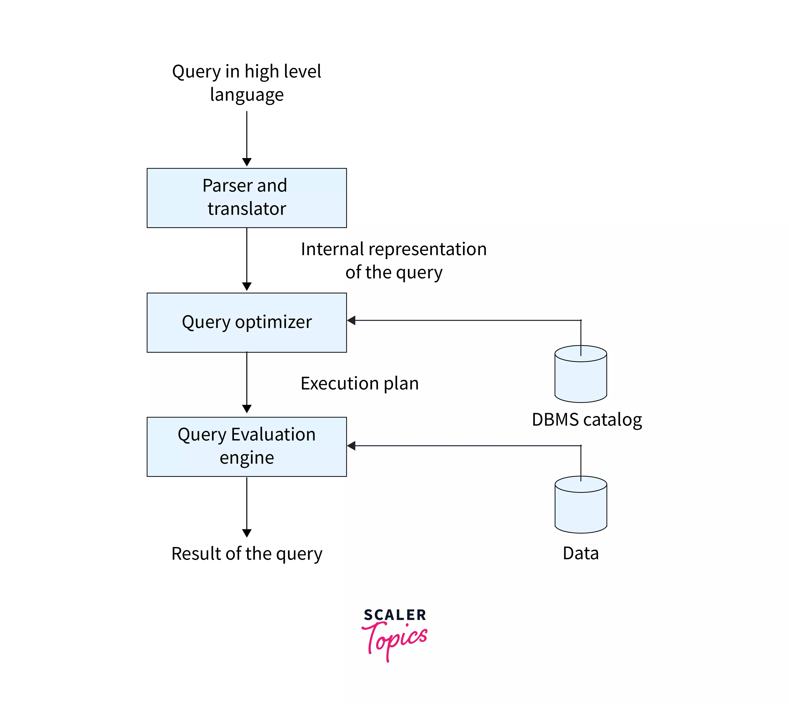
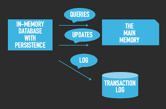

## Topic: Query Optimization
---

Hello! everyone hope you all are doing great. In our flipped class today, we learned about the topic of Query Optimization. It includes materalized view and advanced topics in query optimization.

FIrst of all, today's flipped class was very intresting and indeed i learned almost 100% of the content that was taught. We were divided into four groups, each with six members. Two of these groups, including mine, were given the same topic to study and create quiz questions about for the other groups. We discussed within our own groups, and my group, Group 1, teamed up with Group 3. Together, we came up with quiz questions to ask during the quiz. When the quiz started, we found it challenging and couldn't answer most of the questions correctly. In the end, the other group won the quiz. We learned a lot from this experience and will be better prepared for the next quiz.

It was a great expericence for us and hope our tutor will continue to give us such activities in the future :))

## Materalized view.

A materialized view is a database object that contains the results of a query. Unlike a regular view, which is a virtual table computed on-demand when queried, a materialized view stores the query result physically, allowing for faster access to the data. 

### Key Features:

* Precomputation: The results of the query are precomputed and stored.
* Fast Access: Querying the materialized view is faster because it retrieves precomputed data.
* Periodic Refresh: The data in a materialized view can be refreshed periodically to reflect changes in the underlying tables.
* Indexing: Materialized views can be indexed to further enhance query performance.

### How does it work?

Materialized views function by storing the results of a query in a physical table-like structure within the database, allowing subsequent queries to directly retrieve these precomputed results instead of re-executing the original query.

### Advantages of Materialized Views:

* Materialized views can improve query performance by precomputing and storing the results of a query.
* They are particularly beneficial for complex queries involving joins, aggregations, or filtering large datasets.
* Materialized views can reduce the need to repeatedly execute expensive queries, saving time and resources.
* They can be used to cache frequently accessed data, reducing the load on the underlying tables.

## Advanced query optimization

### Cost-Based Query Optimization

* Query optimization is like finding the best way to do something in SQL. Instead of following a step-by-step procedure, the optimizer can change, combine, or organize data in any order it sees fit.
* The optimizer assigns a numerical "cost" to each possible way of doing the query based on how efficient it thinks it will be. It then compares these costs and picks the one that seems cheapest.

### Execution Plans

* An execution plan is like a roadmap that shows the best way for the database to do the query. It lists all the steps the database will take to get the data.
* Each step in the plan has a cost, which helps the database decide which plan is the best one to use.

### Query Blocks

* The optimizer breaks down the query into smaller parts called query blocks. Each block represents a different part of the query.
* For example, if you have a query that asks for employee names in certain departments, the optimizer might break it into a main query block and a subquery block that gets the department IDs.

#### Example query

    SELECT e.name
    FROM employees e
    WHERE e.department_id IN (
        SELECT d.department_id
        FROM departments d
        WHERE d.department_name = 'Sales'
    );

The query first finds the ID of the 'Sales' department and then finds all employees who work in that department.

### In-Memory Storage

In-memory storage, also known as in-memory computing, is a technology that stores data directly in a computer's main memory (RAM) for faster processing and retrieval.  This is much faster than traditional disk-based storage because RAM can access data significantly quicker than a hard drive.

It is particularly useful for applications that require real-time data processing, such as financial trading systems, online gaming, and social media platforms.  By storing data in memory, these applications can quickly access and update information, leading to improved performance and responsiveness.

An example query for an in-memory database could be finding the current highest bid in an online auction system.  Since in-memory storage excels at real-time data retrieval, it can almost instantly return the highest bid value stored in memory.
