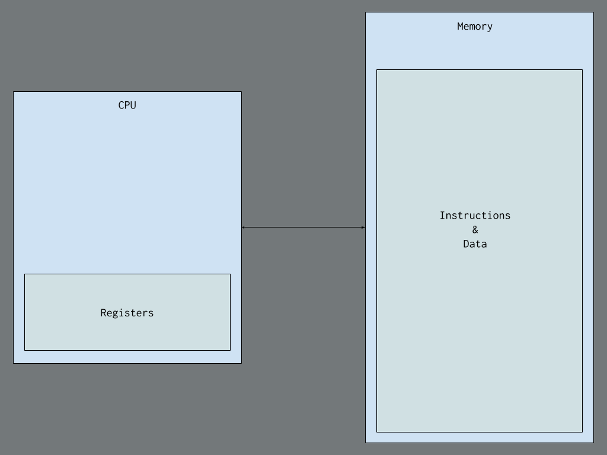

## Topic: Assembly Language
---

Hello! everyone hope you all are doing great, today we are going to learn about x86-64 assembly language programming for Windows, focusing on creating 64-bit applications. 

## Introduction to x86-64 Assembly Programming

Assembly language is a low-level programming language that is closely tied to the hardware of a computer. It provides a way to write programs that can directly interact with the CPU and memory, making it a powerful tool for system programming and optimization.

It is a human-readable representation of machine code instructions that can be executed by a computer's CPU. It provides a way to write programs that are more efficient and optimized than high-level languages like C or Java.

## Getting the Tools

### Assembler:

The assembler act as a translator that converts human-readable assembly language into machine code.

* ``Flat Assembler (FASM)`` is used because it is small, easy to use, and has a nice macro system.

### Debugger:

The debugger examines the state of programs, such as disassembly, memory, and registers.

* `WinDbg` is used because it is suitable for 64-bit programs, unlike OllyDbg, which is only for 32-bit.

## Thinking in Assembly

### Instruction Set:

CPUs, or Central Processing Units, can perform a specific set of tasks called instructions. These instructions are basic operations that the CPU is designed to handle.

An instruction is a command that tells the CPU to do something specific, like write a number to a certain spot in memory or do math with numbers in registers.

Here's a basic idea of what a CPU looks like inside:

Understanding this low-level model is important because it is effective for low-level programming and debugging, as it reveals how high-level concepts translate into these fundamental instructions.

## Registers:

They are small, fast memory locations within the CPU.

Registers in x86-64 are tiny storage spaces inside the CPU that are super quick to access.  Example; think of them like special compartments where the CPU stores and works with data. 

There are sixteen of these compartments called general-purpose registers, each holding 64 bits of data. 

* The registers, like rax, rbx, and rcx, can be used to store numbers or perform calculations. 

* registers like rsp is used for keeping track of the stack.

* registers like rip is used to remember where the CPU should go next.

* rflags keeps track of different conditions during calculations.

        Register	Lower byte	Lower word	Lower dword
        rax	al	ax	eax
        rbx	bl	bx	ebx
        rcx	cl	cx	ecx
        rdx	dl	dx	edx
        rsp	spl	sp	esp
        rsi	sil	si	esi
        rdi	dil	di	edi
        rbp	bpl	bp	ebp
        r8	r8b	r8w	r8d
        r9	r9b	r9w	r9d
        r10	r10b	r10w	r10d
        r11	r11b	r11w	r11d
        r12	r12b	r12w	r12d
        r13	r13b	r13w	r13d
        r14	r14b	r14w	r14d
        r15	r15b	r15w	r15d

## Memory and Addresses:

Memory is a large array of bytes, each with a unique address.
Modern systems use virtual memory, where each process sees a contiguous address space managed by the OS.

Memory in a computer is like a big list of tiny storage spaces, each with its own number called an address. 

* In older days, addressing memory was tough due to limited registers, but with x86-64, it's simpler.

In x86-64, memory is a big flat array of bytes, starting from 0.

The computer and the operating system work together to give each program its own chunk of memory, called a virtual address space, to prevent them from interfering.

Each program has its own virtual space, managed by the operating system, so even if two programs use the same address, they point to different spots in memory.

Instructions (what the computer does) and data (what it works on) are stored in the same memory in most computers, including yours. This is called the von Neumann model.

However, some systems, like microcontrollers in Arduinos, use the Harvard model, where instructions and data are kept separate.

## First Program

Here's the code for our first program in x86-64 assembly:

    format PE64 NX GUI 6.0
    entry start

    section '.text' code readable executable
    start:
            int3
            ret

### Analyzing the code;

* format PE64 NX GUI 6.0: Tells FASM to create a 64-bit Windows executable.
* entry start: Defines the starting point of the program.
* section '.text' code readable executable: Declares a section for executable code.
* start: A label marking the entry point.
* int3: Triggers a breakpoint for debugging.
* ret: Returns to the OS, ending the program.

To run the program, we have to open it with FASMW.EXE, paste the code, save the file, and press Ctrl+F9. This completes our first assembly program, and we can now load it into a debugger to see it in action.

### Using the Debugger

* Open WinDbg: Make sure the Disassembly, Registers, Stack, Memory, and Command windows are visible under the View tab.
* Launch the Executable: Go to File > Launch Executable and select the file you created with FASM.

### What You See

* Disassembly Window: Shows the current executing code (initially OS loader code).

* Registers Window: Displays the contents of x86-64 registers.

* Memory Window: Shows the raw content of the program's memory.

* Stack Window: Displays the current call stack.

* Command Window: Allows you to enter text commands and shows log messages.

### Running the Program

* Press F5: This continues the program until it hits another breakpoint (our hardcoded one).

* Disassembly Window: We will see the int3 and ret instructions you wrote.

* Press F8: Steps to the next instruction. Watch the rip register update in the Registers window.

### Program Exit

* The program returns to the OS code, which calls RtlExitUserThread to clean up and end the program.

### Proper Process Termination

* Uses ret to exit

* Proper Method: Use ExitProcess to ensure the process terminates correctly.

### Importing ExitProcess

* Portable Executable Format (PE): The executable needs to import the ExitProcess function from KERNEL32.DLL.

* Define .idata Section: It contains information about imported functions and the Import Directory Table (IDT).

### Code to Import ExitProcess

        section '.idata' import readable writeable
        idt: ; import directory table starts here
        ; entry for KERNEL32.DLL
        dd rva kernel32_iat
        dd 0
        dd 0
        dd rva kernel32_name
        dd rva kernel32_iat
        ; NULL entry - end of IDT
        dd 5 dup(0)
        name_table: ; hint/name table
                _ExitProcess_Name dw 0
                                db "ExitProcess", 0, 0

        kernel32_name: db "KERNEL32.DLL", 0
        kernel32_iat: ; import address table for KERNEL32.DLL
                ExitProcess dq rva _ExitProcess_Name
                dq 0 ; end of KERNEL32's IAT

### Calling Convention

* Microsoft x64 Calling Convention:

* * Stack aligned to a 16-byte boundary.
* * First four integer/pointer arguments in rcx, rdx, r8, r9.
* * Allocate 32 bytes of space on the stack for the first four arguments.

        format PE64 NX GUI 6.0
        entry start

        section '.text' code readable executable
        start:
                int3
                sub rsp, 8 * 5  ; adjust stack ptr and allocate shadow space.
                xor rcx, rcx    ; The first and only argument is the return code - passed in rcx.
                call [ExitProcess]

        section '.idata' import readable writeable
        idt: ; import directory table starts here
        ; entry for KERNEL32.DLL
        dd rva kernel32_iat
        dd 0
        dd 0
        dd rva kernel32_name
        dd rva kernel32_iat
        ; NULL entry - end of IDT
        dd 5 dup(0)
        name_table: ; hint/name table
                _ExitProcess_Name dw 0
                                db "ExitProcess", 0, 0

        kernel32_name db "KERNEL32.DLL", 0
        kernel32_iat: ; import address table for KERNEL32.DLL
                ExitProcess dq rva _ExitProcess_Name
                dq 0 ; end of KERNEL32's IAT

### Step-by-Step Explanation

* Adjust Stack Pointer: The sub rsp, 8 * 5 aligns the stack and allocates shadow space.

* Set Return Code: xor rcx, rcx sets the return code to 0.

* Call ExitProcess: call [ExitProcess] calls the function to terminate the process.

### Debugging

* Load the program in WinDbg.

* Run until the hardcoded breakpoint.

* Single-step to see how the stack pointer and registers change.

* Observe the call to ExitProcess and ensure proper termination.