## Topic: Ignite
---

Hello everyone, I hope you all are doing good! In this page we will be learning about the Ignite challenges from Try Hack Me.

## Target IP Address

    10.10.235.57

## Enumeration

First, I pinged the target machine to check whether I can communicate with the target machine or not using the ping command and the target IP address. The machine is up and running.

### Nmap

I have used nmap to scan the target IP address to see the open ports.

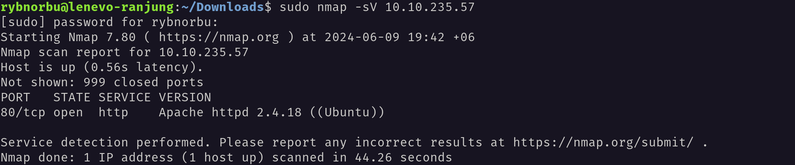

### Result

* 80/tcp open  http    Apache httpd 2.4.18 ((Ubuntu))

After that I have navigated to the web browser and visited the target IP address to see what is there. I found the following webpage.

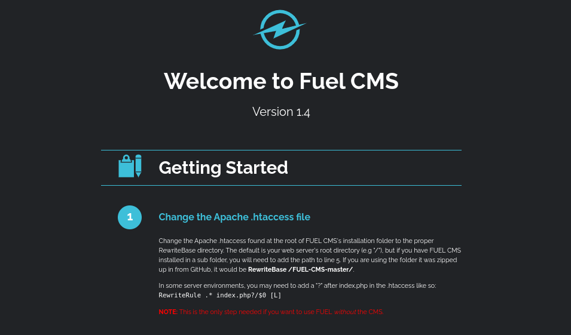

Inside the webpage I found out that the machine is running Apache HTTP Server version 2.4.18 on Ubuntu and the Fuel CMS version 1.4.1 is running on the server. 

## Brute force

I have used ffuf to brute force the directories and found the following directories.

    rybnorbu@lenevo-ranjung:~/Downloads$ ffuf -w /home/rybnorbu/SecLists-master/Discovery/Web-Content/common.txt -u http://10.10.235.57//FUZZ

            /'___\  /'___\           /'___\       
        /\ \__/ /\ \__/  __  __  /\ \__/       
        \ \ ,__\\ \ ,__\/\ \/\ \ \ \ ,__\      
            \ \ \_/ \ \ \_/\ \ \_\ \ \ \ \_/      
            \ \_\   \ \_\  \ \____/  \ \_\       
            \/_/    \/_/   \/___/    \/_/       

        v1.1.0
    ________________________________________________

    :: Method           : GET
    :: URL              : http://10.10.235.57//FUZZ
    :: Wordlist         : FUZZ: /home/rybnorbu/SecLists-master/Discovery/Web-Content/common.txt
    :: Follow redirects : false
    :: Calibration      : false
    :: Timeout          : 10
    :: Threads          : 40
    :: Matcher          : Response status: 200,204,301,302,307,401,403
    ________________________________________________

    .htpasswd               [Status: 403, Size: 296, Words: 22, Lines: 12]
    assets                  [Status: 301, Size: 313, Words: 20, Lines: 10]
    index                   [Status: 200, Size: 16595, Words: 770, Lines: 232]
    offline                 [Status: 200, Size: 70, Words: 8, Lines: 2]
    robots.txt              [Status: 200, Size: 30, Words: 3, Lines: 2]
    server-status           [Status: 403, Size: 300, Words: 22, Lines: 12]
    :: Progress: [4727/4727] :: Job [1/1] :: 8 req/sec :: Duration: [0:09:25] :: Errors: 159 ::

I have found many directories and files using ffuf. Let's navigate to the `/robots.txt.` directory and see what is there.

    User-agent: *
    Disallow: /fuel/

Inside this directory I found out that the `/fuel/` directory is disallowed. Let's navigate to the `/fuel/` directory and see what is there.

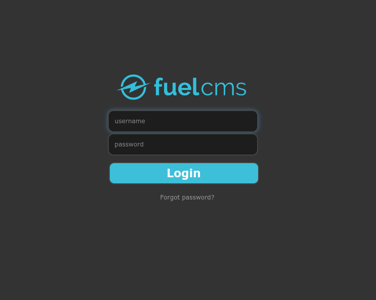

It contains a login page for fuelcms. The login credentials are already given in the webpage, It's `admin:admin`

I found this site when I logged in using this information.

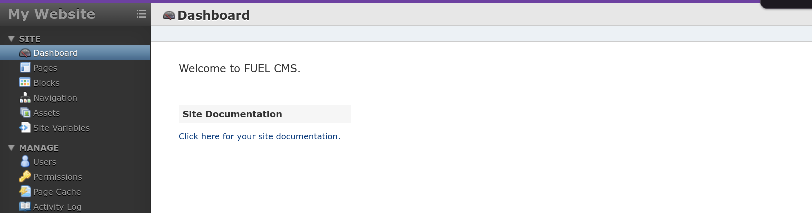

I have used the searchsploit module to find the exploit code for Fuel CMS 1.4.

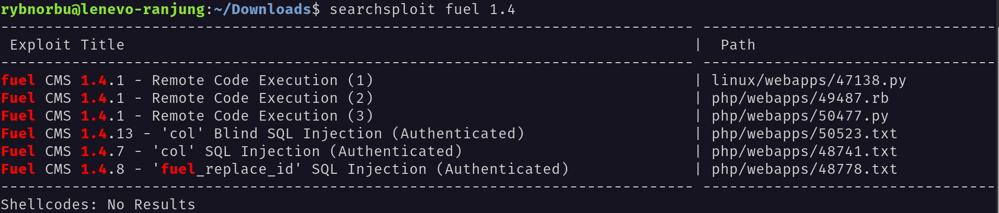

To download the python script I have used this command 

    searchsploit -m php/webapps/50477.py

I have downloade `50477.py` script.

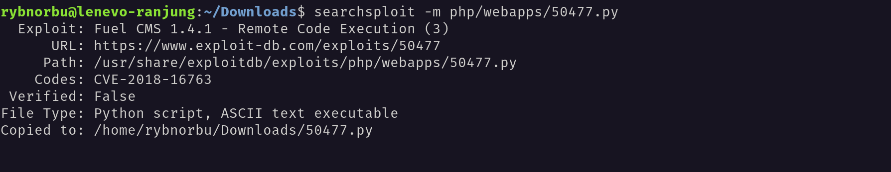

After downloading the script I run the script.

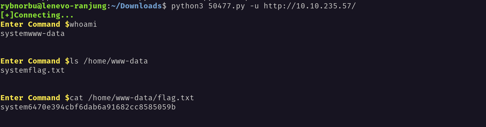

I have found the flag.

## Privilage Escalation

I have used reverse shell to get the shell access to the target machine.

I have done a reverse shell by running a code that I copied from a cheetsheet `pentest monkey.` 

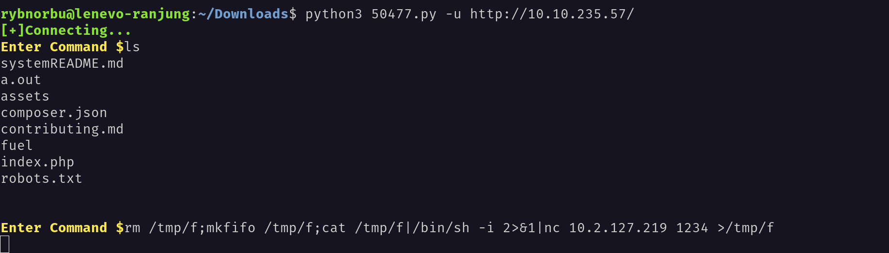

From another terminal I have started the netcat listener.

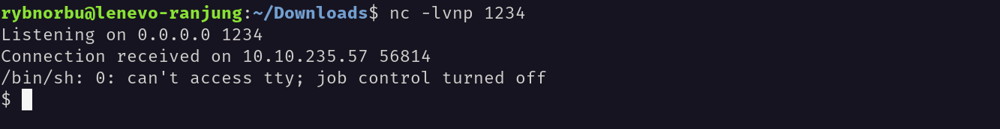

I was able to get the shell access to the target machine.

To get the root access I used `su root` command but it asked for the password. So, I found the password in the database.php file and is `mememe`.

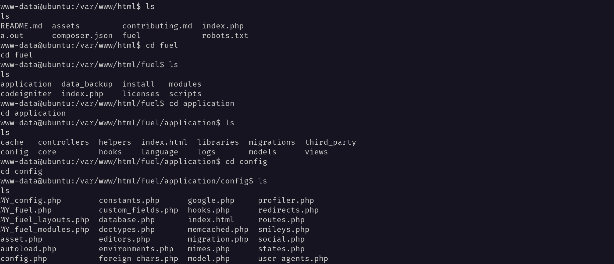

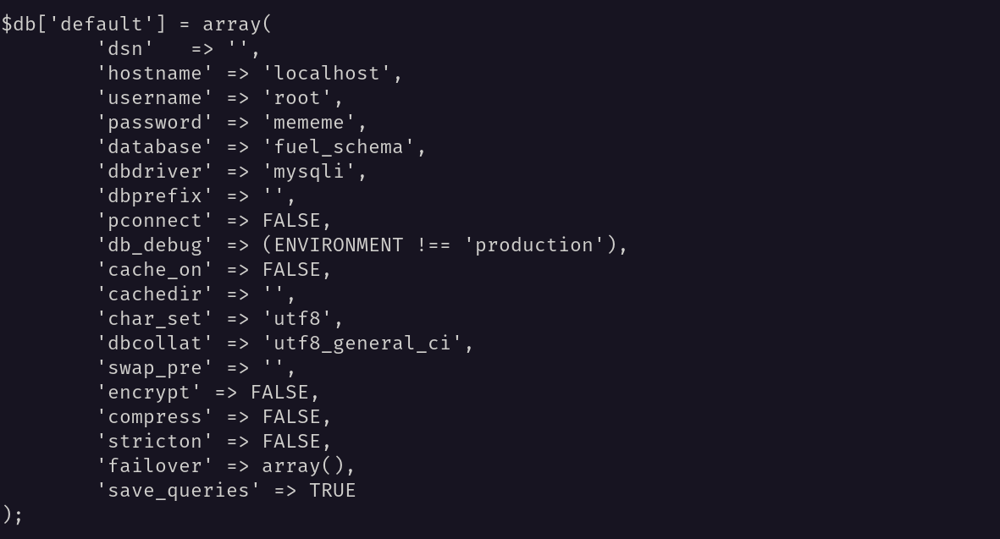

Then I ran `su root` command and got root access.

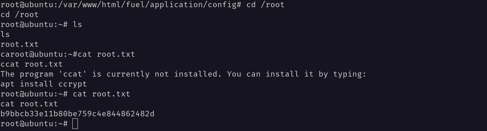

I got the rootflag.