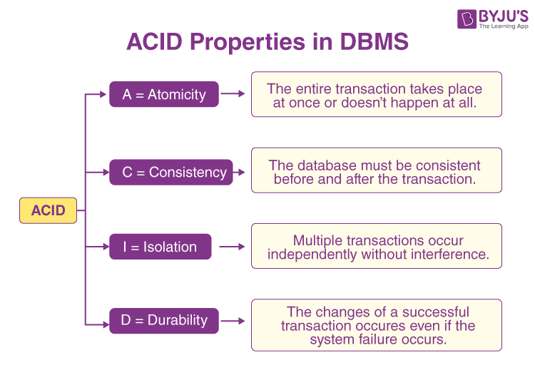

## Topic: Transaction and Serializability

Hello everyone, I hope you all are doing good! Today in our flipped cllass we learned about transactions in databases and I would like to share some of the key points that I have learned.

### Transaction

A transaction in databases is a group of actions that are treated as one complete task. It refers to a collection of operations that form a single logical unit of work. These operations must be performed as a whole, or not at all.

You start a transaction with a command like `"begin transaction"` and end it with `"end transaction"`. Everything that happens between these two commands is part of the transaction.

### Properties of Transaction

There are four properties of transactions that are known as ACID properties. They are:

### A Simple Transaction Model

To understand better let me demonstrate a simple transaction model.

In the first step;

* I have created a new database called `test_transaction` and than connected to that database.

*  Then, Inside this database I have created a table called “acount” and inserted two columns “accoun_name” and “balance”.

* After that I have inserted a necessary data in the tables.

* The `SELECT * FROM accounts;` command retrieves and shows all the current details of the accounts.

* Then BEGIN; command marks the beginning of a transaction, ensuring that the following operations are treated as a single unit.

* The first update command decreases the balance of the account named 'A' by 500 and another update increases the balance of the account named 'B' by 500.

* Then It inalizes the transaction, making the changes to accounts 'A' and 'B' permanent using `commit` command.

### Transaction model

1. Active

This is the initial state; the transaction stays in this state while it is executing.
 

2. Partially commited

After completion of all the read and write operation the changes are made in main memory or local buffer. If the changes are made permanent on the DataBase then the state will change to “committed state” and in case of failure it will go to the “failed state”. 
 
 

3. Failed

When any instruction of the transaction fails, it goes to the “failed state” or if failure occurs in making a permanent change of data on Data Base. 

4. Aborted

After the transaction has been rolled back and the database has been.
restored to its state prior to the start of the transaction.

5. Committed

After successful completion.

### Transaction Isolation

In databases, running multiple transactions at the same time can cause problems with data consistency. It's easier to keep data consistent if transactions run one after the other, but this isn't always practical.

* Schedules help manage running transactions together while keeping data consistent.
* Concurrency-control schemes ensure transactions interact correctly when running simultaneously.

### Transaction Schedules and Serial Execution

Example: Two transactions in a banking system:

* T1: Transfers $50 from account A to B.
* T2: Transfers 10% of balance from account A to B.

#### Serial Schedules:

* Schedule 1: First T1, then T2.
* Schedule 2: First T2, then T1.

Transaction T1: Transfer $50 from account A to B
Sequential execution ensuring consistency

Transaction T2: Transfer 10% of balance from A to B
Sequential execution preserving database integrity
 

## Serializability

Serializability ensures that transactions in a database are isolated. This means they don’t interfere with each other and the final state of the database is consistent.

It allows multiple transactions to run at the same time, but the result is the same as if the transactions were executed one after the other in a serial order.

### Types of Schedules in DBMS

There are two types of schedules in DBMS:

### Serial schedule

These are those schedules in which transactions are executed sequentially, meaning a new transaction doesn't begin until the previous one has concluded.

#### Example:

| Transaction | Operation | 
| ----------- | ----------- | 
| T1 | Read(x) | 
| T1 | Write(x) |
| T2 | Read(Y)  | 
| T2 | Write(Y) |

### Non-serial schedule

This scheduling method involves interleaving the operations of multiple transactions, potentially increasing concurrency challenges. Transactions are executed concurrently, yet the final outcome remains consistent and identical to a serial schedule. It is further divided into two parts:

1. Serializable(Conflict and View Serializable)
2. Non- serializable(Recoverable and Non-recoverable)

#### Example

| Transaction | Operation | 
| ----------- | ----------- | 
| T1 | Read(x) | 
| T2 | Read(Y) |
| T1 | Write(X)  | 
| T2 | Write(Y) |

### Types of Serializability

There are different types of serializability, each with its own pros and cons. They are  conflict serializability and view serializability.

### Conflict Serializability:

* This type of serializability is easy to understand and check.
* Two transactions are in conflict if they try to access the same data at the same time and at least one of them is writing (updating) the data.
* If we can reorder the conflicting transactions to avoid conflicts and get the same result as if they happened one after the other, they are conflict serializable.

| Advantages | Disadvantages | 
| ----------- | ----------- | 
| It’s straightforward to check and enforce | It might be too strict and disallow some schedules (orders of transactions) that could still be correct. | 
| It’s easier to understand and implement | It might not be the most efficient way to run transactions. |

### View Serializability:

* This type of serializability is more flexible and less strict than conflict serializability.
* Two transactions are view serializable if they result in the same final database state, even if they don’t follow the exact same order.
* It looks at the overall effect of the transactions rather than just the conflicting actions.

| Advantages | Disadvantages | 
| ----------- | ----------- | 
| Allows more schedules that can still be correct, providing more flexibility | It’s harder to check and enforce compared to conflict serializability | 

## Testing of Serializability in DBMS with Examples

Testing serializability in DBMS is very important as it maintains the accuracy and stability of multiple simultaneous transactions. There are two methods of testing serializability in DBMS: the precedence graph method and the serialization graph method.

### Precedence Graph Method 

Let us take an example and test serializability with a step-by-step process.

Consider a schedule with three transactions, T1, T2, and T3, and the following set of operations:

    T1: R(A), W(B)
    T2: W(A), R(B)
    T3: R(B), W(A)

* Firstly, we will create a precedence graph.

    T1 -> T2
    T2 -> T3
    T3 -> T1

* In this step, we will check the presence of the cycle in the graph. If there is no cycle, then the schedule is serializable.

In the example, T1 -> T2 -> T3 -> T1 makes up a cycle, so the schedule is not serializable.

### Conflict Serializability Method

This method checks for the conflict between write and read operations. Let us take the example shown for the above method and test serializability with a step-by-step process.

    T1: R(A), W(B)
    T2: W(A), R(B)
    T3: R(B), W(A)

Step 1: we will look for the pairs of conflicting operations in this step.

    T1 and T2 conflict on (R(A), W(A))
    T2 and T3 conflict on (R(B), W(A))

Step 2: If there is no conflict, then the schedule is serializable; otherwise, we would need to do some other analysis to find out the serializability.

There is a conflict between T1 and T2, T2 and T3, so the schedule is not serializab

### Conclusion

Transactions are a fundamental concept in databases. They help ensure data consistency and integrity. Understanding transactions is essential for anyone working with databases.

I hope you all have understood the concept of transactions in databases. If you have any queries, feel free to ask. Thank you for reading!

