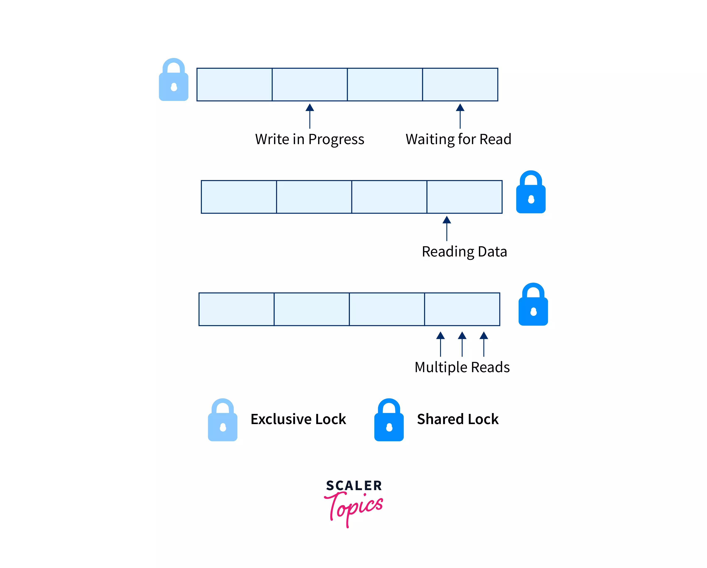
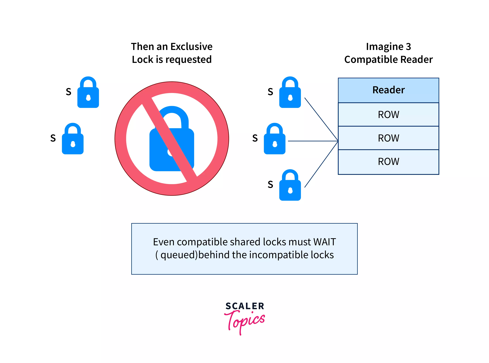
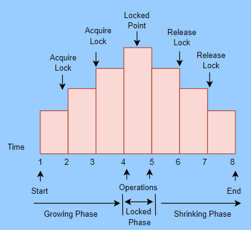
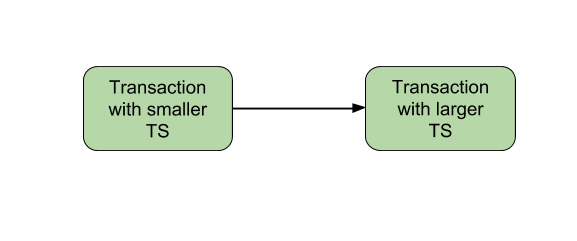

## Topic: Lock & Laches

## Concurrency Control in Database Systems

Concurrency control is a technique used to maintain the integrity and performance of database systems when multiple transactions are accessing and modifying data. Even when multiple transactions execute concurrently, it ensures that the database remains in a consistent state.

When multiple transactions execute in parallel, database systems can utilize available resources more effectively and process a higher volume of requests concurrently.

## Lock 

### Lock Types

There are two modes for locking and unlocking data items Shared Lock (lock-S) and Exclusive Lock (lock-X). 

### Shared Lock

A shared lock, also called an S-lock or read lock, allows multiple users to read data from a database at the same time. However, it does not allow anyone to change or edit the data.

Here’s how it works:

* Read-Only Access: When a shared lock is in place, users can only read the data; they cannot make any changes.
* Multiple Readers: Many users can read the same data at the same time because multiple shared locks can be applied simultaneously.
* No Conflicting Locks: The data with a shared lock must not have any other type of lock on it.
* Read Integrity: Shared locks ensure that the data being read remains consistent and accurate.
* Prevent Updates: By using shared locks, you can prevent the data from being updated while it is being read.

To request a shared lock, you use the Lock-S instruction.

### Exclusive Lock

An exclusive lock (also called a write lock) allows a data item to be read and written by only one transaction at a time. To use an exclusive lock, the user issues a lock-x command. After the transaction finishes writing, it unlocks the data item.

For example, if a transaction needs to update someone's account balance, it can use an exclusive lock to do so. While this lock is in place, no other transaction can read or write the same data item.

Only one transaction can hold an exclusive lock on a data item at any given time. This lock can only be used once on the same data item.

### Example of exclusive locks:

Imagine a data item X has a value of 50, and a transaction needs to deduct 20 from X. To do this, the transaction places an exclusive lock (also known as a write lock) on X. This lock ensures that no other transaction can read or write X while the deduction is being made.

For instance, when the exclusive lock is applied:

* The current transaction can read X (which is 50), subtract 20, and then write the new value (30) back to X.
* During this time, no other transaction can access X to read or write it.

Once the transaction completes the update and unlocks X, other transactions can then read or write X. This exclusive lock guarantees the consistency and correctness of the data by preventing simultaneous conflicting operations.

## Two-phase Locking Protocol

If Locking as well as Unlocking can be performed in 2 phases, a transaction is considered to follow the Two-Phase Locking protocol. The two phases are known as the growing and shrinking phases.

1. Growing Phase: In this phase, we can acquire new locks on data items, but none of these locks can be released.

2. Shrinking Phase: In this phase, the existing locks can be released, but no new locks can be obtained.

Two-phase locking helps manage how multiple transactions access data, but it has some downsides too. It makes transactions slower and more expensive to process. Additionally, it can lead to deadlocks, where two or more transactions get stuck waiting for each other to release locks, and none can proceed.

### Timestamp Ordering Protocol

The Timestamp Ordering Protocol helps decide the order in which transactions are processed based on their timestamps. The transactions are processed in the order they are created, with older transactions having higher priority.

When a transaction is created, it gets a timestamp from the system clock or a counter. This timestamp determines its priority. For example, if Transaction T1 is created at time 007 and Transaction T2 is created at time 009, T1 will be processed before T2 because it has an earlier timestamp.

Unlike lock-based protocols that manage the order of transactions during execution, the Timestamp Ordering Protocol sets the order as soon as transactions are created. This protocol also keeps track of the last time data was read or written, ensuring that operations follow the correct sequence based on timestamps.

### Timestamp ordering protocol works as follows:

1. Check the following condition whenever a transaction Ti issues a Read (X) operation:

* If W_TS(X) >TS(Ti) then the operation is rejected.
* If W_TS(X) <= TS(Ti) then the operation is executed.
Timestamps of all the data items are updated.

2. Check the following condition whenever a transaction Ti issues a Write(X) operation:

* If TS(Ti) < R_TS(X) then the operation is rejected.
* If TS(Ti) < W_TS(X) then the operation is rejected and Ti is rolled back otherwise the operation is executed.

Where,

* TS(TI) denotes the timestamp of the transaction Ti.

* R_TS(X) denotes the Read time-stamp of data-item X.

* W_TS(X) denotes the Write time-stamp of data-item X.

### Advantages and Disadvantages of TO protocol

* Ensures serializability since the precedence graph is as follows:

* Timestamp protocol ensures freedom from deadlock as no transaction ever waits.
* But the schedule may not be cascade free, and may not even be recoverable.