# Executive Summary 

## Github Repo Link for evidences

[Git_Hub_Link](https://github.com/Rynorbu/SWS101/tree/main/SWS/caps/cap2)

# Website Penetration Test Assessment Summary

# URL 1: 10.3.21.141:8000 (Gruyere)

## Vulnerability 1 Title

Path Transversal

### How It works

Path Transversal happens when the attacker is able to access the files and directories that are outside the root directory. It allows an attacker to read arbitrary files on the server that is running an application.

I have found this vulnerability in this website. In this site, I was able to access the `secret.txt` file using `..%2fsecret/txt` which contains the information about the users on the system.

    I used the path `..%2fsecret/txt` to access the `secret.txt` file.

It works by using the input that is used to access files and directories on the server. By using the dot dot %2f (..%2f) sequence, an attacker can go back to the root directory and access files that are outside the web root directory.

## Consequences

The exploitation of this vulnerability could lead to:
* The attackers will be able to steal sensitive information such as cookies, session tokens, or other credentials.
* The attackers can be able to access the source code of the application. This can be used to find other vulnerabilities.

## Steps to Reproduce

## Procedure

This is what I did:

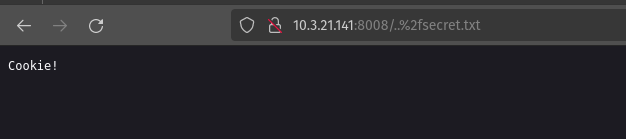

Inside the URL I used path transversal to access the `secret.txt` file. 

I used this code 

    10.3.21.141:8000/..%2fsecret/txt

After using this code I was able to access the `secret.txt` file.

I got access to the `secret.txt` file using the path `..%2fsecret/txt` and I was able to access the file which contains the information about the system.

This type of vulnerabilities allows an attacker to read arbitrary files on the server that is running an application.

## Recommendations

To not have this type of vulnerability we need to:

* Use input validation. This can prevent users from entering the protected scripts.
* Use a security policy as this can prevent the execution of scripts in user input.
* We can store sensitive information in a separate directory that is not accessible from the web root directory.

## Vulnerability 2 Title

File upload vulnerabilities

### How It works

File upload vulnerabilities occur when an application allows users to upload files without proper permission.

In this website, I was able to upload any kind of file without any restrictions. This can lead to file upload vulnerabilities where attackers can upload malicious files that can harm the system. 

To test this, I added a php file that contains a script that will execute when the file is accessed. This vulnerability can be used to upload a web shell that can be used to gain remote access to the server. Attackers can be able to do reverse engineering and can upload malicious files. 

## Consequences

This type of vulnerability could lead to:

* An attacker can be able to upload a web shell that can be used to gain access to the server.
* The attacker can be able to upload malicious files that can harm the system and other users.
* This will also help attackers to perform actions on behalf of the user, such as changing account settings.

## Steps to Reproduce

## Procedure

This is what I did:

In my account I tried to upload a php file and I was able to upload it successfully. Not only the php file I was able to upload any kind of files.

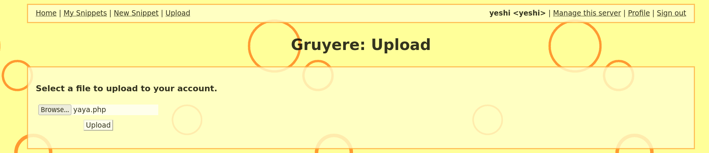

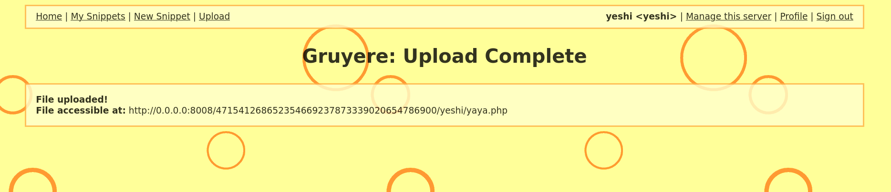

The file was successfully uploaded which is a major vulnerability because it allows attackers to upload files that can harm the system.

This can make attackers to upload a web shell that can be used to gain access to the server.

## Recommendations

To prevent this vulnerability, It is recommended to:

* By making input validation it can help to prevent users from uploading malicious files.
* Using a content security policy to prevent the execution of scripts in user input.
* By using some file extension It can help to prevent this kind of vulnerabilities because it can only allow certain file types to be uploaded.

## Vulnerability 3 Title 

Cross-Site Request Forgery (XSRF/CSRF)

### How It works

Cross-site request forgery (CSRF or XSRF) is a web vulnerability that tricks users into doing things on a website without wanting to.

I have found this vulnerability on this website. It occurs when an attacker is able to trick a user into making a request on behalf of the attacker.

Inside the website, I was able to create a snippet. But I was not able to delete the snippet that I have created when I click the cross button. 

So, I used this vulnerability to delete the snippet that I have created. I used this link to delete the snippet that I have created.

    https://google-gruyere.appspot.com/569901197838708087325705036451811297916/deletesnippet?index=0

## Consequences

The exploitation of this vulnerability could lead to:

* An attacker can be able to delete the snippets that the user has created.
* The attacker can make a web browser to execute an unwanted action in an application to which a user is logged in.

## Steps to Reproduce

## Procedure

This is what I did:

I have created a snippet in my account norbu.

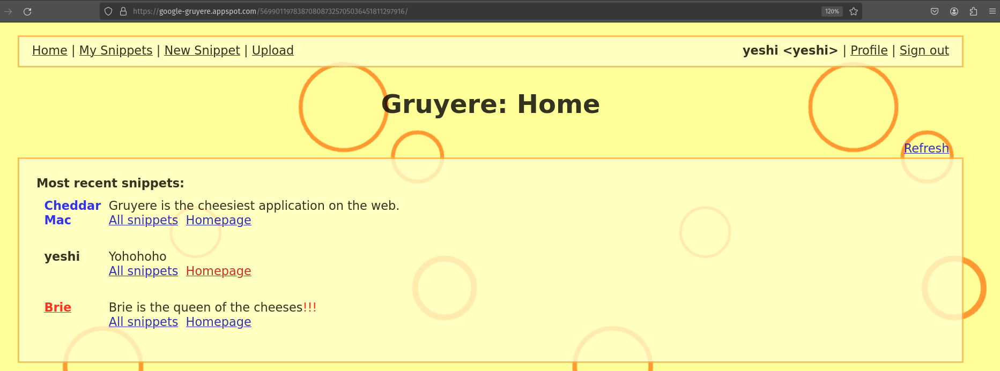

Then from my profile I tried to delete the snippet that I have created and it was successful.

This is the brup suite that I have used to intercept the request.

I used the get request to delete the snippet that I have created.

    https://google-gruyere.appspot.com/569901197838708087325705036451811297916/deletesnippet?index=0

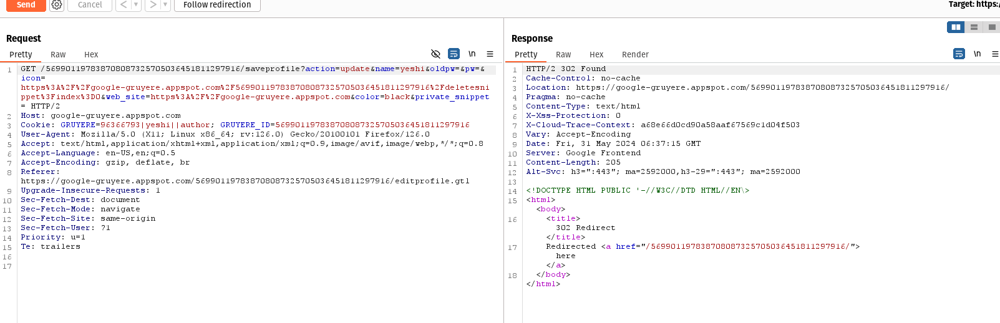

After running this request I was able to delete the snippet that I have created and it was successful.

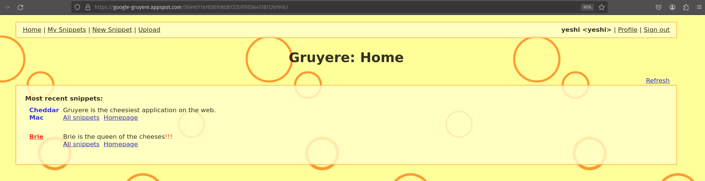

* I have done this by using the link `https://google-gruyere.appspot.com/` to delete the snippet that I have created. 
I have also done this in this IP address `10.3.21.141:8008` but the brup suite was not working so I tried this in my local machine. Both of them are same.

## Recommendations

To prevent this vulnerability, It is recommended to:

* Using a unique token for each request that is generated by the server and is validated when the request is made.
* Use the SameSite cookie attribute to prevent the browser from sending the cookie in cross-site requests.
* By using input validation it can help to prevent users from entering scripts into web forms.

# 10.3.21.141:8008 (Pixi)

## Vulnerability 1 Title

Insecure Direct Object Reference(IDOR)

### How It Works

I have discovered a vulnerability known as Insecure Direct Object References (IDOR). This vulnerability mainly occurs when the application exposes objects such as directories or files.

In this site the application provides direct access to objects based on user input. 

I was able to exploit this vulnerability in this website.

My profile ID is 65 but I was able to view the information that the profile 64 has. I just changed the profile ID to 64 in the my http header and I got all the sensitive information that the profile 64 has.

## Consequences

The exploitation of this vulnerability could lead to:

* It allows users to access another user's information just by altering the profile ID in the HTTP request.
* There is high chances that user will use this information and try to login and will lead to unauthorized access to sensitive data.
* The attackers can be able to modify the data of other users which can lead to potential misuse. 

## Steps to Reproduce

## Procedure

This is what I did:

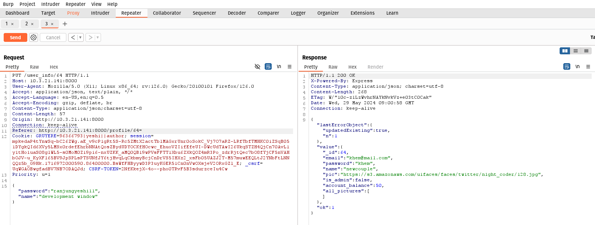

* Initially my profile ID is 65 and I used my own password to update my profile.
* I used brup suite to intercept the request and I got the profile ID in the HTTP request.
* Then, I changed the profile ID in the HTTP request to 64 and surprisingly, I was able to see the email and password of the user with profile ID 64.

In the profile 64, the email is `Khem@mail.com` and password  is`Khem`.

This is a major vulnerability because it allows anyone to access another user's information just by changing the profile ID in the HTTP request. This can lead to unauthorized access to sensitive data.

## Recommendations

To not have this type of vulnerability we need to:

* We need to make sure that the server checks if that particular user has the right to access or modify the requested data.
* It is best to use reference like tokens instead of exposing internal IDs.

By implementing this recommendation, It can prevent unauthorized access and protect user data from being exposed or modified by other users.

##  Vulnerability Title

File upload vulnerabilities

## How It Works

Actually in this website It does not allow other file to upload other than photos but I was able to upload other files like pdf, videos and many other. 

It doesnot check properly wheather the uploaded file is a photo or pdf or others. It just allows us to upload any files. This can lead to file upload vulnerabilities where atackers can upload malicious files that can harm the system.

In this site, I was able to upload a pdf and a gif file which is not a photo. This site doesnot check any file type or extensions and allows us to upload any files.

## Consequences

This vulnerability could lead to:

* The attackers can be able to upload any files that contains malware and this can harm the system and other users.
* The attackers can be able to gain full control of the system by uploading malicious files and doing reverse engineering.

## Steps to Reproduce

### Procedure

This is what I did:

I got a hint that the website only allows to upload photos. But I tried to upload a pdf file and a gif file and I was able to upload them successfully.

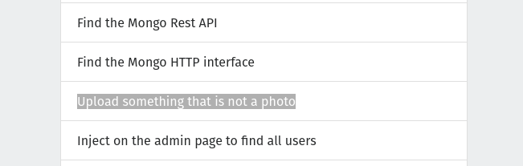

In the first step I tried to upload a gif file and I was able to upload it successfully.

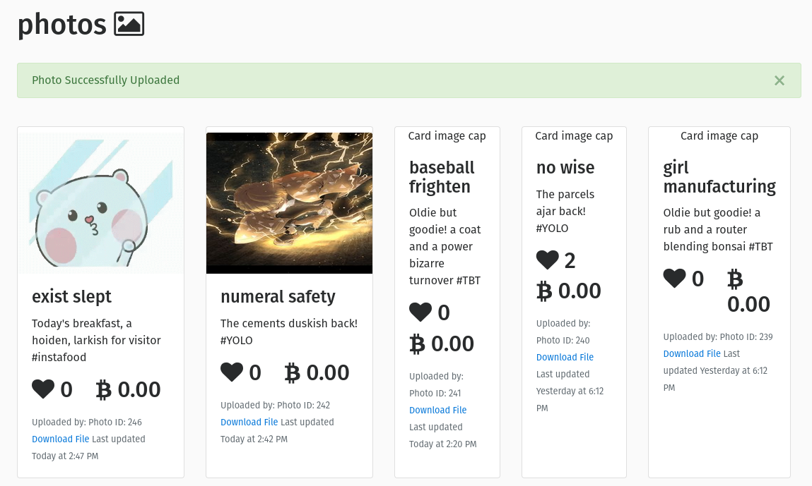

Then I tried to upload a pdf file.

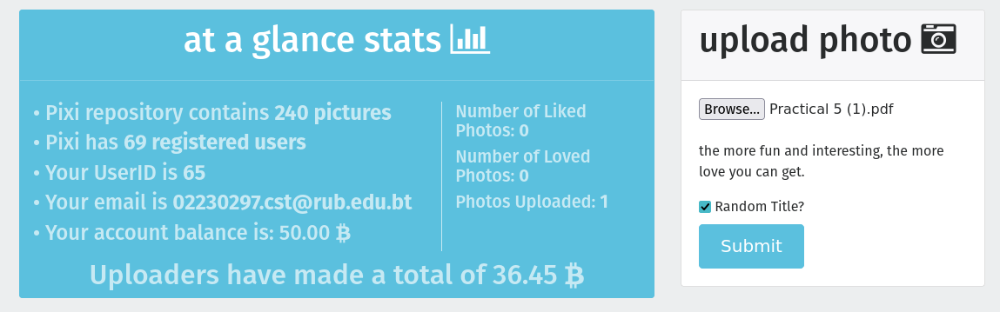

I was able to upload the pdf file successfully.

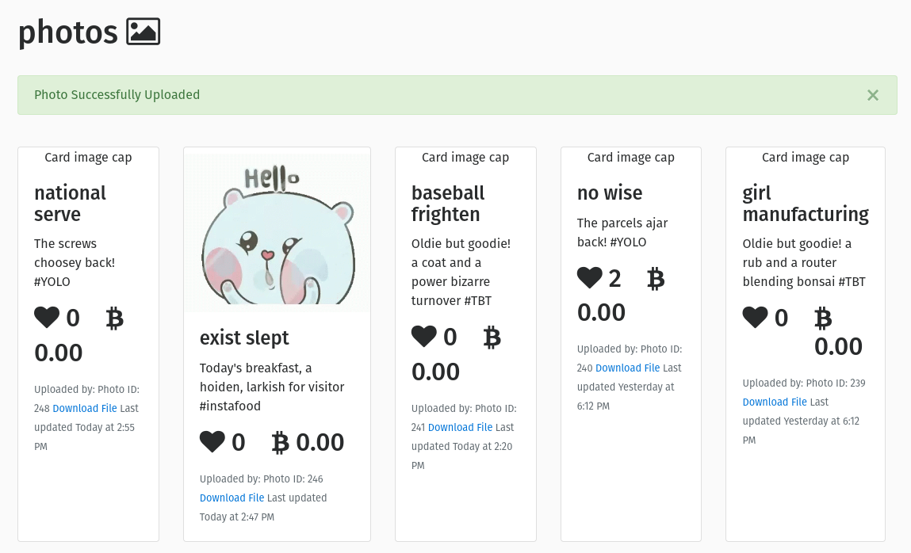

I was able to upload any files other than a photo which is a major vulnerability because it allows attackers to upload malicious files that can harm the system.

##  Vulnerability 3 Title

XSS on search field

## How It Works

I have discovered a vulnerability known as Cross-Site Scripting (XSS) on the search field on this website. This vulnerability mostly occurs when an attacker is able to inject scripts into web pages that can be viewed by other users.

In this site, I was able to inject a script into the search field and when another user searches for something, the script gets executed on their browser.

I ran these scripts on the search field:

    

## Consequences

The exploitation of this vulnerability could lead to:

* Attacker can be able to sploit the website or can be able to display inappropriate content to the users.
* Attackers can be able to disclose the user's session cookie which can allow an attacker to hijack the user's session and can take over the account.
* Attackers can be able to redirect the user to a malicious website that can steal sensitive information.

## Steps to Reproduce

### Procedure

This is what I did:

I found out that I can inject a script as a query in the search field because this vulnerabilty is already given in the about me page in the website. 

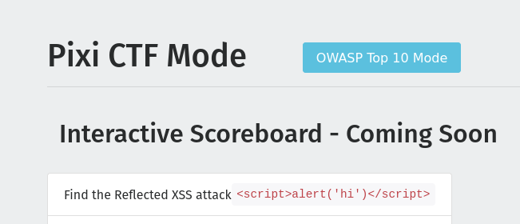

So, I just injected the script into the search field and when another user searches for something, the script gets executed on their browser.

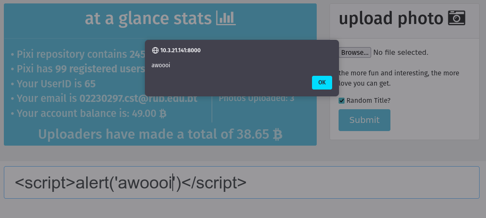

This is the script that I injected into the search field:

    

## Recommendations

To prevent this kind of vulnerability, we should:

* Make the user input to remove any malicious script that the application allows.
* Use a content security policy to prevent the execution of scripts in user input.
* Using input validation to prevent users from entering malicious scripts into web forms.

## www.hackthissite.org

This site is like the try hack me site where we have to slove the questions and each level has a vulnerabilities that we can get into.

I have done some task basic challenges.

### Level 1

Our task is to find the password. It's clearly mentioned that we should have the knowledge about HTML. 

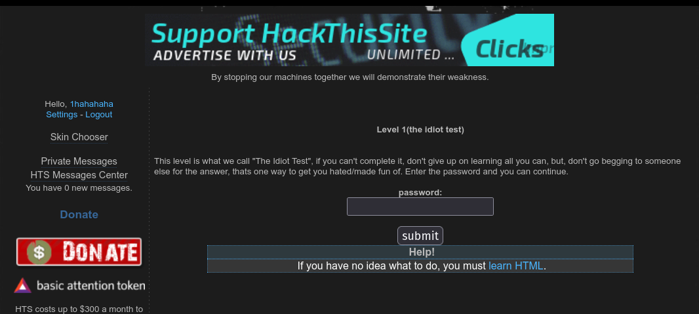

This is the hind that I got;

After understanding the hind, I checked the HTML code and I found the password.

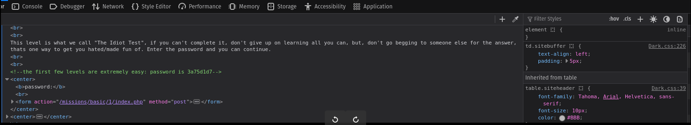

### Level 2

I found this level intresting, it nearly took me 30 minutes to figure out the password. 

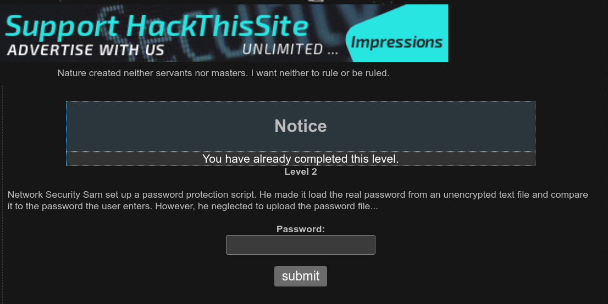

After reading the question many times I found that `He made it load the real password from an unencrypted text file and compare it to the password the user enters. However, he neglected to upload the password file` 

So, from this I found that he neglated to upload the password file so I got it by just submitting the password blank.

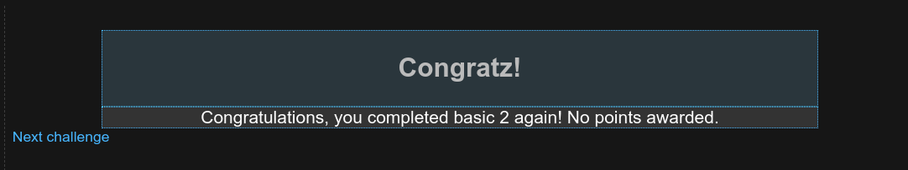

### Level 3

In this level we need to find the password file that are in the hidden directory. 

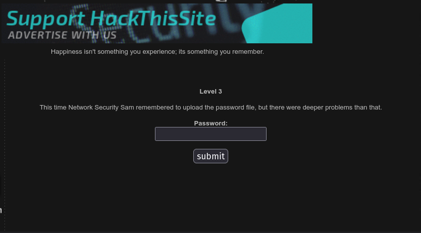

I checked the source code to see the hidden directory and found the input field that has the hidden directory. I knew that was the hidden directory beacuse the `type=hidden` and `name=file`.

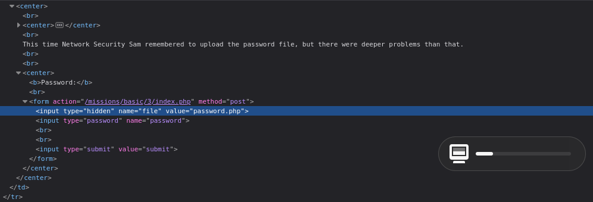

As the hidden directory is `password.php`. I navigated in this directory and foun out the password.

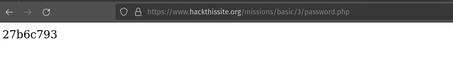

### Level 4

This time the password is long so he wrote a script that would email his password to him automatically in case he forgot. 

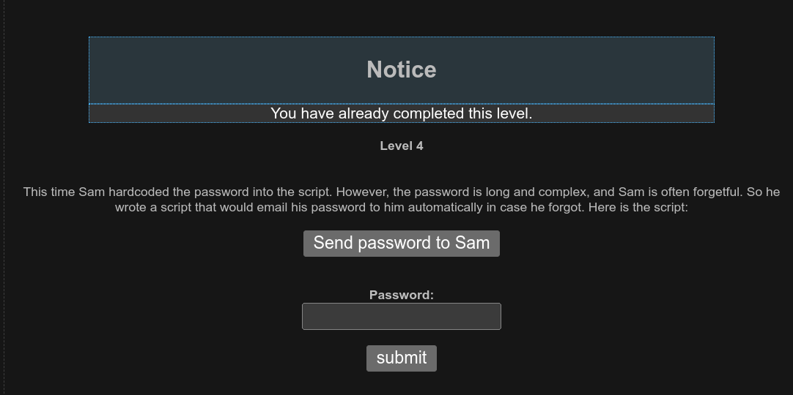

So, I checked the source code and found the script that stores his email. Then I replaced my email with his email.

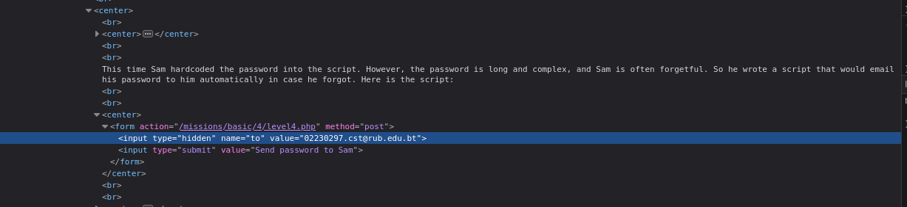

After click the button `Send password to Sam` I recieved the password in my mail.

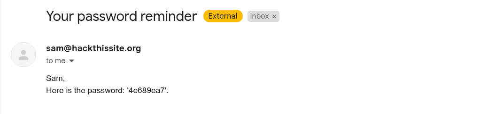

### Level 5

This level is same like the previous level. But this time he got a little smarter and made his email program a littile more secure.

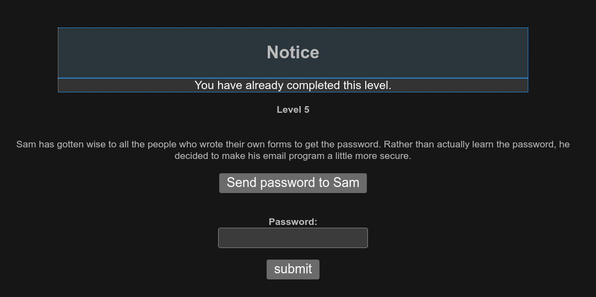

Same like the previous task I checked the source code and found the script that has his email. And then I replaced my email in his.

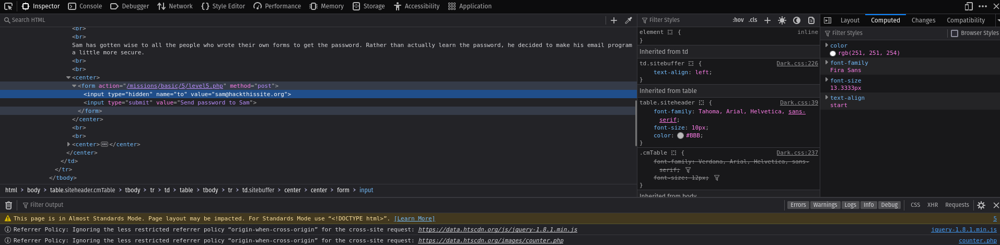

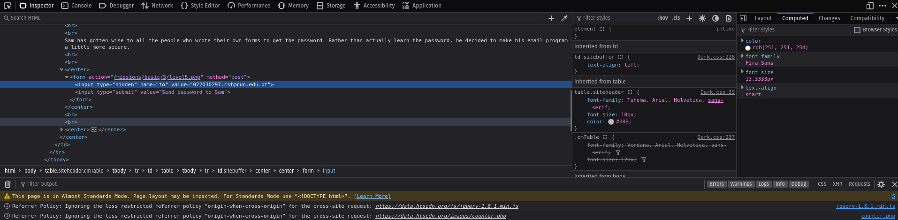

Then after clicking the button `Send password to Sam` I found this message.

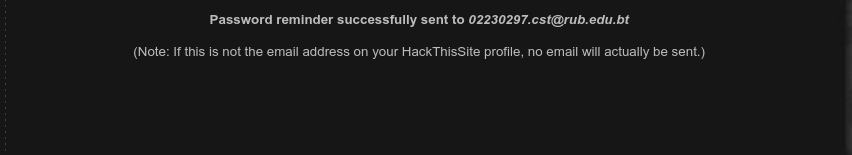

And after checking the email I got password to this level.

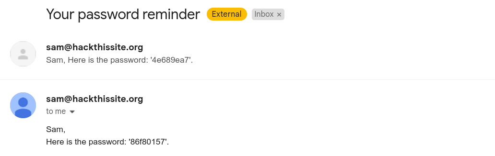