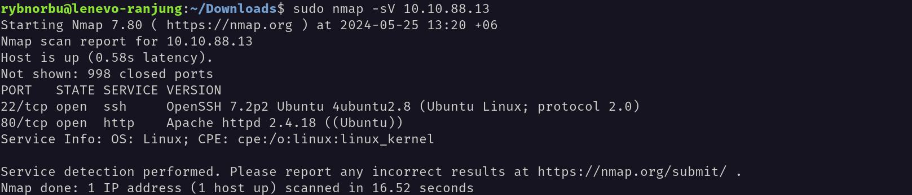
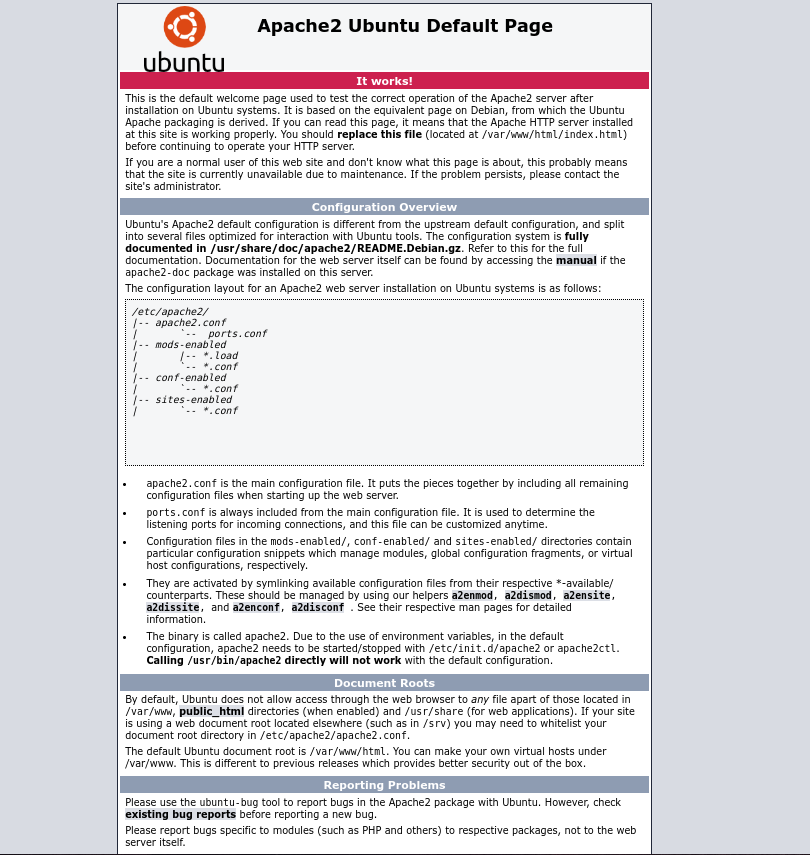
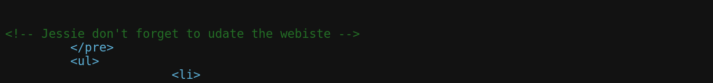
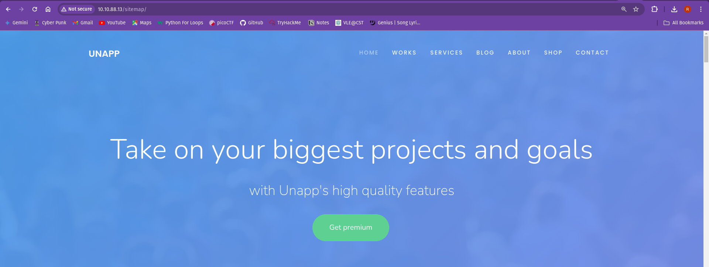
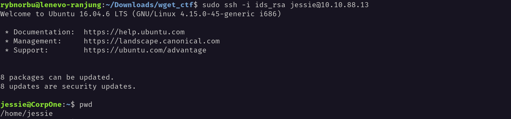
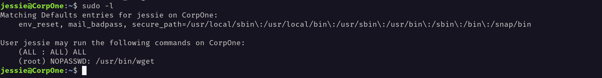
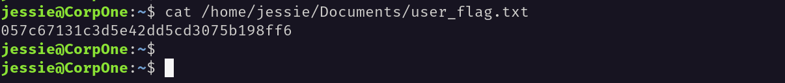

## Topic: Wgel_ctf
---

Hello everyone, I hope you all are doing good! In this page we will be learning about the wgel ctf challenges from Try Hack Me.

## Target IP Address

    10.10.88.13

## Enumeration

First, I pinged the target machine to check whether I can communicate with the target machine or not using the ping command and the target IP address. The machine is up and running.

### Nmap

Used nmap to scan the target IP address to see the open ports.

### Results

* 22/tcp   open  ssh
* 80/tcp   open  http

### Web page

I opened the web page in the browser and found this page.

It’s was just a normal Apache2 page, but I checked the source code of the page and found a comment in the source code.

From this I knew the user was Jessica.

### Brute Force

I tried to brute force the ssh login with the username Jessica and the password list.

Let's navigate to the /sitemap directory and see what's inside.

I found a file called “.ssh” which is a hidden directory. I checked the contents of the file and found a private key.

I copied the private key and saved it in a file called “ids_rsa” and changed the permissions of the file to 600.

Then I tried to login to the ssh using the private key.

I successfully logged in to the ssh.

I used the command sudo -l to check the sudo permissions of the user.

I have the permission to run the /usr/bin/wget as root.

I ran this command 

    locate flag.txt

I found the flag.txt file in the /home/jessica/Document directory.

Then I read the flag.txt file using the cat command.

I found the flag.

