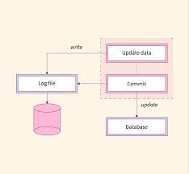
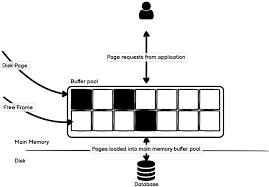
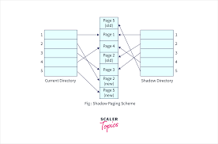
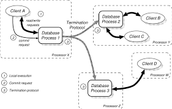

## Topic: Recovery Alogrithms

## Recovery Algorithms in Database Systems

Recovery systems are like insurance policies for your data, making sure it stays intact even if something goes wrong.

Imagine you're editing a document, and suddenly your computer crashes before you can save your changes. Recovery systems work similarly in databases. They help ensure that if something unexpected happens—like a power outage or a software glitch—your data stays safe and doesn't get messed up.

These systems have techniques to undo any changes that weren't saved properly or to redo any changes that were lost. They're like the undo and redo buttons you might use in a word processor, but for databases.

## Atomic Transactions

Atomicity is like a rule that says a transaction in a database must either happen completely or not at all.

This rule makes sure that if you're doing multiple things in a transaction, like updating different parts of the database, either they all happen correctly, or none of them happen. This helps keep the database organized and consistent. Databases keep a record of every transaction before actually doing it. 

## Log-Based Recovery

Log-based recovery means writing down all changes right away in a log file, including what was changed and how. This log helps the system figure out how to fix any mistakes by either undoing or redoing transactions, ensuring everything stays consistent.

Types of Log Records:

* Transaction Begin: Marks the start of a transaction.
* Transaction Commit: Indicates a transaction has successfully finished.
* Transaction Rollback: Marks a transaction as canceled, requiring its changes to be undone.
* Update: Records changes to data, including old and new values.
* Insert: Logs the addition of new data.
* Delete: Logs the removal of data.
* Checkpoint: Records the state of all active transactions and data at a specific point to speed up recovery.
Compensation Log Record (CLR): Logs actions to reverse changes made by canceled transactions.
* System Log Records: Track important system-wide events like start and stop operations.
* Savepoint: Marks specific points within a transaction to allow partial rollbacks.

These log records are essential for keeping data accurate and ensuring smooth recovery if something goes wrong.

## ARIES (Algorithms for Recovery and Isolation Exploiting Semantics)

ARIES (Algorithms for Recovery and Isolation Exploiting Semantics) is a method used in databases to keep everything safe and consistent, especially if something goes wrong like a crash. 

1. Write-Ahead Logging (WAL): Before making any changes to the database, ARIES writes all changes to a log file first. This log keeps track of all modifications, ensuring that if something goes wrong, we can use the log to restore the database.

### Three Phases of Recovery:

* Analysis Phase: This phase identifies which transactions were active at the time of the crash and which pages in the database might need to be redone or undone.
* Redo Phase: In this phase, ARIES re-applies all the changes recorded in the log since the last checkpoint to ensure that all committed transactions are reflected in the database.
* Undo Phase: This phase undoes the changes of any transactions that were not completed before the crash, ensuring that the database returns to a consistent state.

2. Checkpoints: ARIES periodically takes snapshots of the database's state. These checkpoints help speed up the recovery process by providing a known good state from which to start applying logs.

3. Compensation Log Records (CLRs): When undoing changes, ARIES writes compensation log records to the log. These records help track the undo process, ensuring that even if a crash happens during recovery, the system can continue where it left off.

## Shadow Paging Recovery Technique

Shadow Paging is a recovery technique used in databases to ensure data consistency without requiring extensive logging. 

Here’s a simple explanation of how it works:

* Shadow Pages: Instead of changing the actual data pages directly, shadow paging creates copies of the data pages, called shadow pages. These shadow pages are modified while the original pages remain unchanged.

* Page Table: The database uses a page table that keeps track of which pages are currently in use. When a transaction starts, the current page table is saved as a shadow page table.

* Modifying Pages: When changes are made during a transaction, they are made to the shadow pages, not the original data pages. The shadow page table is updated to point to these modified shadow pages.

* Commit Operation: When the transaction is ready to commit, the shadow page table replaces the original page table, effectively making the shadow pages the new data pages. This switch is done atomically, meaning either the entire switch happens, or none of it does, ensuring data consistency.

* Rollback Operation: If a transaction needs to be rolled back, the database simply discards the shadow pages and continues using the original pages, as they were never altered during the transaction.

### Advantages:

* Simplicity: No need for complex logging and recovery mechanisms.
* Atomicity: Changes are made visible all at once, ensuring consistency.

### Disadvantages:

* Overhead: Requires additional storage for shadow pages.
* Inefficiency: Can be slower and more resource-intensive for large databases.

## Deferred Update Techniques

Deferred Update Techniques in database management ensure that changes made by a transaction are not immediately applied to the database. Instead, they are temporarily stored and only written to the database when the transaction commits.

A simple explanation:

* Temporary Storage: When a transaction makes changes, it doesn’t directly modify the database. Instead, these changes are stored in a temporary area (like an in-memory buffer or a log file).

* Commit Operation: Once the transaction completes all its operations and decides to commit, only then are the changes written to the actual database. This ensures that no partial changes are applied if something goes wrong before the commit.

* Rollback Operation: If the transaction decides to roll back or if something goes wrong before committing, the changes are simply discarded. Since the database was never modified, there’s no need to undo anything.

